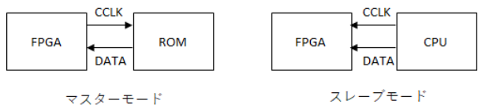
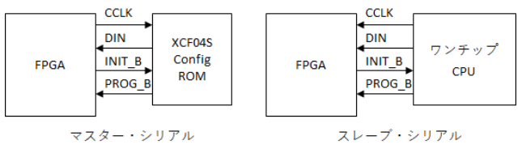

## コンフィギュレーションとは
電源が投入された直後では FPGA は起動していません。Xilinx FPGA は RAM ベースであるため、電源が切れると記憶している回路が消えてしまうからです。

まっさらな FPGA にユーザ回路を書きこんで、望みの動作ができるようにすることをコンフィギュレーションといいます。

コンフィギュレーションを行うデータ列をビットストリームといいます。Xilinx の FPGA ではビットストリームを与えるために大きく分けて7種類の方法が用意されています。

- マスターシリアル・コンフィギュレーション・モード
マスターというのは FPGA が CCLK (コンフィギュレーション・クロック) を出力して能動的に行うモードです。
スレーブというのは外部の CPU などから FPGA に CCLK とともにコンフィギュレーションデータを与えて受動的に行うモードです。

- スレーブシリアル・コンフィギュレーション・モード
シリアルコンフィギュレーションモードとは、1bit のデータ入力端子を通じてビットストリームを流し込むモードです。
CCLK を FPGA が出すのがマスターシリアル、CCLK を FPGA が受け取るのがスレーブシリアルです。

- マスター SelectMAP (パラレル)・コンフィギュレーション・モード
- スレーブ SelectMAP (パラレル)・コンフィギュレーション・モード
- JTAG/バウンダリスキャンモード・コンフィギュレーション・モード
- マスター SPI フラッシュ・コンフィギュレーション・モード
- マスター BPI フラッシュ・コンフィギュレーション・モード

たくさんの方法があるのですが、実際に使われるのはマスター SPI フラッシュ・モードと、開発時に使う JTAG モードくらいです。
それ以外の方法は旧世代からの互換性のためにあったり、FPGA にソフトコアの CPU を内蔵してシステム開発をしていた名残のようなものなので、あまり使いません。
