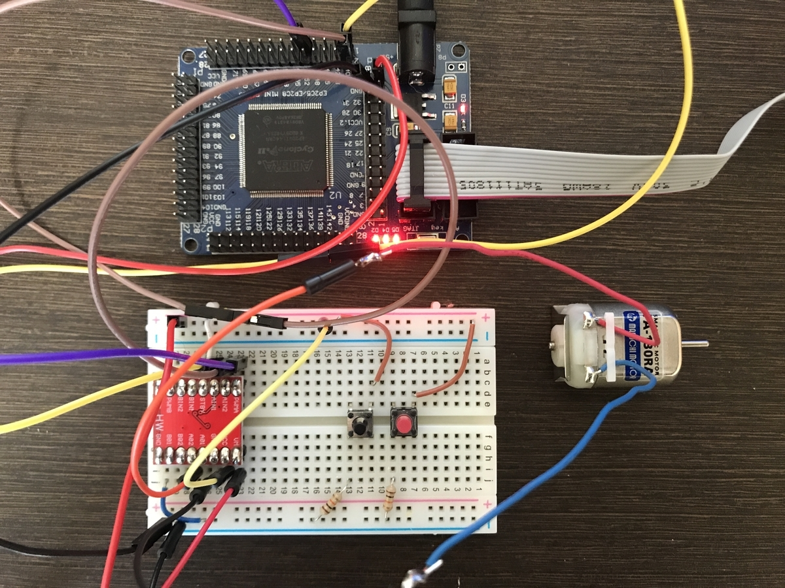
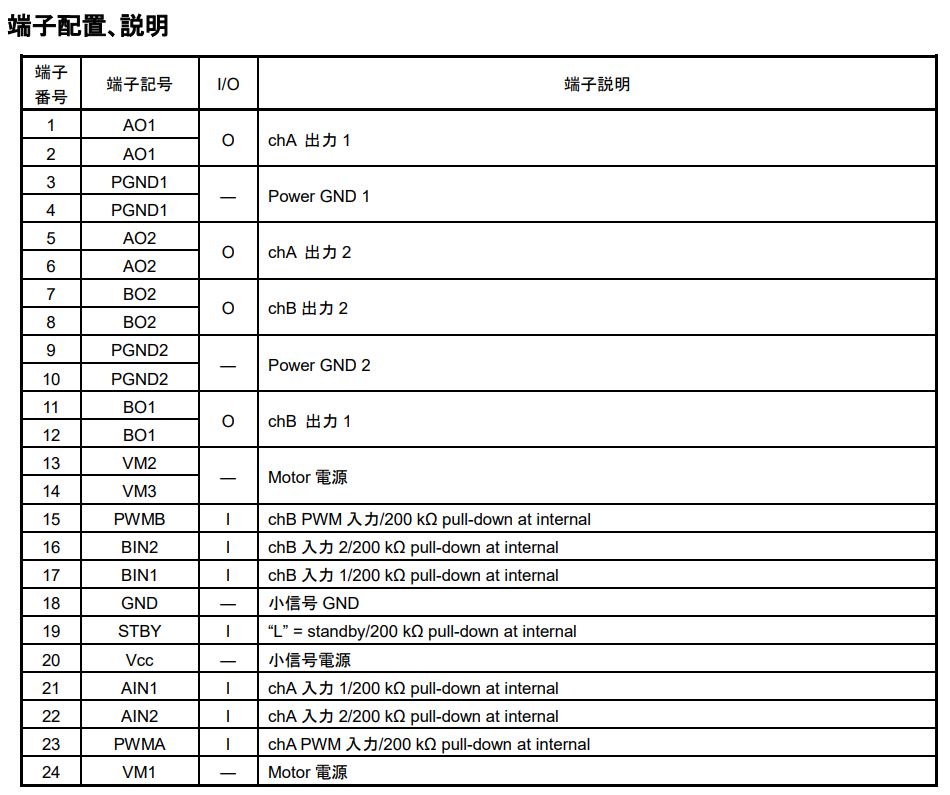
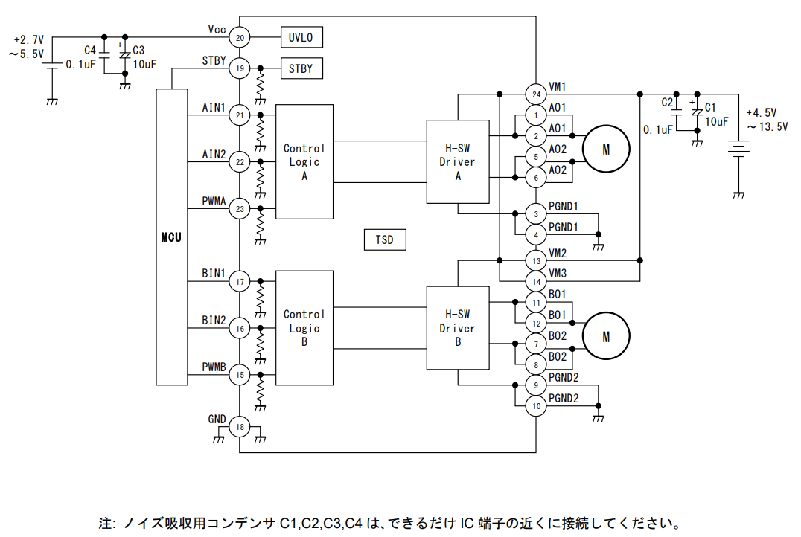

https://uuktuv.hateblo.jp/entry/2020/05/23/143141


1.　はじめに
　あのFPGAボードで今度はDCモータをPWM制御した。FPGAで任意にクロックを生成し、PWM信号として利用してみる実験。


2.　実験結果
　使用したモータードライバはこの前と一緒のもの。この前はテストのためずっとHIGHをPWMに入れっぱなしだったが、今回はFPGAで分周したクロック入力を作り、PWMとして入力する。

　が、実験したところ、モータ電源3V程度の設定では、PWMを高周波にし過ぎても正味かかる電圧（実効電圧）が低下すぎて？しまい、連続したモータ出力が得られなかった。
(実効電圧を概算したい場合、電力に変換⇒PWM周期より十分大きい領域で電力を時間積分⇒単位時間当たりの仕事量[W]に直して実効電圧を得る、のが調べると定石のよう）

モータ電源3Vの状態で1kHzぐらい（FPGAの発振器が50MHzなのでクロック換算なら50000回）与えてやるとOKだった。この時、モーターに流れる電流値は安定化電源の表示だと150mA程度だった。



```vhdl
library ieee;
use ieee.std_logic_1164.all;
use ieee.std_logic_unsigned.all;

entity MOTOR is
port( CLK :         in  std_logic;
      IN1, IN2, PWMA:     out std_logic  );
end MOTOR;


architecture RTL of MOTOR is

 -- 5000カウントで0.1ms(10kHz), 50000カウントで1ms(1kHz)
signal CNT_PWMA:  integer range 0 to 4999999;  
signal PWMA_TR : std_logic; 

begin
    
    process( CLK )
    begin
       if( CLK'event and CLK = '1') then
           if( CNT_PWMA < 50000 ) then
               PWMA_TR <= '1';
                CNT_PWMA <= CNT_PWMA + 1;
            elsif (  50000 <= CNT_PWMA and CNT_PWMA < 50000*2  ) then
               PWMA_TR <= '0';
                CNT_PWMA <= 0;
                CNT_PWMA <= CNT_PWMA + 1;
            else
                CNT_PWMA <= 0;
            end if;
        end if;
    end process;
    
    
    process(PWMA_TR)
    begin
        if(PWMA_TR = '1') then
            IN1 <= '1';
            IN2 <= '0';
            PWMA <= '1';
        else
            IN1 <= '0';
            IN2 <= '0';
            PWMA <= '0';
        end if;
    end process;
    

end RTL;
```

## モータの配線



画像の端子配置を確認しました。モータ制御に使用するための基本的な配線方法を以下に示します：

電源接続:

PGND1とPGND2をモータの電源グランドに接続します。
ICの電源端子（画像には表示されていないかもしれません）をモータの電源に接続します。
モータ出力接続:

AO1とAO2をモータのAチャンネルの出力端子に接続します。
BO1とBO2をモータのBチャンネルの出力端子に接続します。
制御信号接続:

モータ制御用の入力信号端子（画像には表示されていないかもしれません）を制御回路からの信号に接続します。
具体的な配線方法はICのデータシートやモータの仕様に依存するため、詳細な情報を確認することをお勧めします。データシートには、端子の詳細な説明や推奨される配線方法が記載されています。




1. Vccに5V電源を入力
2. ノイズ取のコンデンサを指定の場所に配置
3. 
