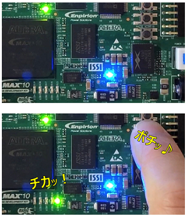
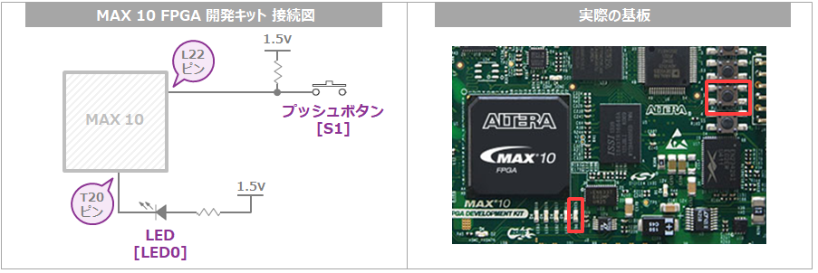
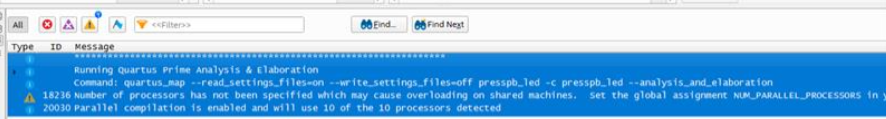
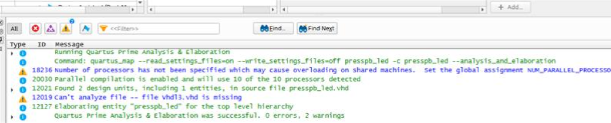
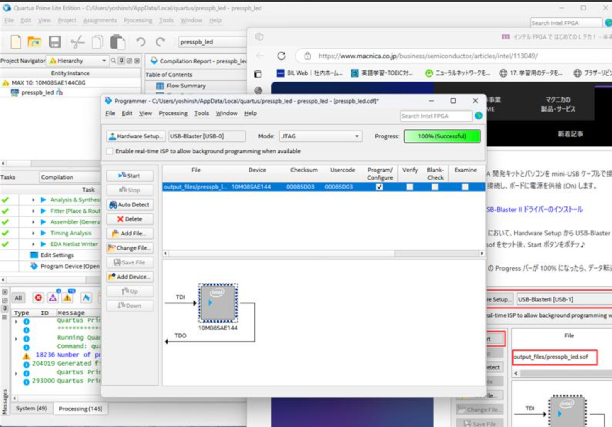

## 目的
MAX10を用いたLチカを行います

## 参考
[参考](https://www.macnica.co.jp/business/semiconductor/articles/intel/113049/)

## Lチカ
基板上のプッシュボタンを押したときだけ LED が点灯し、
プッシュボタンを離すと消灯する、
この動作を FPGA を介して行わせます。


## 準備
- Quartus® Prime Standard Edition
- ModelSim* - Intel® FPGA Edition
- MAX® 10 FPGA 開発キット

## 開発ボードの接続構成



プッシュボタンとLEDは基盤上で図のような接続構成となっている

プッシュボタンを押したらLEDが点灯してプッシュを話すとLEDも消灯する。

FPGAのピンとLEDにつながっているFPGAのピンを単純につなげばよい。

- FPGAの中身は空っぽの箱
- プッシュボタンからの入力信号をFPGAが受信してFPGAを通る
- 信号をLEDへ出力するためのデジタル論理回路を設計

### 1. Quartus Prime  
インテル FPGA の開発ソフトウェア Quartus Prime を使用

#### 1. 論理回路を設計する
ここでは、プロジェクト名と最上位エンティティ名を presspb_led に設定します。 

ターゲットデバイスは、MAX 10 ファミリーの 10M50DAF484C6GES を選択します。

```vhdl
-- VHDL sample : presspb_led.vhd


library ieee;
use ieee.std_logic_1164.all;


entity presspb_led is
	port (
		PB	 :  in  std_logic;
		LED 	 :  out std_logic
	     );
end;


architecture rtl of presspb_led is 
begin 
	LED <= PB;			
end rtl;
```

```vhdl
// Verilog HDL sample : presspb_led.v


module presspb_led
(
	input	 PB,
	output LED
);


	assign LED = PB;


endmodule
```

#### 2. 論理シミュレーションをする
ModelSimで作成したデザインのRTLレベルシミュレーションを行う

>RTLレベル
>レジスタ転送レベル（レジスタてんそうレベル、英: register transfer level、RTL）は、論理回路の動作記述などにおいて、「ゲートレベル」よりも一段抽象的な記述レベルである。
>ゲートレベルでは、組合せ論理回路の（すなわち、状態を持たない）ゲートのネットリストを記述するが、レジスタ転送レベルでは、状態を持つラッチ回路など順序回路に相当する最小の部分を「レジスタ」として抽象化（ブラックボックス化）する。
>


>ネットリスト
>FPGA 内の電子回路（ハードウェア）の構成は、HDL というコードを使って書くことができます。

ネットリストとは、回路ブロックの接続関係を示したコードのことです。HDL を変換することで、ネットリストを作ることができます。
>HDL をネットリストに変換することを、「論理合成」とよびます。
>最終的に FPGA に書き込むのは、HDL のプログラムファイルではなく、このネットリストです。

https://zenn.dev/nekoallergy/articles/fpga-basic-02
ここを読んでください


>動作レベル　　　　　（抽象度：高）　: 普通のプログラミングはコレ
>レジスタ転送レベル　（抽象度：中）　: HDL で書くのはコレ
>ゲートレベル　　　　（抽象度：低）　: 実際に FPGA に書き込むのはコレ


=======
## Quartusのプロジェクト作成時
**Quartus Prime**を使って、FPGAアルテラ（現Intel）の**MAX10**シリーズの**DEV KIT EK10M08E144**をコーディング（設計・開発）することは可能です。
 
### 理由と補足説明
 
1. **Quartus PrimeはMAX 10に対応**
   - Quartus Primeは、Intel（旧Altera）のFPGA開発用統合ツールで、MAX 10シリーズも正式にサポートしています。
   - MAX 10ファミリ用の開発キットやデバイスも、Quartus Primeのデバイスリストに含まれています。
 
2. **DEV KIT EK10M08E144について**
   - 型番から、「EK10M08E144」はMAX 10シリーズのM08（8Kロジックエレメント）・E144パッケージのデバイスを搭載した開発キットであることが分かります。
   - Quartus Primeでこのデバイスをターゲットとしてプロジェクトを作成できます。
 
3. **開発の流れ**
   - Quartus Primeで新規プロジェクトを作成し、ターゲットデバイスとして「10M08SAE144C8G」など、開発キット搭載のMAX 10デバイスを選択します。
   - VerilogやVHDLで回路設計し、論理合成・配置配線・書き込みまで一連の開発作業が可能です。
 
4. **無償版でも利用可能**
   - MAX 10シリーズは、無償の「Quartus Prime Lite Edition」でもサポートされています。
 

## ファイル作成時

注釈にエラーあった
--
ではなく
//
が真。

修正したところ、コンパイル成功。






このエラーの原因は、**同じFPGAのピン番号（例：Pin_18やPin_20）に複数の信号を割り当ててしまった**ためです。
 
---
 
## エラー内容の解説
 
たとえば、  
```
Error (176310): Can't place multiple pins assigned to pin location Pin_18 (IOPAD_X10_Y17_N21)
    Info (176311): Pin LED is assigned to pin location Pin_18 (IOPAD_X10_Y17_N21)
    Info (176311): Pin ~ALTERA_TCK~ is assigned to pin location Pin_18 (IOPAD_X10_Y17_N21)
```
この部分は「**LED**ピンと、JTAG用の**~ALTERA_TCK~**ピンがどちらも**Pin_18**に割り当てられています」と言っています。
 
同様に、
```
Error (176310): Can't place multiple pins assigned to pin location Pin_20 (IOPAD_X10_Y16_N21)
    Info (176311): Pin PB is assigned to pin location Pin_20 (IOPAD_X10_Y16_N21)
    Info (176311): Pin ~ALTERA_TDO~ is assigned to pin location Pin_20 (IOPAD_X10_Y16_N21)
```
これは「**PB**ピンと、JTAG用の**~ALTERA_TDO~**ピンがどちらも**Pin_20**に割り当てられています」と言っています。
 
---
 
## 主な原因
 
- **.qsf（Quartus Settings File）やAssignment Editorで、複数の信号を同じピン番号に割り当ててしまった**
  - 例えば、ピン配置の指定で
    ```
    set_location_assignment PIN_18 -to LED
    set_location_assignment PIN_18 -to ~ALTERA_TCK~
    ```
    のように、LEDと~ALTERA_TCK~が同じピンに割り当てられている
- **JTAG用ピン（~ALTERA_TCK~や~ALTERA_TDO~など）は、通常ユーザーI/Oとして使えない or 使う場合はJTAG機能が制限される**
- **ピン配置の指定ミスや、テンプレートのコピペミス**
 
---
 
## 解決方法
 
1. **ピン割り当てを見直す**
    - Assignment Editor や .qsf ファイルで、**LEDやPBなどのユーザー信号と、JTAG信号が同じピンに割り当たっていないか**を確認してください。
    - 必ず**1つのピンには1つの信号だけ**を割り当てること。
 
2. **JTAGピンを避ける**
    - JTAG用ピン（TCK, TDI, TDO, TMSなど）は、プログラム書き込みやデバッグで必須です。**これらのピンはユーザーI/Oに割り当てないようにしましょう。**
    - 開発ボードの回路図やピン配置図を確認し、使って良いピン番号を選んでください。
 
3. **ピン配置の修正例**
    - 例えば、LEDはPin_18ではなくPin_21、PBはPin_22など、**JTAGピンと重ならない番号**に割り当て直します。
    - .qsfファイルの該当部分を修正するか、Assignment Editorで編集してください。
 
---
 
## まとめ
 
- **同じピン番号に複数の信号を割り当てているため、エラーが出ています。**
- JTAGピン（~ALTERA_TCK~等）とユーザー信号（LEDやPB）を同じピンにしないよう、ピン割り当てを修正してください。
 
---
 
**開発ボードのマニュアルや回路図で「使って良いピン番号」を必ず確認してから割り当てる**ことが大切です。

## Lチカできた！！！！

うれしい♪
あとで振り返りましょう！



## 課題
1. 使えるピンと使えないピンが判別つかなかった
2. ピンの配置は何を基準に考えるかわからなかった
3. DBは何のために必要？


## 処理
1. Quartusを起動→プロジェクト構築
2. VHDL記載
3. start→analysisする(エラーないならDBに登録完了)
4. ModelSimで解析
5. ピンプランナー
6. complile
7. FPGAにconfigureを移管

## ピン
電子部品やICなどの外部と接続するための端子を示す。
FPGAやマイコンなどのICパッケージでは部品の外側にならんでいる金属製の足やパッドがピン。

### ピンの役割
ピンの役割
外部と信号や電源をやり取りする窓口
入力ピン：外部から信号を受け取る
出力ピン：内部の信号を外部に出す
双方向ピン：入出力の両方に使える
電源やグラウンドの供給
クロックやリセットなど、制御信号の入力

FPGAのピンにはいろいろな種類があります。

ユーザーI/Oピン（GPIO）
→ ユーザーが自由に入出力に使えるピン。LEDやスイッチ、外部回路との通信などに使う。
電源ピン（VCC, GND）
→ FPGA本体に電源を供給するためのピン。
クロックピン
→ クロック信号を入力する専用ピン。
JTAGピン
→ プログラム書き込みやデバッグ用のピン。


