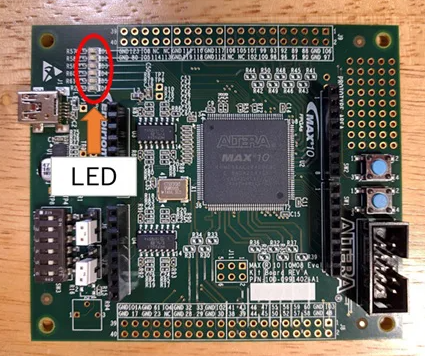
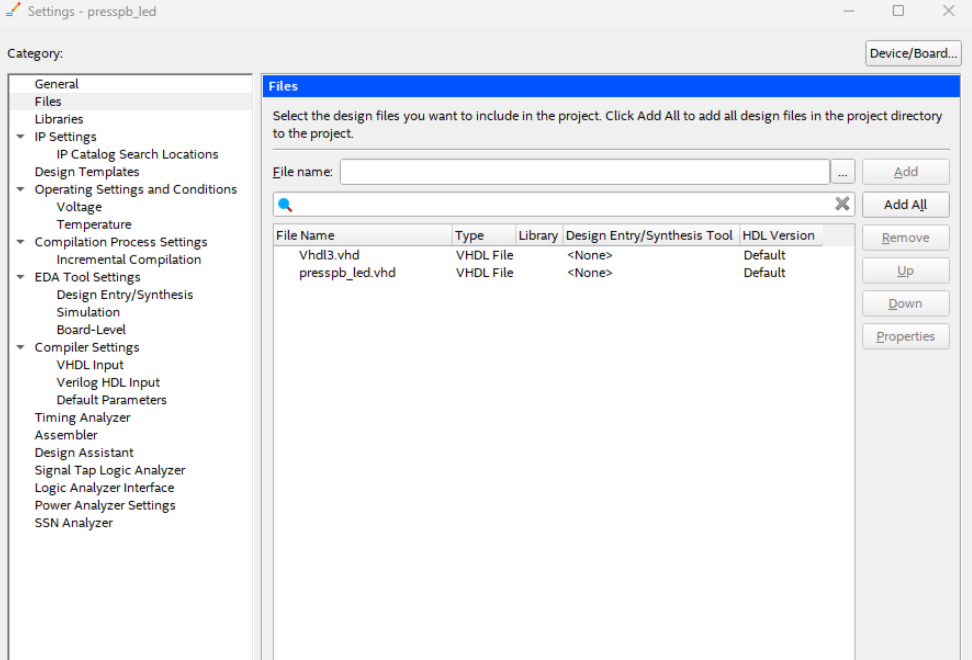
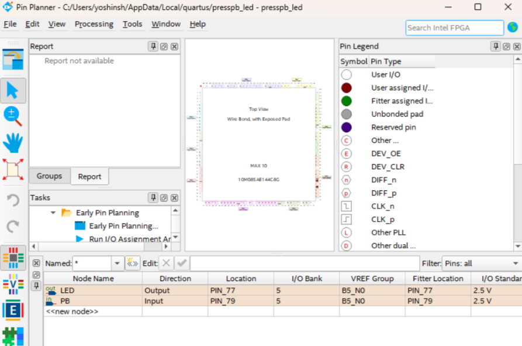
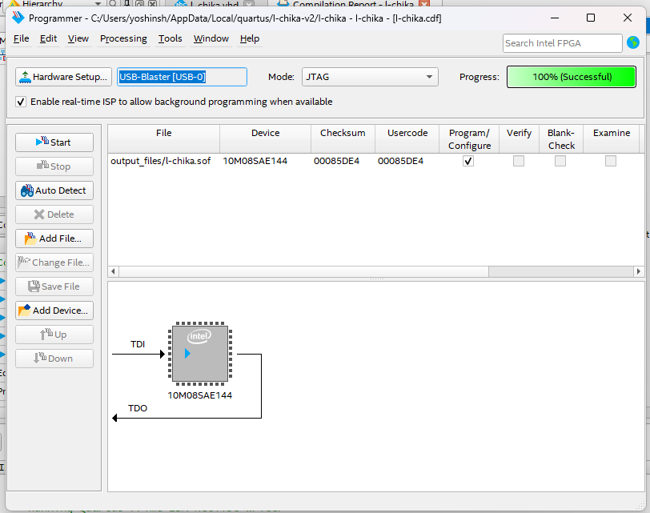

# Lチカ再び
## 目的
以前のLチカが今一つだったので、再トライ。

https://tetsufuku-blog.com/max10-evaluation-kit-led-hw/



LEDが5個あるので2個はハード制御、残り3個はソフト制御

## プログラムできない原因
指定通りしたはずなのに、プログラムがfailしている。
原因について確認する。

ファイル構成は以下のようになっている。


ファイルが一つ不足している。
→あまり関係ないファイルっぽい。



ここみてsdcファイル追加した

http://star.a.la9.jp/Quartus/Quartus17_1/HLS/tutorial7.html

やっぱり動作せず。。。

https://community.intel.com/t5/Programmable-Devices/Quartus-programmer-start-failed/m-p/1645217

一度動作してるのでこれではないはず

https://community.intel.com/t5/Programmable-Devices/Quartus-programmer-start-failed/m-p/1645217


いった！
答えはデバイスの選択を間違えてたから。。。。


選ぶべきデバイスはこれでした

10M08SAE144C8G
 

10M08SAE144C8G

```vhd
--- library
library IEEE;
use IEEE.STD_LOGIC_1164.ALL;
use IEEE.NUMERIC_STD.ALL;
 
--- entity
entity led_chaser is
	Port(
		clk	: in std_logic;
		reset	: in std_logic;
		leds	: out std_logic_vector(5 downto 0)
		);
end led_chaser;
 
--- architecture
architecture Behavioral of led_chaser is
	signal cnt	:unsigned(25 downto 0) := (others => '0'); -- 26bitカウンタ(約1秒@50MHz)
	signal led_idx	:unsigned(2 downto 0) := (others => '0');  -- LEDインデックス(0～5)
begin
	process(clk, reset)
	begin
		if reset = '1' then
			cnt <= (others => '0');
			led_idx <= (others => '0');
		elsif rising_edge(clk) then
			if cnt = 49999999 then  -- 50,000,000クロック=1秒
				cnt <= (others => '0');
				if led_idx = 5 then
				  led_idx <= (others => '0');
				else
				  led_idx <= led_idx + 1;
				end if;
			else
				cnt <= cnt + 1;
			end if;
		end if;
	end process;
	leds <= std_logic_vector(shift_left(to_unsigned(1, 6), to_integer(led_idx)));
end Behavioral;
```


このVHDLコードは、「**LEDチェイサー（流れるLED）回路**」を実現するものです。  
以下、動作の詳細を説明します。
 
---
 
## 主な動作
 
- **6個のLED（leds[5:0]）を1秒ごとに1つずつ順番に光らせる**回路です。
- 1クロックごとに26ビットのカウンタ（`cnt`）がインクリメントされ、**50,000,000クロック（=1秒@50MHz）ごとにカウントがリセットされます**。
- 1秒ごとにLEDの位置（`led_idx`）が0→1→2→3→4→5→0...と順番に進み、その位置だけが点灯します。
 
---
 
## 具体的な流れ
 
1. **リセット時**
   - `cnt`と`led_idx`が0にリセットされます。
 
2. **クロック立ち上がりごと**
   - `cnt`が1ずつ増加します。
   - `cnt`が49,999,999（0からカウントなので50,000,000クロック目）になると、
     - `cnt`を0に戻す
     - `led_idx`を1増やす（5まで行ったら0に戻る）
 
3. **LEDの制御**
   - `leds`出力は、`led_idx`で指定された1ビットだけが'1'で、他は'0'になります。
   - 例えば、`led_idx=2`のときは`leds="000100"`となり、3番目のLEDだけが点灯します。
 
---
 
## 波形イメージ
 
| 時刻 | led_idx | leds    | 点灯LED番号 |
|-----|--------|--------|-----------|
| 0s  | 0      | 000001 | 0         |
| 1s  | 1      | 000010 | 1         |
| 2s  | 2      | 000100 | 2         |
| 3s  | 3      | 001000 | 3         |
| 4s  | 4      | 010000 | 4         |
| 5s  | 5      | 100000 | 5         |
| 6s  | 0      | 000001 | 0         |
| ... | ...    | ...    | ...       |
 
---
 
## まとめ
 
- **LEDが1秒ごとに左へ1つずつ順番に点灯していく「流れるLED（LEDチェイサー）」回路です。**
- 6個のLEDが順番に1つずつ点灯し、最後まで行くとまた最初に戻ります。
 
以上です。

