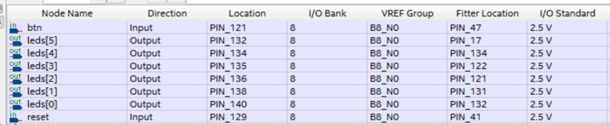

## 目的
LEDを順繰りに点滅するようにしたい


## resetの扱い
resetはどんなピンにアサインメントすべきでしょうか。


FPGAなどのハードウェア設計において、`reset` 信号は**システム全体を初期状態に戻すための重要な信号**です。  
この `reset` ピンをどこにアサインするか（どのFPGAピンに割り当てるか）は、以下のポイントを考慮します。

---

### 1. **外部リセット用のスイッチや回路に接続**

- **一般的には、外部プッシュボタンスイッチやリセット回路に接続するピンに割り当てます。**
- ボードによっては「RESET」や「nRESET」とラベルされた物理スイッチやピンヘッダが用意されています。
- 例：  
  - FPGA開発ボードの「リセットボタン」につながっているピン  
  - マイコンのリセットピンと同様の扱い

---

### 2. **FPGAピン配置ファイル（constraintsファイル）で指定**

- 実際のピン番号は、利用するFPGAボードやデバイスによって異なります。
- 例：Xilinxなら`XDC`ファイル、Intel(Altera)なら`qsf`ファイルで下記のように指定します。

#### Xilinx Vivadoの例（.xdcファイル）
```
set_property PACKAGE_PIN K17 [get_ports reset]
set_property IOSTANDARD LVCMOS33 [get_ports reset]
```
（`K17`は例。ボードの回路図やマニュアルでリセットボタンに対応するピン番号を調べて指定）

#### Intel Quartusの例（.qsfファイル）
```
set_location_assignment PIN_AA1 -to reset
```
（`AA1`は例）

---

### 3. **注意点**

- **ノイズ対策**として、外部リセットスイッチにはプルアップ抵抗やデバウンス回路を入れるのが一般的です。
- **初期化が必要な場合**は、必ずリセット信号をアサインしてください（未接続だと動作が不安定になることがあります）。

---

### まとめ

- **resetピンは、外部リセットスイッチや回路が接続されているFPGAの物理ピンに割り当ててください。**
- 具体的なピン番号は、**お使いのFPGAボードの回路図やピン配置表を確認して**決めてください。

---

#### 参考（例：Digilent Basys3ボードの場合）

- Basys3のリセットボタン（BTN0）は`U18`ピンです。
- 例：  
  ```
  set_property PACKAGE_PIN U18 [get_ports reset]
  set_property IOSTANDARD LVCMOS33 [get_ports reset]
  ```

---

**要点：**  
「reset」は、**外部リセットボタンや回路に接続されているピン**にアサインしてください。  
ピン番号はボードごとに異なるため、**必ず回路図やマニュアルで確認**しましょう。

なのでこうした。




