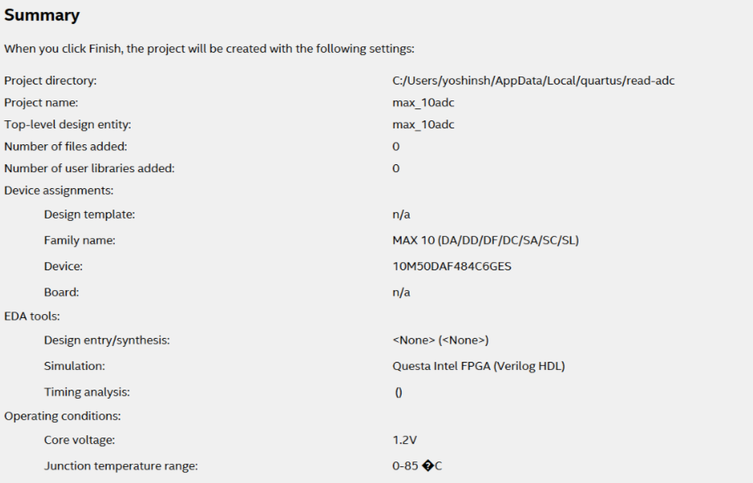
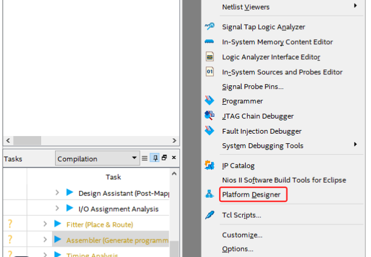
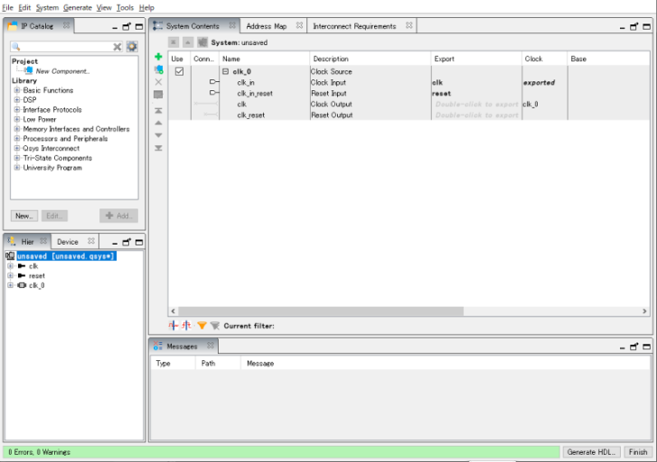
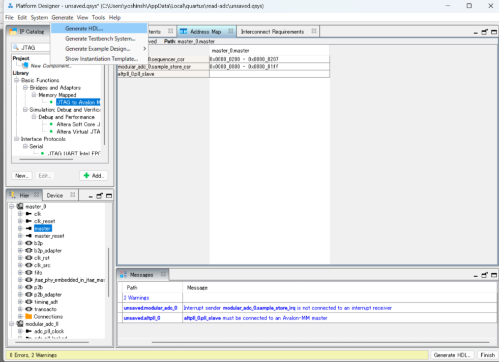
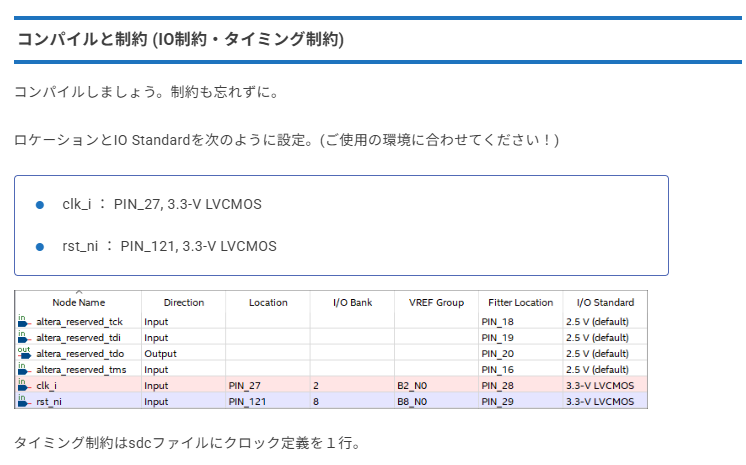

## reference

https://tetsufuku-blog.com/max10-adc-temperature/


## 記事の注目ポイント

MAX 10のADCの使い方がわかる
Platform Designer (旧Qsys)の最低限の使い方がわかる
ALTPLLの最低限の使い方がわかる
IO制約とタイミング制約の最低限の使い方がわかる
System Consoleの最低限の使い方がわかる

## 実験
1. プロジェクト作成



2. Platform Designerを起動
Platform DesignerでIPを作成








これでADCモジュールができあがり。


Quartusで**ピン配置（ロケーション）とIO Standard**の制約を設定する方法を、初心者にもわかりやすく説明します。

---

## 1. **Assignment Editor（アサインメントエディタ）を使う方法**

### 手順

1. **Quartusでプロジェクトを開く**
2. メニューバーから  
   `Assignments` → `Assignment Editor` をクリック
3. Assignment Editor画面で、下記のように設定

| To      | Assignment Name    | Value       |  
|---------|-------------------|-------------|  
| clk_i   | Location          | PIN_27      |  
| clk_i   | IO Standard       | 3.3-V LVCMOS|  
| rst_ni  | Location          | PIN_121     |  
| rst_ni  | IO Standard       | 3.3-V LVCMOS|  

4. 入力後、`File` → `Save` で保存

---

## 2. **.qsfファイルに直接書く方法**

プロジェクトフォルダ内の`.qsf`（Quartus Settings File）に、以下を追記します。

```
set_location_assignment PIN_27 -to clk_i
set_instance_assignment -name IO_STANDARD "3.3-V LVCMOS" -to clk_i

set_location_assignment PIN_121 -to rst_ni
set_instance_assignment -name IO_STANDARD "3.3-V LVCMOS" -to rst_ni
```

---

## 3. **制約を設定したらコンパイル**

1. メニューバーから  
   `Processing` → `Start Compilation` をクリック

---

## 4. **注意**

- ピン番号（PIN_27, PIN_121）は、実際の基板やFPGAピン配置図で確認してください。
- IO StandardもFPGAや基板仕様に合わせて正しく設定してください。

---


