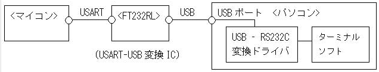
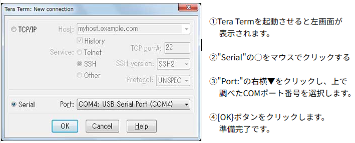
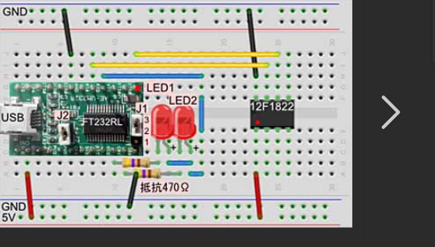
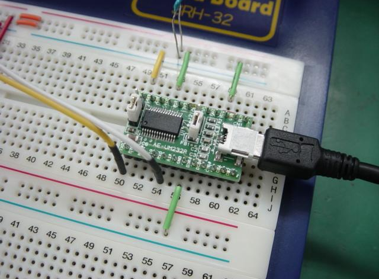
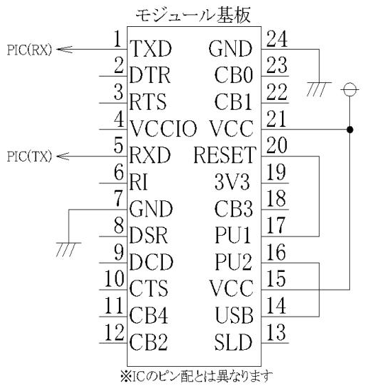

# 目的
UARTで読み取ったセンサーの値をPCで読み取る

https://usicolog.nomaki.jp/engineering/avr/serial.html

## FT232RL (USB−シリアル変換モジュール)
USBから電源を取る場合は、以下のように回路を組めばシリアル通信ができます


## FT232RL
　FT232RLは、秋月で買えます。パソコンとつなげる前に、FT232RLのドライバをパソコンにインストールします。

ドライバをFTDI社からダウンロードする.
ダウンロードしたフォルダを解凍する.
FT232RLをパソコンと繋ぐと,ドライバを要求される.
先ほどのフォルダ(CDM ○○ WHQL Certified)を選ぶ.
　 これで完了。また、ドライバ要求をされたら、同じ手順をすることで要求されなくなるのでOK。
FT232RLは、USBから電源をとるか、外部から電源を供給するか、をジャンパにより電源(Vcc)を選択することができます。
その他に、I/Oピンの電源を3.3Vか、Vccかをジャンパにより選択することができます。

### ジャンパ1 (J1)
- 1-2間をショート：I/Oの電圧を3.3Vにする
- 2-3間をショート：I/Oの電圧をVccにする
### ジャンパ2 (J2)
- 有り(ショート)：USBから電源を取る(Vcc = 5V)
- 無し(オープン)：外部から電源を取る(Vccは3.3〜5V)


## 調べる
### 知りたいコト
1. USBはマイクロUSB？
2. PCでモニタリング
3. センサーと実際配線している
4. ショートはどんな内容



この方法はパソコン側に”ＵＳＢ信号をＲＳ２３２Ｃ信号に変換”するドライバソフトをインストール
する必要が有ります、これによりパソコン側のターミナルソフト等のアプリソフトからは仮想ＣＯＭポート
とし利用可能になります。

__FT232RL__

送信時のインジケータLEDを接続出来る端子が容易されている。

RX: 22番ピン
TX: 23番ピン


__ターミナルソフト__

TeraTermを使ってモニタリング






[FT232](https://burariweb.info/electronic-work/ftdi-ft232rl-usb-serial-conversion-module.html)


ご質問の内容を整理すると、「22番ピンのCBUS1端子がRX（受信）、23番ピンCBUS0端子がTX（送信）のインジケーターLEDの接続で使える端子です」とあります。

これは、**USBシリアル変換IC（例：FT232Rなど）**などでよく見られる記述です。

---

## 意味の解説

### 1. **CBUS端子とは**
- **CBUS（Configurable BUS）端子**は、IC内部でユーザーが用途を設定できる多機能ピンです。
- FTDI社のFT232RなどのICでは、CBUS0, CBUS1, ... などの端子があります。
- これらの端子は、IC内部の設定（EEPROMやソフトウェア）によって「GPIO」「パワーオンリセット」「TX LED」「RX LED」など、さまざまな機能に割り当てることができます。

### 2. **RXインジケーターLED／TXインジケーターLED**
- **RX LED**：データ受信時に点灯するLED
- **TX LED**：データ送信時に点灯するLED
- 通信の状態を「目で見て確認する」ために使われます。

### 3. **「接続で使える端子」とは**
- 22番ピン（CBUS1）を「RX LED」機能に設定すると、データ受信時にこのピンが「L」レベル（またはパルス）になり、LEDを点灯させることができます。
- 23番ピン（CBUS0）を「TX LED」機能に設定すると、データ送信時にこのピンが「L」レベル（またはパルス）になり、LEDを点灯させることができます。
- つまり、**この2つの端子にLEDと電流制限抵抗を接続すれば、送受信のインジケーターLEDとして使える**という意味です。

---

## 実際の接続例

```
Vcc
 |
[抵抗]
 |
LED（アノード）
 |
CBUSx端子（カソード）
```
- CBUS端子が「L」になるとLEDが点灯します（オープンドレイン出力の場合が多い）。

ここが分かり易い！

https://amahime.main.jp/ft232rl/main.php?name=ft232rl


これっすよ！これこれ！






---

## まとめ

- **CBUS1（22番ピン）をRX LED、CBUS0（23番ピン）をTX LEDとして設定できる**
- それぞれの端子にLEDと抵抗をつなげば、通信時にLEDが点灯し、送受信の状態が分かる
- これは主にUSBシリアル変換ICなどで使われる機能です

## センサとの接続
### そのまま読み込む場合

1. センサのTX → FT232RLのRX（受信ピン）
2. センサのRX ← FT232RLのTX（送信ピン）（センサがコマンド入力を必要とする場合）
3. GND同士を接続（センサとFT232RLとPCのGNDを共通に）

### センサがI2Cやアナログ出力などの場合
1. マイコン（Arduino、ESP32など）を使い、センサ値を読み取ってUARTで出力
2. マイコンのTX → FT232RLのRX
3. マイコンのRX ← FT232RLのTX（必要に応じて）
4. GND同士を接続

### FT232RLとPCの接続
FT232RLのUSB端子をPCのUSBポートに接続
ドライバが自動インストールされる（FTDI公式サイトからも入手可能）
PC上で「仮想COMポート」として認識される

