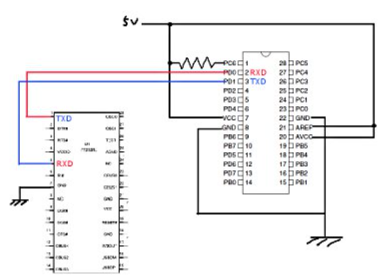

# 目的
UARTで読み取ったセンサーの値をPCで読み取る

https://usicolog.nomaki.jp/engineering/avr/serial.html

## FT232RL (USB−シリアル変換モジュール)
USBから電源を取る場合は、以下のように回路を組めばシリアル通信ができます

## FT232RL
　FT232RLは、秋月で買えます。パソコンとつなげる前に、FT232RLのドライバをパソコンにインストールします。

ドライバをFTDI社からダウンロードする.
ダウンロードしたフォルダを解凍する.
FT232RLをパソコンと繋ぐと,ドライバを要求される.
先ほどのフォルダ(CDM ○○ WHQL Certified)を選ぶ.
　 これで完了。また、ドライバ要求をされたら、同じ手順をすることで要求されなくなるのでOK。
FT232RLは、USBから電源をとるか、外部から電源を供給するか、をジャンパにより電源(Vcc)を選択することができます。
その他に、I/Oピンの電源を3.3Vか、Vccかをジャンパにより選択することができます。

### ジャンパ1 (J1)
- 1-2間をショート：I/Oの電圧を3.3Vにする
- 2-3間をショート：I/Oの電圧をVccにする
### ジャンパ2 (J2)
- 有り(ショート)：USBから電源を取る(Vcc = 5V)
- 無し(オープン)：外部から電源を取る(Vccは3.3〜5V)
