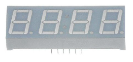

https://www.monotaro.com/p/4937/3294/?utm_id=bi_pla&cq_plt=bp&cq_net=o&utm_medium=cpc&utm_source=bing&utm_campaign=shopping_424303920&utm_content=49373294&msclkid=a7a42d5fb01d1e3c3b4b452d9ce71fb6

Kingbrightの7セグメントLED数字表示器について、文字高14.2mm、4桁表示の製品に関する情報ですね。Kingbrightは、LED製品を幅広く提供しており、7セグメントLED表示器もその一つです。この製品は、数字を表示するために設計されており、様々な電子機器や計器類で使用されます。14.2mmの文字高は、ある程度の距離からでも数字を視認しやすく、4桁表示は、複数の数字を同時に表示できるため、様々な用途に適しています。

