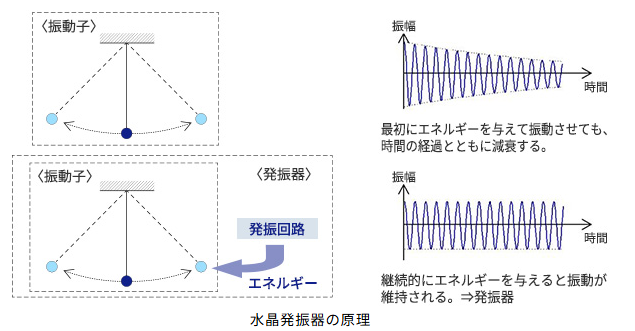
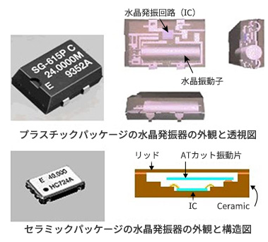
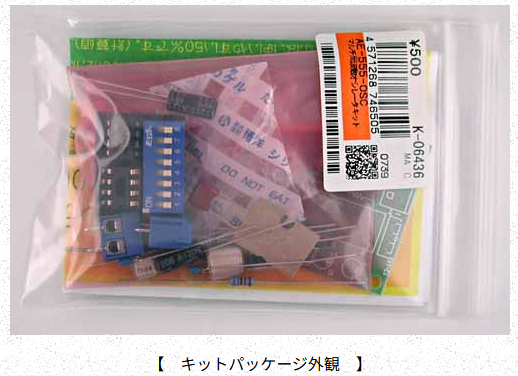
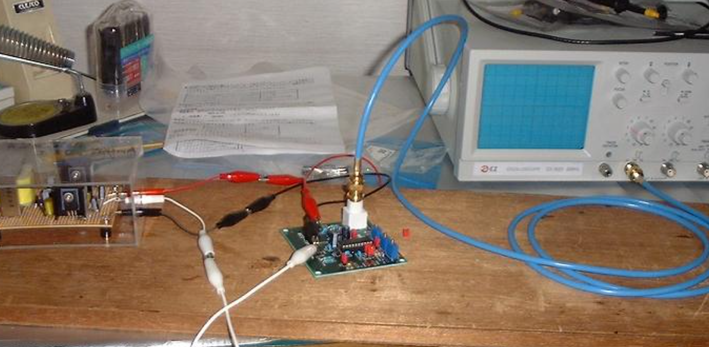

## 仕組み

水晶振動機と発振回路をワンパッケージした電子部品。

水晶発振器は、安定した周波数を発生させ、規則正しい基準信号を作り出します。

振り子を水晶振動子に例えて、振り子の運動で考えてみます。振り子の運動を継続させるためには、振り子が振れる最大の振れ幅の位置と時点を検出することと、その位置と時点を継続するよう押し戻す力が必要です。この検出と一定のエネルギーで押し戻す力を発振回路が担っています。




### 水晶発振器の構造

冒頭でも述べましたが、水晶発振器は、水晶振動子と発振回路(IC)を1つのパッケージに入れ込んだ電子部品です。パッケージの中の構造は以下画像のようになっています。



### 用途

水晶を用いた発振器は高精度で安定という特徴をもつため、高い精度が求められる用途において、周波数を制御する電子部品の一つとして周波数標準や時刻の基準に使用される。

__例__

- 通信機器や産業機器、車載機器などの分野における製品の周波数信号源
- デジタル回路のクロック源


## 情報収集

ＬＭＣ５５５というＩＣは、発振回路を作るのが容易です

周波数もＣとＲから計算できます。これを使って基準発振器を製作するキットがマルチ周波数オシレータキットです。

周波数は、１Ｈｚ～１００ｋＨｚまで１０倍ずつで発振できます。電源電圧が１．５Ｖ～１４Ｖと広範囲なので組み込む回路に対応できます。

波形は方形波なので、アンプの周波数特性を測るなどには使えませんが、ＬＥＤを点滅させるカウンター回路のクロックなどには使えるでしょう。精度のよい抵抗などを使用しているので周波数は数パーセントの誤差です。

### キットを使った製作

https://cba.sakura.ne.jp/kit01/kit_926.htm




https://amanokatsutoshi.github.io/public_html/handicrafts/oscillator_kit/oscillator_kit.html




### 1. DIFFIO_RX_L27P（差動入力ピン）
 
- **DIFFIO**は「Differential I/O（差動入出力）」の略です。
- **RX**は「受信（Receive）」を意味します。
- **L27P**は「左バンク27番目のPositive（＋）」を示します。
- つまり、「**左バンク27番目の差動入力ピン（＋側）**」という意味です。
- 差動信号（例：LVDSなど）を受け取るために使われます。通常は「P（＋）」と「N（－）」の2本で1ペアになります。
 
---
 
### 2. PLL_L_CLKOUTP（PLLクロック出力ピン）
 
- **PLL_L_CLKOUTP**は、**PLL（Phase Locked Loop）からのクロック出力ピン（＋側）**です。
- 「L」は左バンクまたは特定のPLLブロックを示す場合があります。
- **PLLで生成したクロック信号を外部に出力するためのピン**として使うことができます。
 
---
 
### まとめ
 
このピンは、**FPGAのピンアサインや設定（ピン割り当て）によって、**  
- 差動入力ピン（例：LVDS受信など）
- PLLクロック出力ピン
 
のいずれかの機能として使われます。  
どちらの機能として使うかは、FPGA設計時に**ピン配置（ピンアサイン）やI/O規格の設定**で決まります。
 
---
 
#### 参考
 
- **データシートやピン配置表**で「DIFFIO_RX_L27P/PLL_L_CLKOUTP」の記載があれば、上記いずれかの用途で使えるピンであることを示しています。
- 実際の使い方は、FPGAのプロジェクトで「このピンを差動入力として使う」または「PLLクロック出力として使う」と設定することで決まります。
 

 FPGAの出力ピンにLEDを接続する場合の**配線方法**と**グランドの取り方**について説明します。
 
---
 
## 1. LEDとの配線方法
 
### 【基本的な接続例】
 
```
FPGA出力ピン ──[電流制限抵抗]──|>（LEDのアノード）カソード──GND
```
 
- **FPGA出力ピン**：クロックや任意の出力信号を出すピン
- **電流制限抵抗**：LEDを壊さないために必須（数百Ω程度が一般的）
- **LED**：アノード（＋）側が抵抗とFPGA出力ピン、カソード（－）側がGND
- **GND**：FPGA基板のグランド（0V）
 
---
 
### 【具体的な手順】
 
1. **出力ピンの選定**  
　LEDを点灯させる出力ピン（例：`clk_out_pin`）を決めます。
 
2. **電流制限抵抗の選定**  
　LEDの順方向電圧（通常2V程度）と希望する電流（5～10mA程度）から抵抗値を決めます。  
　例：抵抗値 = (FPGA出力電圧 - LED順方向電圧) / LED電流  
　例：3.3V出力、LED Vf=2V、I=10mA → (3.3-2.0)/0.01 = 130Ω（150Ω程度が安全）
 
3. **配線**  
　FPGA出力ピン → 抵抗 → LED（アノード）  
　LED（カソード） → FPGAのGNDピン
 
---
 
### 【配線図イメージ】
 
```
+--------------------------+
|                          |
|    FPGA                  |
|                       [出力ピン]
|                          |
+--------------------------+
               |
               |
          [電流制限抵抗]（例：150Ω）
               |
               |
          [LED]（アノード側）
               |
          [LED]（カソード側）
               |
               [GND]
```
 
---
 
## 2. グランド（GND）の取り方
 
- **必ずFPGAボードのGNDに接続してください。**
- GNDはFPGAの電源コネクタやピンヘッダ、GNDピンなど、基板上で「GND」と表示されている場所に接続します。
- **LEDのカソード側をGNDに落とす**形にします。
 
---
 
## 3. 注意点
 
- **FPGA出力ピンの最大電流**（多くは8～20mA程度）を超えないようにします。
- **たくさんのLEDを同時に点灯させる場合**は、合計電流がFPGAのI/Oバンクの最大値を超えないように注意してください。
- **LEDの極性**（アノード：＋、カソード：－）を間違えないようにします。

# 555タイマーIC
ちょっとした波形が欲しい時に気軽に使えるCR発振タイプです。 部品点数も少ないですのでタイマーIC、555を使った発振回路を学ぶのにも最適です。 周波数はディップスイッチの選択により周波数出力が選べます。 デューティ比は使いやすい50%です。


## 555タイマーICとは？

- **555タイマーIC**は、発振回路（オシレータ）やパルス生成回路、タイマー回路として広く使われる汎用ICです。
- 低価格で入手しやすく、電子工作や回路設計の基本部品です。


## 555タイマーICのオシレータ回路

555タイマーICを使ったオシレータ（発振回路）は、主に以下の2種類があります。

1. **アスティブル（Astable）マルチバイブレータ**
   - 外部に抵抗2本（R1, R2）とコンデンサ1個（C）をつなぐことで、**連続的にパルス波（矩形波）を発生**させる回路です。
   - 「発振回路」「パルス発生回路」とも呼ばれます。
2. **モノスタブル（Monostable）マルチバイブレータ**
   - トリガ信号が入力されたときだけ一定時間パルスを出す「ワンショット回路」です。

## 555アスティブル・オシレータの基本回路図

```
   +Vcc
     |
    [R1]
     |
     +-----+------+
     |     |      |
    [R2]   |     [C]
     |     |      |
   GND    555   GND
          OUT
```

- **R1, R2, C**の値で発振周波数とデューティ比が決まります。
- **OUTピン**から矩形波が出力されます。


## まとめ

「COM型555オシレータ」とは、**555タイマーICを使った一般的（common）な発振回路（アスティブル・マルチバイブレータ）**のことを指していると考えられます。  
この回路は、LEDの点滅、ブザーの駆動、クロック信号の生成など、幅広い用途に使われます。

もし「COM型」という表現に特別な意味（メーカー独自の型番など）がある場合は、もう少し詳しい文脈や資料が必要です。

