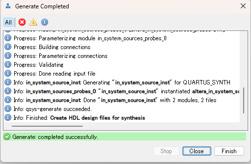
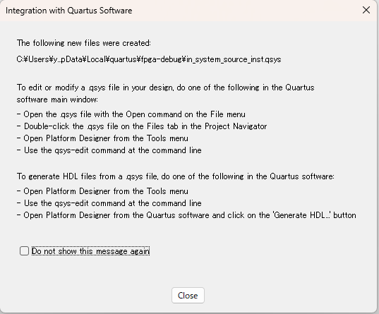
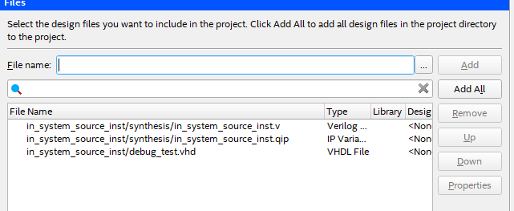
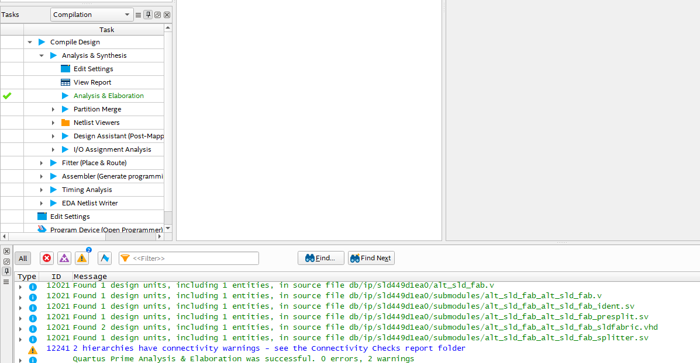

はい、QuartusでIPコア（例：**in_system_source**コア）を実装する具体的な手順を、画像のないテキストベースでわかりやすく説明します。

---

## 1. Quartusプロジェクトを作成・開く

1. Quartus Primeを起動
2. 新規プロジェクト作成（`File` → `New Project Wizard...`）
3. プロジェクト名やディレクトリ、ターゲットデバイスを設定

---

## 2. IP CatalogからIPコアを生成

ここでは例として「In System Sources and Probes」IPコア（`in_system_source`）を使います。

1. メニューで `Tools` → `IP Catalog` を選択（または画面右側のIP Catalogを開く）
2. 検索窓で「in system」と入力し、「**In System Sources and Probes**」をダブルクリック
3. **IP Parameter Editor**が開くので、必要な設定を行い「Finish」を押す
   - 例：ソース数やプローブ数など
4. 保存場所とファイル名（例：`in_system_source_inst`）を指定し「OK」
5. 自動的に**.qip**や**.vhd**などのファイルが生成される





---

## 3. IPコアのファイルをプロジェクトに追加

1. メニューで `Project` → `Add/Remove Files in Project...` を選択
2. 生成された
    - `in_system_source_inst.vhd`（または`.v`）
    - `in_system_source_inst.qip`
   などのファイルを**すべて追加**
3. 「OK」でダイアログを閉じる





## 4. トップレベルVHDL/VerilogでIPコアをインスタンス化

例：VHDLの場合

コンパイル通った！



```vhdl
library ieee;
use ieee.std_logic_1164.all;

entity top_module is
    port (
        my_source : out std_logic_vector(0 downto 0);
        my_probe  : in  std_logic_vector(0 downto 0)
    );
end top_module;

architecture rtl of top_module is

    component in_system_source_inst is
        port (
            source : out std_logic_vector(0 downto 0);
            probe  : in  std_logic_vector(0 downto 0)
        );
    end component;

begin

    u0 : in_system_source_inst
        port map (
            source => my_source,
            probe  => my_probe
        );

end rtl;
```

---

## 5. コンパイル

1. メイン画面で「Start Compilation」ボタンをクリック
2. エラーが出なければIPコアが正しくインスタンス化されたことになります

---

## 6. Signal Tapなどで活用（任意）

「In System Sources and Probes」IPコアの場合は、Signal Tap Logic Analyzerでのデバッグに使います。

---

## まとめ（手順のポイント）

1. **IP Catalog**からコアを生成
2. **生成されたすべてのファイルをプロジェクトに追加**
3. **トップレベルでインスタンス化**
4. **コンパイルしてエラーがないか確認**

---

### 【補足】
- 生成された`.qip`ファイルは**必ずプロジェクトに追加**してください。これを忘れるとIPコアの参照エラーが出ます。
- IPコアのパラメータは、再生成することで変更できます。

---

もし具体的なIPコア名や用途が決まっている場合は、その例も挙げて説明できますのでご相談ください。


# デモ用VHDL
`In System Sources and Probes` IPコアを使い、FPGA内部信号（ここではカウンタ値）をプローブとして観測する**デモ用VHDL**を作成します。


## デモ内容

- 8ビットのカウンタをFPGA内で動かします。
- カウンタ値を`In System Sources and Probes` IPコアの**プローブ端子**に接続します。
- Signal Tap Logic Analyzerで、このカウンタ値を観測できます。


## 1. IPコア側の設定例

- プローブ数：1
- プローブ幅：8ビット
- ソース数：0（今回は使いません）


## 2. デモ用VHDLコード

```vhdl
library ieee;
use ieee.std_logic_1164.all;
use ieee.numeric_std.all;

entity demo_top is
    port (
        clk : in std_logic;
        rst : in std_logic
    );
end entity;

architecture rtl of demo_top is

    -- 8ビットカウンタ
    signal counter : std_logic_vector(7 downto 0);

    -- In System Sources and Probes IPコアのコンポーネント宣言
    component in_system_source_inst is
        port (
            probe : in std_logic_vector(7 downto 0)
        );
    end component;

begin

    -- カウンタの動作
    process(clk, rst)
    begin
        if rst = '1' then
            counter <= (others => '0');
        elsif rising_edge(clk) then
            counter <= std_logic_vector(unsigned(counter) + 1);
        end if;
    end process;

    -- IPコアのインスタンス化
    u_in_system_source : in_system_source_inst
        port map (
            probe => counter
        );

end rtl;
```


## 3. Signal Tapでの観測手順

1. Signal Tap Logic Analyzerを開く
2. 「Node Finder」で`in_system_source_inst`の`probe`ポートを選択
3. 観測信号として追加し、Signal Tapをコンパイル・実行
4. 実際にFPGAを動かしながら、カウンタ値がSignal Tap上で変化することを確認


## まとめ

このデモでは、FPGA内部のカウンタ信号を**プローブ経由でSignal Tapから観測**できます。  
IPコアのプローブ幅や数は、IPコア生成時に自由に変更できます。

---

# PC上で観測する方法

結論から言うと、**「In System Sources and Probes」IPコアのプローブ信号は、PCのSignal Tap Logic Analyzer（Quartus付属のデバッグツール）を通じて観測することはできますが、Signal Tap以外の一般的な方法（UARTやUSB経由など）で直接PCのアプリケーションから観測することはできません**。

---

## 詳細解説

### 1. **Signal Tap経由での観測**

- 「In System Sources and Probes」IPコアは**Signal Tap Logic Analyzer**と連携するためのIPコアです。
- Signal TapはPC上で動作し、JTAG経由でFPGA内部のプローブ信号をリアルタイムで観測できます。
- したがって、**PC上のSignal Tapウィンドウでプローブ信号の値を波形として確認できます**。

### 2. **一般的なPCアプリ（ターミナルや独自ソフト）からの観測**

- 「In System Sources and Probes」IPコアはJTAG経由でQuartusのSignal Tapと通信するためのものなので、**UARTやUSBなど一般的な通信インターフェースを通じてPCの他のアプリケーションから直接観測することはできません**。
- もし、PCのターミナルや独自のPCアプリケーションで信号を観測したい場合は、**UARTやUSB、Ethernetなどの通信回路を自作して、FPGA内部信号を外部に送信する設計が別途必要**です。

---

## まとめ

- **Signal Tap Logic Analyzer**を使えば、PC上でプローブ信号を観測できます（Quartus必須）。
- **Signal Tap以外の方法では直接観測できません**。  
  → 他の方法でPCから観測したい場合は、UART等の通信インターフェースを自分で設計する必要があります。


# Signal Tapで観測する手順

はい、`In System Sources and Probes` IPコアを使ったVHDLデモ（カウンタ信号）を**Signal Tap Logic Analyzerで観測する手順**を、初心者向けにわかりやすく説明します。

---

## 1. Signal Tapファイル（.stp）を新規作成

1. Quartusでプロジェクトを開く
2. メニューから  
   `File` → `New...` → `Signal Tap Logic Analyzer File` を選択
3. 新規の `.stp` ファイルが開く

---

## 2. Signal Tapの設定

### JTAGデバイスの選択

- 画面上部の「Hardware」欄で、使うFPGAボードのJTAGデバイスを選択

### クロック信号の指定

- 「Clock」欄の右側の「...」ボタンをクリック
- 「Node Finder」ウィンドウが開く
- `clk` など**カウンタ回路のクロック信号**を選択し、「>」で追加、「OK」

---

## 3. 観測したい信号（プローブ）の追加

- 「Data」欄で右クリック → 「Insert Node or Bus...」を選択
- 「Node Finder」ウィンドウが開く
- `in_system_source_inst` の `probe` ポート（例：`probe[7..0]`）を探す
- 見つかったら「>」で追加、「OK」
- 追加された信号がリストに表示される

---

## 4. 設定の保存

- メニューから `File` → `Save` で `.stp` ファイルを保存

---

## 5. FPGAへの書き込み（プログラミング）

- Quartusで「Start Compilation」（既に済みの場合は不要）
- 「Program Device」からFPGAにビットストリームを書き込む

---

## 6. Signal Tapの実行

1. Signal Tapウィンドウで「Auto-compile Design」ボタンをクリック
2. 「Start Analysis」ボタンをクリック
3. 「Run Analysis」ボタンをクリック  
   → FPGAとPCがJTAG経由で接続され、信号がキャプチャされる

---

## 7. 波形の観測

- 画面下部に**カウンタ値（probe[7..0]）の波形**が表示される
- 必要に応じて「Trigger条件」や「サンプル数」を調整
- 波形をズームしてカウンタの動作を確認

---

## 8. トリガ条件の設定（任意）

- 「Trigger Flow」タブで、特定の条件（例：カウンタが0になる瞬間など）を指定可能

---

## まとめ

1. Signal Tapファイルを作成
2. クロックと観測したい信号（プローブ）を追加
3. FPGAを書き込み
4. Signal Tapで「Start Analysis」→「Run Analysis」
5. 波形でカウンタ信号を観測

---
