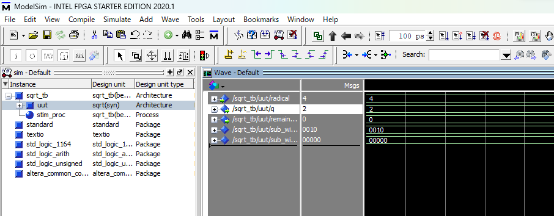

一応動作してるが、値が入ってない。。。


radicalに値を設定してシミュレーションすることはできないか・・・？

できた！



testbenchがなかったことが原因。


## テストベンチとは

テストベンチ（testbench）とは、**ハードウェア記述言語（HDL：VHDLやVerilog）で設計した回路をシミュレーションでテストするための専用プログラム**です。

---

## テストベンチの役割

- **回路（デザイン）に入力信号を与える**
- **回路からの出力信号を観察する**
- **設計した回路が正しく動作するかを検証する**

テストベンチは、**テスト用の「仮想的な実験環境」**のようなものです。

---

## テストベンチの特徴

- **回路本体（デザイン）とは別に作成する**
- **通常、入出力ポートを持たない（トップレベルのテストベンチはポートなし）**
- **シミュレーション専用で、FPGAやLSIには実装されない**
- **クロックやリセット信号もテストベンチで生成できる**

---

## イメージ図

```
┌────────────┐       ┌──────────────┐
│            │       │              │
│ Testbench  │──────▶│  Design      │
│            │◀──────│  Under Test  │
└────────────┘       └──────────────┘
```
- Testbench（テストベンチ）がDesign Under Test（設計回路）に入力を与え、出力を観察します。

---

## 例：VHDLテストベンチ

```vhdl
ENTITY testbench IS
END testbench;

ARCHITECTURE behavior OF testbench IS
    -- 被テスト回路のコンポーネント宣言
    COMPONENT my_design
        PORT ( ... );
    END COMPONENT;

    -- テスト用信号宣言
    SIGNAL clk : std_logic := '0';
    SIGNAL rst : std_logic := '1';
    SIGNAL in1 : std_logic;
    SIGNAL out1 : std_logic;
BEGIN
    -- 回路のインスタンス化
    uut: my_design PORT MAP (...);

    -- クロック生成、入力信号の変化など
    process
    begin
        rst <= '0' after 10 ns;
        in1 <= '1';
        wait for 20 ns;
        in1 <= '0';
        wait;
    end process;
END behavior;
```

---

## まとめ

- テストベンチとは、**回路設計の動作確認や検証を行うための「テスト用プログラム」**です。
- シミュレーション時にのみ使われ、実際のFPGAやICには実装されません。

