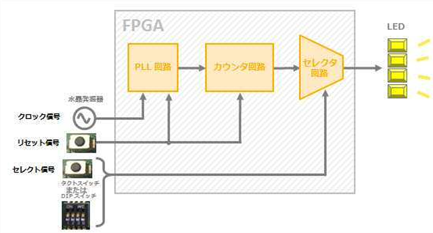
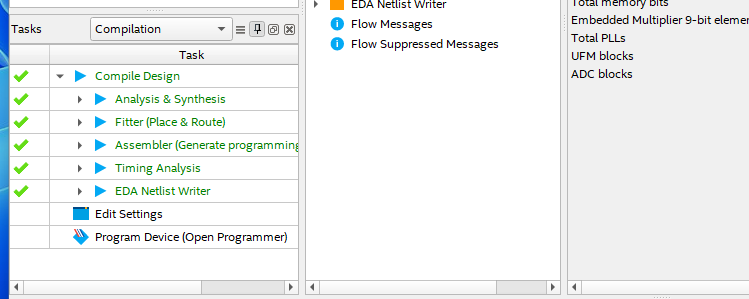
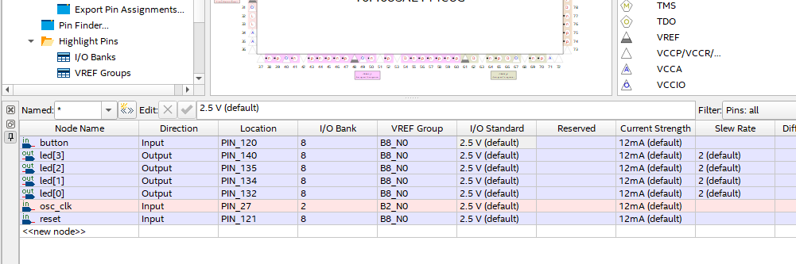
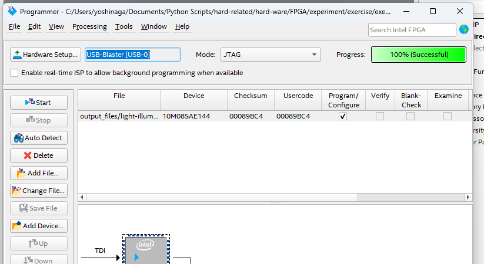

# 作成物

こんな回路。

入力ボタンにより点滅速度を制御する論理回路。



PLL回路：クロック信号の周波数を逓倍や分周、クロックの位相をシフトする回路

カウンタ回路：入力されたクロックの家運とを行う回路

セレクタ回路：複数入力のうち、一つを選択する回路

ご提示のエラーを見ると、**Quartus Prime がトップレベルのエンティティ（デザインの最上位モジュール）を見つけられない** ことが原因です。順を追って解消方法を整理します。

---

## 1️⃣ エラー内容の整理

```
Error (12007): Top-level design entity "light-illumination" is undefined
```

* Quartus が **"light-illumination" という名前のトップモジュール** を探しているが、存在しない
* 原因は主に以下です：
  1. エンティティ名の誤り
  2. VHDL/Verilogファイルがプロジェクトに追加されていない
  3. トップレベルとして指定した名前と実際のエンティティ名が一致していない

---

## 2️⃣ 解消手順

### Step 1: ファイルとエンティティ名を確認

* VHDLの場合：

```vhdl
library ieee;
use ieee.std_logic_1164.all;

entity light_illumination is  -- ← ここが正しい名前か？
    port(
        ...
    );
end light_illumination;
```

* **注意** : `light-illumination` とハイフン `-` はVHDLでエンティティ名として使えません。

  → エラーの原因はここです。VHDLでは `_` を使いましょう。

### Step 2: プロジェクトに正しいファイルを追加

* Quartus Project Navigator で
  * **Project → Add/Remove Files in Project**
  * トップレベルエンティティが書かれたファイルが追加されているか確認
* 追加されていなければ追加する

### Step 3: トップレベルエンティティの指定を修正

* **Assignments → Settings → General → Top-level entity**
  * トップレベルのエンティティ名を正しいものに変更
  * VHDLなら `light_illumination` のように `_` を使う

### Step 4: 再コンパイル

* 変更後 **Compile → Start Compilation**
* エラーが解消されるはず

---

## 3️⃣ 注意点

* VHDLでは **ハイフン `-` は識別子として使用不可**
* Verilog でもハイフンはNG（アンダースコア `_` を使う）
* ファイル名とエンティティ名は一致させる必要はないが、**トップレベルエンティティの名前は正確に指定すること**

---

💡 **まとめ**

1. トップレベルエンティティ名にハイフンを使っていないか確認
2. VHDL/Verilogファイルがプロジェクトに追加されているか確認
3. Quartusでトップレベルエンティティを正しい名前に設定
4. 再コンパイル

## コンパイル

とりあえず通った。



### ピンアサインメント




### 制約条件

```sdc
create_clock -period 20.000 -name osc_clk OSC_CLK
derive_pll_clocks
derive_clock_uncertainty
```

意味：入力クロックと、派生クロックの条件を正しくタイミング解析に反映させるための制約。

１行目：OSC_CLKは50MHzのクロック

-period: クロック周期20nsec＝50MHz

-name osc_clk このクロックにosc_clkという名前をつける

OSC_CLK: 実際のクロック信号ピンの名前(これってピンの名前なんね・・・)

2行目：PLLから出てくるクロックもツールが自動で探して定義してね

PLLから生成されるクロックを自動的に解析して制約に反映。

ユーザーが個別に描かなくても、PLL出力クロックをツールが認識してくれる

＝クロックを認識するとタイミング解析ツール(STA)が信号をクロックとして扱えるようになる。


PLL を使うと、入力クロックから複数の周波数のクロックが生成されます。

例：50MHz → PLL で 100MHz, 200MHz を生成。

* これを書かないと：

  ツールは「PLL出力信号をただの信号」として扱い、解析できない。
* これを書くと：

  **PLL出力がクロックだと自動で判定・生成（＝認識）** して、

  100MHz や 200MHz のタイミング解析を正しく行える。

3行目：実際のクロックは理想的でないから、安全マージンを入れて解析してという命令

ツールが自動的にクロックのジッタやスキューによる不確かさを見積、セットアップ/ホールド時間解析に考慮する制約を追加


ということで

　1: 基準クロックの定義

2. PLL出力クロックを自動生成
3. クロックの揺らぎを考慮


FPGAへの書き込みもできました




## 動作させた動画

一応思ったような動作をした。

<video src="illuminate.mp4" controls="true" width="600"></video>
