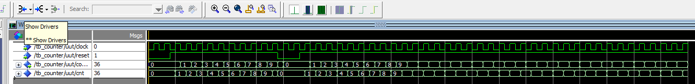

## 目的

コードのレビューを行い、不明点をクリア＆スキルとする。


## 制作物

PLL回路：PLL信号を生成する

リセット信号：カウンタ回路

セレクタ回路：

複数の入力の中から制御信号に応じて一つを選択する回路。マルチプレクサと言われる。

結果、LEDライトを選択して発行させる回路を製作する。


## 気になる文法

### others

VHDLにおいて、`others`はビットベクトルや配列などの他の要素を指すキーワードとして使用されます。

具体的には、ビットベクトルの未指定の位置に対して値を一括で割り当てる際に用いられます。

`others = '0'`という記述は、指定されていないすべてのビット位置に `'0'`を割り当てる、という意味になります。

#### 使い方

```vhd
signal my_vector : std_logic_vector(7 downto 0);
begin
    my_vector <= (7 => '1', others => '0');
end;
```


このコードでは、8ビットのビットベクトル `my_vector`を定義しています。

`my_vector`の7番目のビットだけを `'1'`にし、それ以外のビットを `others => '0'`で一括で `'0'`にしています。


## テストベンチ

### カウンター





```vhd
library ieee;
use ieee.std_logic_1164.all;
use ieee.numeric_std.all;

entity tb_counter is
end entity;

architecture sim of tb_counter is
    -- DUT（Device Under Test）のポートに接続する信号
    signal clk         : std_logic := '0';
    signal rst         : std_logic := '0';
    signal counter_out : unsigned(31 downto 0);

    -- 定数
    constant CLK_PERIOD : time := 20 ns;  -- 50MHz相当
begin

    -- DUT インスタンス化
    uut: entity work.counter
        port map (
            clock       => clk,
            reset       => rst,
            counter_out => counter_out
        );

    -- クロック生成プロセス
    clk_process : process
    begin
        while true loop
            clk <= '0';
            wait for CLK_PERIOD / 2;
            clk <= '1';
            wait for CLK_PERIOD / 2;
        end loop;
    end process;

    -- テストシーケンス
    stim_proc : process
    begin
        -- 初期状態
        rst <= '0';
        wait for 40 ns;

        -- リセット解除
        rst <= '1';
        wait for 200 ns;

        -- 再度リセット
        rst <= '0';
        wait for 40 ns;
        rst <= '1';
        wait for 200 ns;

        -- シミュレーション終了
        wait;
    end process;

end architecture;
```
