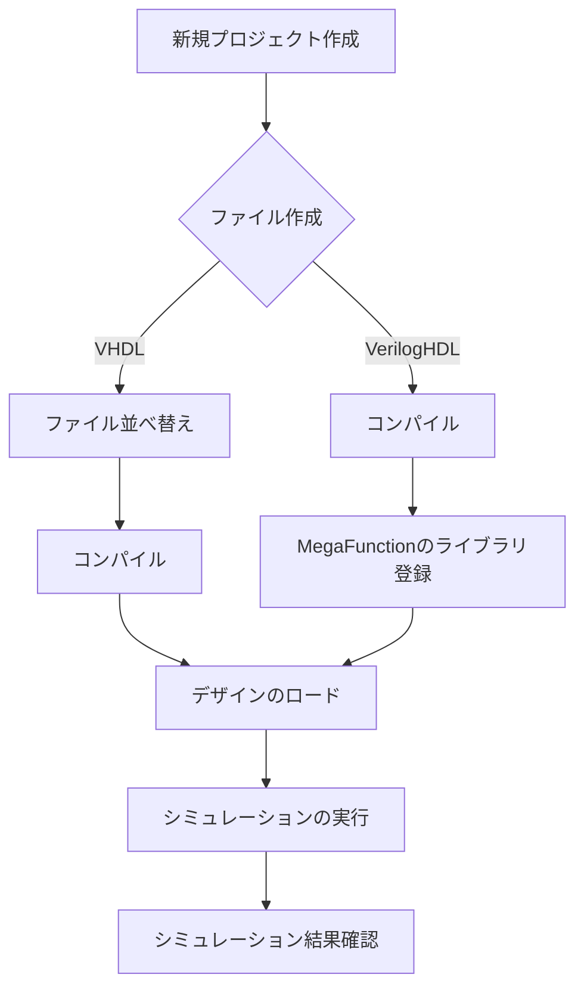

# ModelSim

ModelSimはHDLソースコードのコンパイル、シミュレーション、波形確認を行うための強力なツールです。以下に基本的な使い方を説明します。

## 操作法

1. ModelSimの起動
ModelSimを起動します。Lattice DiamondやQuartus IIから直接起動することも可能です。
2. プロジェクトの作成
新しいプロジェクトを作成し、シミュレーション対象のHDLファイルを追加します。
3. HDLソースコードの記述
VerilogやVHDLで回路を記述します。例えば、カウンタや分周器などの回路を作成します。
4. コンパイル
HDLソースコードをコンパイルします。これにより、シンタックスチェックが行われ、エラーがあれば修正します。
5. シミュレーションの実行
トップモジュール（通常はテストベンチ）を指定し、シミュレータを起動します。シミュレーションを実行し、波形を表示します。
6. 波形の確認
シミュレーション結果を波形ウィンドウで確認し、信号の動作を分析します。必要に応じて、波形表示の設定を調整します。
7. 終了
シミュレーションが完了したら、結果を保存し、ModelSimを終了します。
これらの手順を通じて、ModelSimを使用してHDLのシミュレーションを行うことができます。詳細な手順やトラブルシューティングについては、各種資料やユーザガイドを参照してください。 

[マニュアル！](https://www.macnica.co.jp/business/semiconductor/articles/pdf/ELS1420_Q1510_10__1.pdf)

VHDL の場合、コンパイル前にファイルの階層を指定する必要があります。下位階層（パッケージやユーザ・ライブラリ）から順にコンパイルし、最後に最上位階層のファイル（テストベンチ）をコンパイルします。

