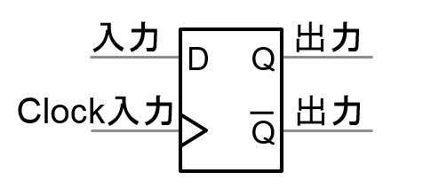

## 概要

FPGA（Field Programmable Gate Array）とは、購入者や設計者が構成を設定できる集積回路のこと。

「現場で回路の書き換えが可能な集積回路」として知られています。

あらかじめ複数の回路が用意されており、用途やニーズに合わせて組み合わせを自由に変えることができます。

ユーザーやエンジニアが製品購入後にプログラミングを行い、仕様変更やカスタマイズが可能な点が大きな特徴です。この変更は何度でも繰り返し行えるため、新製品の開発やプロトタイピング、AI技術の進化など、多岐にわたる分野で活用されています。

デジタル化が進む現代において、FPGAはその柔軟性と効率性から、半導体市場において急速に重要性を増しています。

## FPGAのメリット

### コストを削減できる

FPGAの最大のメリットはコスト削減です。従来の専用LSI（Large Scale Integration）と比較して製造コストが低く、少量生産に適しています。

また、FPGAは再プログラミングが可能であるため、一度の設計で複数のプロジェクトや製品に対応でき、長期的なコスト削減にもつながります。

このため、専用LSIを購入するよりも安価で、かつ、開発期間の短縮が可能です。特に開発初期段階でのプロトタイピングや少量生産が求められる場面で、コスト削減に大きく貢献します。

### 柔軟性が高い

FPGAは、設計者が現場で論理回路の構成をプログラムできます。このため、製品の開発やプロトタイピングの過程での仕様の変更やカスタマイズが容易です。

また、FPGAは再プログラミングが可能であるため、多様な用途に対応できることも大きなメリットです。

このような高い自由度（柔軟性）を活用すれば、システムを自社開発することも、他社のプログラムと組み合わせることも可能です。

また、FPGAの柔軟性は、製品のライフサイクルにおいても大きなメリットを提供します。
プログラムの書き換えが可能なため、市場の変化や顧客の要望に応じて製品の機能を迅速にアップデートすることもできます。このため、長期的な製品の利用や改良が可能になります。
また、複数の機能を一つのFPGAに統合することが可能なため、製品の小型化や複雑なシステムの簡素化にも寄与します。

こうした高い柔軟性は、製造業における製品の多様化やカスタマイズニーズに応えるための重要な要素だといえるでしょう。

### 演算性能が高い

FPGAは高い演算性能を持っており、データ処理の速度と効率において優れた性能を発揮します。

並列処理能力に優れているため、大量のデータを高速に処理することが可能です。
これが、画像処理やデータ分析、通信システムなど、高速なデータ処理が求められる分野での利用が増えている理由です。

また、FPGAは特定の処理に特化させることができるため、効率的な処理が可能となり、全体的なシステムのパフォーマンス向上に寄与します。

### 消費電力量が比較的少ない

FPGAは高い効率性を持ち、必要な処理だけをプログラミングできるため、無駄なコアや回路を減らし、少ない消費電力で運用できます。たとえば、同等の処理を行うCPUやGPUと比較すると、消費電力が少ない傾向にあります。これは、エネルギー効率が重視される現代の製品設計において大きなメリットです。

低消費電力は、特にバッテリー駆動のポータブルデバイスや、エネルギー消費を抑える必要がある大規模システムにおいて重要です。
また、FPGAを使用することで、エネルギーコストの削減と環境への影響を低減することも可能です。

## FPGAとCPU、CPLD、GPU、ASICの違い

### VS CPU

CPU（Central Processing Unit）は、コンピュータの「脳」ともいえる主要な処理装置で、プログラムの命令を解釈し、実行します。一般的なパソコンやサーバーなどに広く使用されており、多目的な計算処理に適しています。

CPUは汎用性が高く、さまざまなタスクに対応できますが、その構造上、特定の処理に特化することは難しいです。複雑なアルゴリズムやデータ集約型のタスクには適していますが、特定の処理を高速化するためのカスタマイズは行えません。

FPGAはCPUと比べて柔軟性が高く、カスタマイズ性があり、高速処理が可能で、電力消費と発熱を低く抑えられます。

### VS CPLD

CPLD（Complex Programmable Logic Device）は、プログラム可能な論理デバイスの一種で、FPGAよりも小規模な論理回路に適しています。

その構造がシンプルであるため、高速な動作が可能で、比較的単純な論理処理や制御タスクに使用されます。

しかし、FPGAに比べて論理素子の数が少ないため、複雑な処理や大規模なデータ処理には向いていません。

CPLDは、小規模な制御システムや簡単なデータ処理に適しており、コストとスペースの制約がある場合に有効です。

### GPUとの違い

GPU（Graphics Processing Unit）は、もともとはグラフィックス処理に特化したプロセッサですが、現在ではその高い並列処理能力を活かして、データ分析や機械学習などの分野でも使用されています。

並列処理に優れており、大量のデータを同時に処理する能力があります。このため、ビデオゲーム、画像処理、ディープラーニングなどの分野で広く利用されています。

GPUは特定の処理に最適化されており、柔軟性が低いですが、FPGAは柔軟性が高いのが特徴です。
また、GPUは高性能な分、電力を多く消費しますが、FPGAは消費電力が少ないです。

### ASICとの違い

FPGAはしばしばASIC（Application Specific Integrated Circuit）と比較されます。ASICは特定のタスクやアプリケーションに特化した集積回路で、一度設計されると仕様変更ができません。

高い効率性と少ない消費電力を実現していますが、柔軟性に欠け、設計変更が必要な場合は新たに開発する必要があります。

これに対してFPGAは、仕様変更が容易で、プロトタイピングや少量生産に適しています。

ASICは量産に向いており、FPGAと組み合わせて使うことが一般的です。
たとえば、プロトタイピングの段階ではFPGAを使用し、実際の生産ラインではASICを使用するといった方法があります。

## 経緯
2010年移行に大容量化、開発環境の使いやすさが向上したことで、ハードウェアエンジニアだけでなく、ソフトウェアエンジニアにも注目されるようになった。
ASICやASSPと比較すると、チップ単価、実装面積、消費電力は大きくなりがちで、ロットが莫大な製品には向かない。
他方通信規格が変更になると、処理内容を変更する必要のある携帯電話の基地局や、数量の出ない業務用の機器には適している。
FPGAはCPUやGPUと比較すると、ある程度のフレキシビリティ（プログラマブルであるという観点での柔軟性）を持ちながらも、演算性能が非常に高く、かつ消費電力性能も高い（消費電力が低い）点が採用の理由です。

## 仕組み
FPGAが処理内容を変更できるのはメモリによりLookup Tableの処理内容を変更できるため。
LUTとは参照表のようなもので、入力値に対する出力値を定義して任意の演算を行うことができる。

例. AND回路を構成したい場合

| 入力1 |	入力2 |	出力 |
| 0 |	0 |	0 |
| 0 |	1 |	0 |
| 1 |	0 |	0 |
| 1 |	1 |	1 |

例. OR回路を構成したい場合

| 入力1 |	入力2 |	出力 |
| 0 |	0 |	0 |
| 0 |	1 |	1 |
| 1 |	0 |	1 |
| 1 |	1 |	1 |

このようにメモリ技術を利用してＬＵＴの構成を変更して、演算内容を変更できるのがFPGAがプログラマブルである基本原理。
ＬＵＴに加えて、マルチプレクサ、レジスタを一つの回路単位として、INTEL社ではロジックエレメント、AMD社ではロジックセルと呼ぶ。
マルチプレクサではほかのLUTの出力信号との切り替えに利用され、レジスタではＬＵＴの出力をクロックに同期させるために利用される。

上記図のレジスタにはRS型、JK型、D型、T型など様々な種類がありますが、通常FPGAではD型が使用されます。D型のレジスタの真理値表は下表となっており、クロックエッジが入力されるとD端子の入力が出力に反映され、それ以外では値を保持する仕組みとなっています。

| D | Clock | Q           |
|---|-------|-------------|
| 0 | ↑     | 0           |
| 1 | ↑     | 1           |
| X | ↓     | 前の状態を保持 |

現在FPGA設計においては、殆どの場合このD型のレジスタを使用して同期を取りながら信号を伝搬させていく同期回路方式で設計されます。この同期回路方式では、回路や配線長によって遅延が異なることで出力されるタイミングがばらばらになる信号が、レジスタの出力できちんと揃うことになりタイミング設計を容易に行うことができるようになります。FPGA入門においては、このレジスタの動作について理解することが非常に重要です。

## FPGA内部の構成
FPGA内部は基本要素であるロジックエレメント（ロジックセル）の他に、I/O部、内部配線、クロック専用配線、乗算器（DSPブロック）、ブロックRAM、PLLなどで構成されています。これらの基本要素があらゆる回路パターンでも配置・配線しやすいよう、網の目状に整理整頓されて並んでいます。FPGA開発ツールでVHDL®/Verilog®コードをコンパイル（論理合成、マッピング、配置配線）して出来たプログラム用ファイルをダウンロードすると、これらの基本要素の有効無効を含めた設定と配線（コンフィギュレーション）が行われ、設計した通りの動作をするようになります。

最近はFPGAの中に、外部デバイスや機器と通信を行うための高速シリアルインターフェースを内蔵していたり、ARM®社のCortex®シリーズなどのプロセッサコアをハードウェアとして内蔵していたりするものもあります。

### VHDL/verilogの基礎演習
FPGAのコーディングに用いられる言語がVHDL / Verilogです。
正体はデジタル回路設計用のハードウェア記述言語です。
独自学習する場合はマクニカの公式サイトがおすすめ。
https://www.macnica.co.jp/business/semiconductor/articles/intel/110109/

**■VHDL**

[はじめてみよう！VHDL - 半導体事業 - マクニカ](https://www.macnica.co.jp/business/semiconductor/articles/intel/117805/)

**■Verilog-HDL**

[はじめてみよう！Verilog-HDL - 半導体事業 - マクニカ](https://www.macnica.co.jp/business/semiconductor/articles/intel/117781/)

こちらの内容はマクニカのワークショップで開催されていた内容を公開している記事になります。
テキストのスライドに沿って、基礎を学び、要所要所で演習を行う内容になっています。

上記の演習には、IntelのVHDL/Verilog-HDLのシミュレーションツール「Model-sim」または「Questa」のインストールが必要になります。

Model-simについては、「Quartus prime lite edition」についてくるので無償で使用できます。

>**FPGAボード**
>FPGAを搭載した電子基盤のことです。
>- FPGAチップ：ユーザーが自由に回路構成をプログラムできるデバイス
>- ボード：FPGAチップに加えて、電源・クロック・メモリ・入出力端子（USB, HDMI, GPIOなど）・開発用インターフェースなどを載せた基板
>どんなことができる？
>FPGAボードは「自分で設計した回路」を物理的に動かせるので、用途はとても広いです。
>1. デジタル回路の試作・学習
論理回路、加算器、カウンタ、状態遷移回路などを自分で作って動作確認できる
大学や高専の授業・研究などでもよく使われる
>2. 高速な信号処理
画像処理や音声処理など、CPUよりも高速に並列処理ができる
産業用カメラや医療機器、通信機器などで活用
>3. 独自プロセッサや周辺回路の実装
独自のCPU（ソフトコアプロセッサ）や特殊なインターフェース回路を設計できる
既存のパソコンやマイコンではできない処理をハードウェアで実現できる
>4. IoT・ロボット制御
センサーやモーターの制御回路を自分で設計して組み込める
小型・省電力なシステムの開発にも適している
>5. AI・ディープラーニングのアクセラレータ
AIの推論処理（ニューラルネットワークの計算）をFPGA上で高速化する用途も増えている
>6. プロトタイピング・製品開発
ASIC（専用IC）を作る前の試作や検証に使われる
ハードウェアの動作を素早く試せる

**勉強すると良いこと**
1. 言語→VHDL/verilog
2. FPGAボード：実装の演習が出来る

