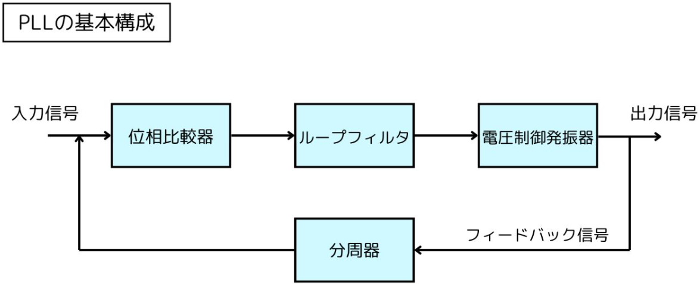

## PLLとは？
PLL（Phase-Locked Loop）とは、日本語で「位相同期ループ」という電子回路の一種です。
特定の周波数や位相を持つ信号を生成、追従、または制御するために使用されます。

### 仕組み

1. 位相比較器（Phase Detector, PD）

位相比較器は、入力信号（外部信号）とフィードバック信号（VCO出力）を比較して位相差を検出します。その位相差に基づいて、エラー信号を生成する役割があります。

エラー信号は、PLLのフィードバックループを通じて位相差がゼロ（または一定の関係）に近づくように制御されます。出力信号は位相差の方向と大きさを反映し、設計に応じてアナログ信号またはデジタル信号として表現されます。

 
- アナログ位相比較器：アナログ信号同士を直接比較
- デジタル位相比較器：クロック信号やデジタル信号を処理。フリップフロップを利用する場合が多い

2. ループフィルタ（Loop Filter）

ループフィルタは、位相比較器からのエラー信号を平滑化します。高周波ノイズを除去し、制御信号として適切な形状に整え、スムーズな電圧を生成する役割があります。

フィルタの設計（一次、二次など）は、安定性や応答速度に影響を与えるため重要です。フィルタには、単純なRCフィルタ（抵抗とコンデンサ）や、より複雑なアクティブフィルタを使用します。

3. 電圧制御発振器（Voltage-Controlled Oscillator, VCO）

入力された制御電圧に基づき、発振周波数を変化させる役割があります。出力信号の周波数は制御電圧と一定の関係を持ち、制御電圧が変化することで周波数が動的に調整されます。

VCOの周波数範囲は設計によりますが、広い範囲で動作するものも多く、正弦波や方形波などの信号を生成する用途に応じた設計が可能です。

 4. 分周器（Frequency Divider）

分周器は、電圧制御発振器の出力周波数を整数または小数で分周し、位相比較器に入力します。PLLの動作周波数範囲を拡張することで、より柔軟な用途を可能にする役割があります。

分周とは、ある信号の周波数を特定の整数や小数の比率で減少させることをいいます。信号のタイミングや周波数を調整するために、頻繁に使用される技術です。

### もっと簡単に
PLLとは「Phase Locked Loop（位相同期回路）」の略で、電子回路の一種です。主に以下のようなことを行います。

周波数の同期
入力信号の周波数や位相に、自分自身の発振器（VCO: Voltage Controlled Oscillator）の出力を合わせる（ロックする）ことができます。

周波数の生成・変換
周波数合成や分周・逓倍（周波数を整数倍・分数倍にする）など、任意の周波数を作り出すのに使われます。

ノイズの除去・信号の安定化
入力信号のノイズ成分を除去し、より安定した信号を得ることができます。

データ復調・クロック抽出
デジタル通信などで、受信した信号から正確なクロック（タイミング信号）を抽出するのにも使われます。

【簡単な動作原理】
PLLは「位相比較器」「ループフィルタ」「VCO（電圧制御発振器）」の3つの主要な部分から構成されます。

位相比較器で入力信号とVCOの出力の位相差を検出
ループフィルタで位相差信号を平滑化
VCOの制御電圧を変えて周波数・位相を調整
このループを繰り返すことで、VCOの出力が入力信号と同じ周波数・位相に同期します。
