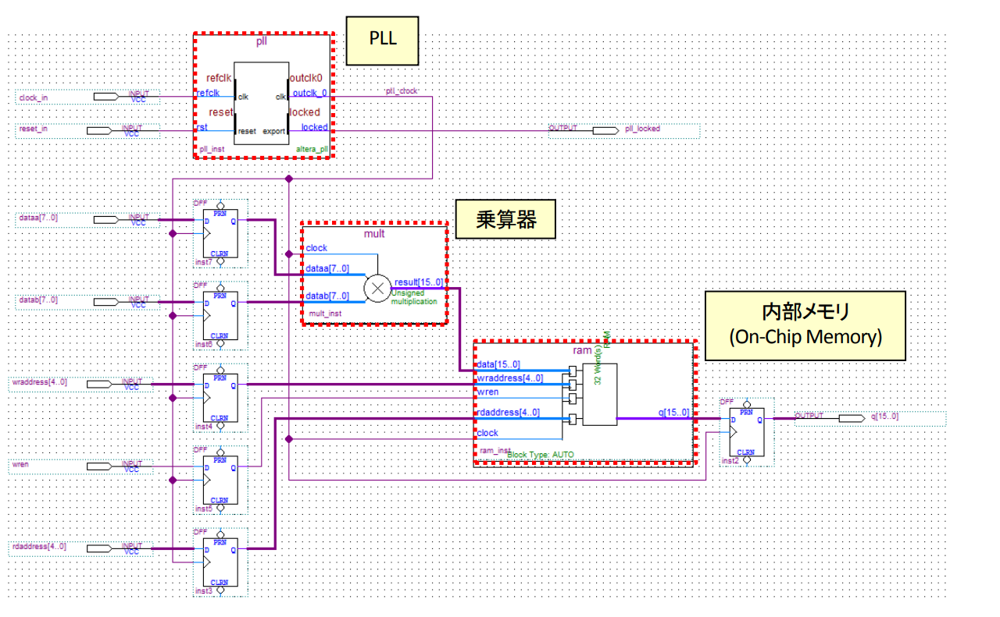
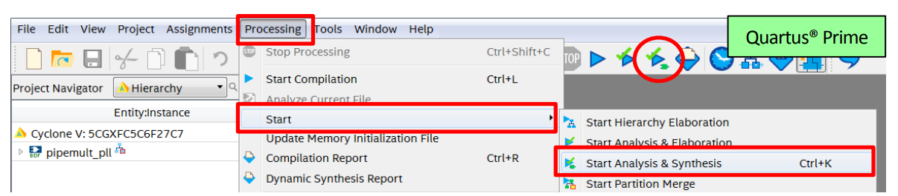
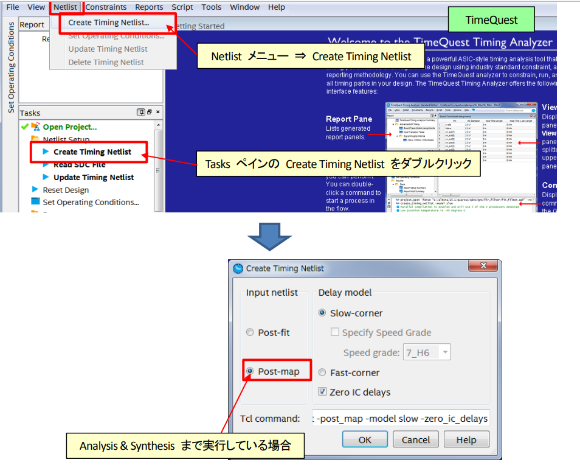
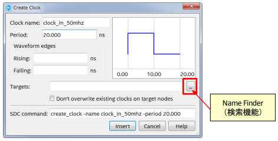
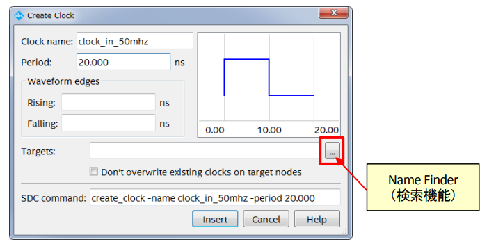
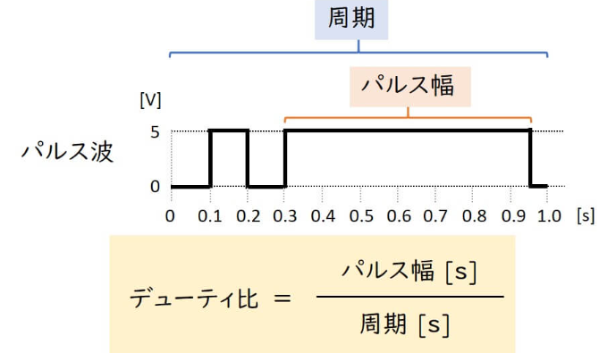

# 制約

FPGAの設計ではチップが設計者の期待通りの動作が実毛hンできるように論理合成/配置配線をおこなう前に、いくつかの制約条件を開発ツールに入力しておく必要がある。
制約を設定すりうためには開発ツールやウィザードを利用することで実現する。

制約の中でも特に重要なものはピンアサインとタイミング。

## ピンアサインメント
### 開発工程のここに相当
FPGAのピンアサインメントは、FPGA（Field Programmable Gate Array）の各ピンに対して、どの信号（入力・出力・クロック・電源など）を割り当てるかを決める作業、またはその割り当て情報のことを指します。

■ピン番号を変更する場合は、Location欄のピン番号を編集する。記述は以下のようになる。

　　　　記述 ：　PIN_番号　　　　記述例 ：　PIN_E2

■I/O規格を変更する場合は、I/O Standard欄の規格名を編集する。記述は以下の通り。

　　　　記述例 ： 3.3V　LVTTL

###　目的

1. 正しい信号の接続
FPGAは多くのピンを持ち、どのピンがどの外部回路やデバイスと接続されるかを明確に決める必要があります。ピンアサインメントによって、設計した論理回路の各信号が正しいピンに割り当てられ、基板上の外部部品と正しく通信できるようにします。

2. 回路設計と基板設計の整合性
回路図や基板レイアウト設計とFPGA内部の論理設計（HDL設計）を一致させるために、ピンアサインメントが必要です。これにより、物理的な配線ミスや設計ミスを防ぐことができます。

3. 設計の最適化と配線効率向上
基板上の他の部品や配線の都合を考慮してピン配置を最適化することで、配線が短くなり、ノイズや信号遅延のリスクを低減できます。また、組み立てやすい基板設計が可能になります。

4. FPGAの制約条件の指定
FPGA開発ツールでは、ピンアサインメント情報（ピン配置制約ファイル、例：XDCファイルやUCFファイルなど）を使って、どの論理信号をどの物理ピンに割り当てるかを明示的に指定します。これにより、設計者の意図通りにFPGAが動作します。

5. 情報共有・ドキュメント化
ピンアサインメント表を作成することで、設計チームや製造部門と情報を共有しやすくなり、後工程でのトラブルを防ぎます。

1. 正しい信号の接続
FPGAは多くのピンを持ち、どのピンがどの外部回路やデバイスと接続されるかを明確に決める必要があります。ピンアサインメントによって、設計した論理回路の各信号が正しいピンに割り当てられ、基板上の外部部品と正しく通信できるようにします。

2. 回路設計と基板設計の整合性
回路図や基板レイアウト設計とFPGA内部の論理設計（HDL設計）を一致させるために、ピンアサインメントが必要です。これにより、物理的な配線ミスや設計ミスを防ぐことができます。

3. 設計の最適化と配線効率向上
基板上の他の部品や配線の都合を考慮してピン配置を最適化することで、配線が短くなり、ノイズや信号遅延のリスクを低減できます。また、組み立てやすい基板設計が可能になります。

4. FPGAの制約条件の指定
FPGA開発ツールでは、ピンアサインメント情報（ピン配置制約ファイル、例：XDCファイルやUCFファイルなど）を使って、どの論理信号をどの物理ピンに割り当てるかを明示的に指定します。これにより、設計者の意図通りにFPGAが動作します。

5. 情報共有・ドキュメント化
ピンアサインメント表を作成することで、設計チームや製造部門と情報を共有しやすくなり、後工程でのトラブルを防ぎます。

https://www.macnica.co.jp/business/semiconductor/articles/pdf/ELS1411_Q1510_10__1.pdf

## タイミング制約
https://www.macnica.co.jp/business/semiconductor/articles/pdf/quartus-hg_timing-constraint_v1710_r2__1.pdf

チップ内外でクロック周波数や入出力のタイミングがマッチしないとチップやシステムレベルで不具合を引き起こした入り、十分な演算性能がえられなかったりする可能性がある。
チップ内部の入出力回路が複雑になるほど、タイミング制約の設定も複雑になる。

プロセスの微細化が進展したことで、これまで以上にタイミングのバラつきが生じやすくなるなど、タイミング設計に影響を与える要因がふえてくる。

一方でタイミングの制約を過度に厳しくするとタイミング設計に影響を与える要因が増えている。

そのため、設計者はツールに対してタイミングに関する設計要求を支持する必要がある。

基本的なタイミング制約の例としてはクロック周波数の指定がある。
複数のクロックが一つのチップ内に混在する場合には、それらの関係を制約として定義することが必要となる。

Quartus II に搭載されているタイミング検証ツール「TimeQuest」を使って、FPGA内部の周波数や I/Oタイミングなど、設計者が期待するタイミング値を設定することができる。Quartus II に標準搭載されたTimeQuestは、ASIC業界では標準の制約手法となっている「Synopsys Design Constraints (SDC)」 を採用したハイエンドな解析エンジンである。

TimeQuest では、Quartus II のテキスト・エディタを使用しSDCの作成/編集を行う。一般的にSDCの作成/編集を行う場合は、設計者が直接コマンドを入力して制約を設定するが、TimeQuest のエディタはGUIを使用して制約のコマンドを入力することもできるため、設計者がコマンドを覚えていなくても済むなど、簡単操作が特徴である（図3）。このため、コマンド入力によるSDC作成に対して「経験や知識がまったくない」、あるいは「経験や知識は少しあるが十分ではない」といった不安を抱える技術者でも容易にSDCを作成することが可能である。既存のSDCファイルの内容を取り込むことも可能だ。

### タイミング制約
どれだけのタイミング制約をすればいいか

→「少なくとも回路内のすべてのパスに対して」です。制約されていないパスが回路内にあれば、設計が完了したとはいえません。

ASIC 業界の標準フォーマットになっている Synopsys Design Constraints (SDC) ファイルを FPGA/CPLD のタイミング制約に使用することで、Quartus® Prime の Fitter（配置配線）で目標（ガイド）として参照するだけでなく、TimeQuest Timing Analyzer による高性能なタイミング解析にも使用されます。

ASICの標準フォーマットとなっているSDCを使ってタイミング制約している

ユーザ・ロジック部分のタイミング制約は、設計者であるユーザが自分で制約する必要があります。IP(Intellectual Property) をデザイン内に使用している場合は、IP 部分に限って IP ベンダーが提供してくれるケースが多いので、ベンダーに確認してください。

### SDCファイルの作成

デザイン作成＝回路設計がおわったら、タイミング制約用のSDCファイルを作成する。

1. Analysis & Synthesis（論理合成）の実行
QuartusのPrimeのProcessing→Start→Start Analysis & SYnthesisより実行する。

論理合成がタイミング制約の窓口になるんやな。。。

2. TimeQuest Timing AnalyzerよりSDCを作成

2-1. Toolメニュー→Time Analyzerを起動

2-2. タイミング用ネットリストを作成

Create Timing Netlistを実行してタイミング用ネットリストを作成。

Netlist メニュー ⇒ Create Timing Netlist を実行後、Input netlist で Post-map を選択して OK

2-3. SDC エディタを起動

TimeQuest の File メニュー ⇒ New SDC File で SDC エディタを起動。

環境によってSDCエディタを別ウィンドウで起動。

2-4. SDCエディタに記述
クロック、
I/O、
フォルス・パスなどのタイミング制約コマンドをSDCエディタ上に記述。
→Save Asで保存する。

ファイル名はプロジェクトのトップ階層と同じ名前にしておくことをお勧めします。

### クロックの制約

クロックの制約には FPGA/CPLD 外部から供給される基本クロック（Base Clock）と FPGA/CPLD 内部で生成した生成クロック（Generated Clock）があり、それぞれ決まったコマンドで制約します。PLL で生成したクロックも生成クロックに含まれます。

#### 基本クロック（Base Clock） ＜コマンド：create_clock＞
FPGA/CPLD 外部から供給されるクロックは、基本クロック（Base Clock）用のコマンドを使用します。
SDC エディタでコマンドを挿入したい行にカーソルを合せた状態で Edit メニュー ⇒ Insert Constraint ⇒ Create Clock を選択すると、Create Clock 用の設定ウィンドウが表示されます。

#### Clock name  
TimeQuest や SDC 上で表記させたい名称を指定します。デザイン上の信号名と異なる名称にしたい場合に入力します。

これはオプションなので空白でも良いですが、空白にした時はデザインで使用している信号名が TimeQuest や Quartus® Prime で使用されます。

FPGA/CPLD外部より供給されるクロックは、基本クロック用のコマンドを使用する。
SDCエディタでコマンド挿入した偉業にカーソルを合わせた状態で Editメニュー → Insert Constraint → Create Clock を選択すると、 Create Clock 用の設定ウィンドウが表示される。

__入力項目__

Clock name

TimeQuest や SDC 上で表記させたい名称を指定します。デザイン上の信号名と異なる名称にしたい場
合に入力します。

Period

クロックの周期を指定します。

Waveform edges

デューティー比が50%以外の時に立ち上がりエッジと立下りエッジの絶対時間を指定する。
空白にしたい場合はデューティー比が50%と認識される。

>デューティー比  
>Highを保持する時間をパルス幅と言い、周期に対して割合をデューティ比といいますね。  
>

Targets

ターゲットとなるクロックのポートやピンを指定。
TimeQuastの検索機能で指定することをお勧め。

