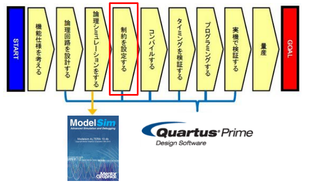

# 制約

FPGAの設計ではチップが設計者の期待通りの動作が実毛hンできるように論理合成/配置配線をおこなう前に、いくつかの制約条件を開発ツールに入力しておく必要がある。
制約を設定すりうためには開発ツールやウィザードを利用することで実現する。

制約の中でも特に重要なものはピンアサインとタイミング。

## ピンアサインメント
### 開発工程のここに相当
FPGAのピンアサインメントは、FPGA（Field Programmable Gate Array）の各ピンに対して、どの信号（入力・出力・クロック・電源など）を割り当てるかを決める作業、またはその割り当て情報のことを指します。

■ピン番号を変更する場合は、Location欄のピン番号を編集する。記述は以下のようになる。

　　　　記述 ：　PIN_番号　　　　記述例 ：　PIN_E2

■I/O規格を変更する場合は、I/O Standard欄の規格名を編集する。記述は以下の通り。

　　　　記述例 ： 3.3V　LVTTL

###　目的

1. 正しい信号の接続
FPGAは多くのピンを持ち、どのピンがどの外部回路やデバイスと接続されるかを明確に決める必要があります。ピンアサインメントによって、設計した論理回路の各信号が正しいピンに割り当てられ、基板上の外部部品と正しく通信できるようにします。

2. 回路設計と基板設計の整合性
回路図や基板レイアウト設計とFPGA内部の論理設計（HDL設計）を一致させるために、ピンアサインメントが必要です。これにより、物理的な配線ミスや設計ミスを防ぐことができます。

3. 設計の最適化と配線効率向上
基板上の他の部品や配線の都合を考慮してピン配置を最適化することで、配線が短くなり、ノイズや信号遅延のリスクを低減できます。また、組み立てやすい基板設計が可能になります。

4. FPGAの制約条件の指定
FPGA開発ツールでは、ピンアサインメント情報（ピン配置制約ファイル、例：XDCファイルやUCFファイルなど）を使って、どの論理信号をどの物理ピンに割り当てるかを明示的に指定します。これにより、設計者の意図通りにFPGAが動作します。

5. 情報共有・ドキュメント化
ピンアサインメント表を作成することで、設計チームや製造部門と情報を共有しやすくなり、後工程でのトラブルを防ぎます。

1. 正しい信号の接続
FPGAは多くのピンを持ち、どのピンがどの外部回路やデバイスと接続されるかを明確に決める必要があります。ピンアサインメントによって、設計した論理回路の各信号が正しいピンに割り当てられ、基板上の外部部品と正しく通信できるようにします。

2. 回路設計と基板設計の整合性
回路図や基板レイアウト設計とFPGA内部の論理設計（HDL設計）を一致させるために、ピンアサインメントが必要です。これにより、物理的な配線ミスや設計ミスを防ぐことができます。

3. 設計の最適化と配線効率向上
基板上の他の部品や配線の都合を考慮してピン配置を最適化することで、配線が短くなり、ノイズや信号遅延のリスクを低減できます。また、組み立てやすい基板設計が可能になります。

4. FPGAの制約条件の指定
FPGA開発ツールでは、ピンアサインメント情報（ピン配置制約ファイル、例：XDCファイルやUCFファイルなど）を使って、どの論理信号をどの物理ピンに割り当てるかを明示的に指定します。これにより、設計者の意図通りにFPGAが動作します。

5. 情報共有・ドキュメント化
ピンアサインメント表を作成することで、設計チームや製造部門と情報を共有しやすくなり、後工程でのトラブルを防ぎます。

https://www.macnica.co.jp/business/semiconductor/articles/pdf/ELS1411_Q1510_10__1.pdf

## タイミング制約

チップ内外でクロック周波数や入出力のタイミングがマッチしないとチップやシステムレベルで不具合を引き起こした入り、十分な演算性能がえられなかったりする可能性がある。
チップ内部の入出力回路が複雑になるほど、タイミング制約の設定も複雑になる。

プロセスの微細化が進展したことで、これまで以上にタイミングのバラつきが生じやすくなるなど、タイミング設計に影響を与える要因がふえてくる。

一方でタイミングの制約を過度に厳しくするとタイミング設計に影響を与える要因が増えている。

そのため、設計者はツールに対してタイミングに関する設計要求を支持する必要がある。

基本的なタイミング制約の例としてはクロック周波数の指定がある。
複数のクロックが一つのチップ内に混在する場合には、それらの関係を制約として定義することが必要となる。

Quartus II に搭載されているタイミング検証ツール「TimeQuest」を使って、FPGA内部の周波数や I/Oタイミングなど、設計者が期待するタイミング値を設定することができる。Quartus II に標準搭載されたTimeQuestは、ASIC業界では標準の制約手法となっている「Synopsys Design Constraints (SDC)」 を採用したハイエンドな解析エンジンである。

TimeQuest では、Quartus II のテキスト・エディタを使用しSDCの作成/編集を行う。一般的にSDCの作成/編集を行う場合は、設計者が直接コマンドを入力して制約を設定するが、TimeQuest のエディタはGUIを使用して制約のコマンドを入力することもできるため、設計者がコマンドを覚えていなくても済むなど、簡単操作が特徴である（図3）。このため、コマンド入力によるSDC作成に対して「経験や知識がまったくない」、あるいは「経験や知識は少しあるが十分ではない」といった不安を抱える技術者でも容易にSDCを作成することが可能である。既存のSDCファイルの内容を取り込むことも可能だ。

