# IPコア

FPGAを使って実用的なパウリケーションを実装するために必要なIPコア。
IPコアを使いこなせるようになると、既に開発されているモジュールの流用で開発コストを低く抑え、自分のアプリケーションの開発に注力できるようになる。

## IPコアとは？
IP コアの IP は Intellectual property (知的財産) の略。
FPGA や ASIC 開発の界隈では、既に開発・検証されて流用できる部品を IP コアと呼ぶ。


__ソフトウェアの開発では__

ゼロから自分で実装することはほとんどなくライブラリを積極的に利用する。

例. Python でプログラミングをするときに数値計算の numpy やグラフ描画用の matplotlib を利用

ソフトのライブラリと同様にFPGAでアプリケーションを実装する際に、必要な処理のすべてを自分で実装する代わりに利用できるものがIPコア。

応用例. 画像のエッジを検出するアプリケーションを実装したい場合に、ちょうどよい通信とエッジ検出の IP コアがあれば，データをハンドリングするモジュールだけ実装すればよくなります。

## IPコアの種類
ソフトウェアプログラミングのために様々なソフトウェアライブラリが存在しているように、IP コアにもたくさんの種類。

また、FPGAベンダが提供するIPコアのほかに様々なメーカが開発、販売しているIPコアや、OSSのIPコアがある。

割り算や掛け算といった基本的な数値演算に相当する IP コアから、画像処理や CNN 計算といった高機能の IP コアまで、さまざまな IP コアが、それぞれの FPGA 向けに用意されている。

演算処理だけではなく、パソコンでおなじみの Ethernet や PCIe、マイコンなどでおなじみの I2C 、UART 、 といった通信処理用の IP コアもベンダから多数リリースされている。

FPGA上に何かのアプリケーションを実装する場合にFPGAのみで実装することはなく、PCやネットワークに接続されることがほとんど。

### IPコアの利用方法
ソフトウェアはライブラリの呼び出しにABIのように守るべきインターフェースが規定されている。
他方、FPGA用のIPコアの場合、必ず守るべきIFは存在しない

いろいろな開発者が好き勝手に IP コアを開発していると、ユーザはそれぞれにあわせた使い方を調べて対応する必要があり不便です。そのため、2020年現在では共通の接続方式に集約されつつあります。代表的なものに、AXI 、Avalon 、Wishbone といった方式があります。

### 特に重要なIPコア
IP コアを利用すると FPGA でアプリケーションを開発するときの手間を省くことができます。実装したいアプリケーションに応じて便利なコアを探してきて使えばよいのですが、実用的なアプリケーションに不可欠なコアも存在します。

それが、入出力、クロック管理およびメモリの IP コアです。ソフトウェアプログラムを書く場合でも、入出力とメモリ、データ管理は必須ですね。一方で、クロック管理はソフトウェアプログラミングではあまり馴染みがないかもしれません。

パソコンのプロセッサでは負荷に応じてクロックの動作周波数が高くなったり低くなったりします。 FPGA を使う場合には、ハードウェアが適切に動作するように積極的にクロックの値を設定する必要があります。 

### VIO コア
https://www.acri.c.titech.ac.jp/wordpress/archives/43

FPGA を使うときには、JTAG というインターフェースを通じてコンフィギュレーションします。
この JTAG を使って動作中の FPGA 内部のレジスタの値を読み書きする機能を提供するIPコアが VIO (Virtual Input/Output) (PG159)です。


次のコードは、onoff_circuit.sv の入力のスイッチ ( SW_ON、SW_OFF ) を内部信号に変更したものです。ここで、logic の前についている (* KEEP *) というのは、ツールに対する指示子 ( プログラミング言語 C の #pragma みたいな ) です。ツールに KEEP を付けると変数名を残すことを指示できます。

### 実装
次のコードは、onoff_circuit.sv の入力のスイッチ ( SW_ON、SW_OFF ) を内部信号に変更したものです。ここで、logic の前についている (* KEEP *) というのは、ツールに対する指示子 ( プログラミング言語 C の #pragma みたいな ) です。ツールに KEEP を付けると変数名を残すことを指示できます。

```hdl
module onoff_circuit (
    input  logic CLK, RST,
    output logic ON
    );

    // 入力から内部信号に変更。logicの前の (* KEEP *) で信号を残すようツールに指示
    (* KEEP *) logic SW_ON, SW_OFF; 
    
    typedef enum {
        STATE_OFF,
        STATE_ON
    } state_type;
    state_type state, n_state;

    always_comb begin
        ON      = 1'b0;
        n_state = state;
        if (state == STATE_OFF) begin
            if (SW_ON & ~ SW_OFF) begin
                ON      = 1'b1;
                n_state = STATE_ON;
            end
        end else if (state == STATE_ON) begin
            if (SW_OFF) begin
                n_state = STATE_OFF;
            end
        end
    end

    always_ff @ (posedge CLK) begin
        if (RST) begin
            state <= STATE_OFF;
        end else begin
            state <= n_state;
        end
    end
endmodule
```

上記コードでFPGAを動作させても、SW_ONとSW_OFFを変更出来ない。
このSW_ONとSW_OFFにVIOを接続することで仮想的に操作できるようにする。手順は以下通り。

1. カタログから使いたいIPコアを選択→パラメタを設定してモジュールを生成
2. SystemVerilogコード内に作ったモジュールのインスタンスを作成し、読み書きしたい信号を接続する

__ソフトとのアナロジー__
1. でクラスを作る
2. 1のインスタンスを作る

### IPコアを選んでモジュールを生成する
IP コアのカタログは、Vivado の Flow Navigator の IP Catalog をクリックすると表示できる。

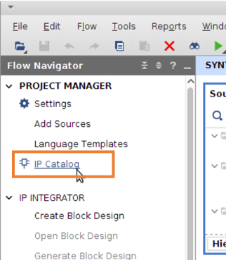

検索ボックスに vio と入力すると、今回使用したい VIO コアが表示されます。そこをダブルクリックします。

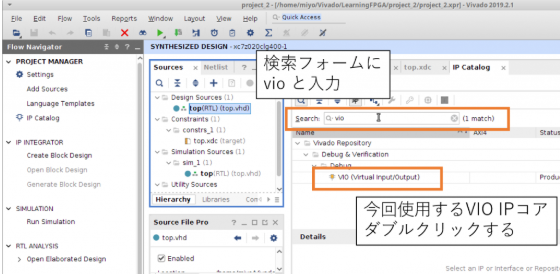

設定ダイアログで、モジュールの名前とIP
IPコアで設定が可能なパラメタの値を決定する。

今回の名前はvio_0のまま。

VIOは入力と出力を設定可能。
VIOの入力はFPGA内部の信号をJTAG経由で引き出すための信号、出力はJTAG経由でFPGA内部のレジスタに値を書き込むためのポート。
ここではONの信号を観測するためにビット幅1の入力ポートと、FPGA内のSW_ONとSW_OFFの2つの値を変更するビット幅2の出力ポートを有効とする。

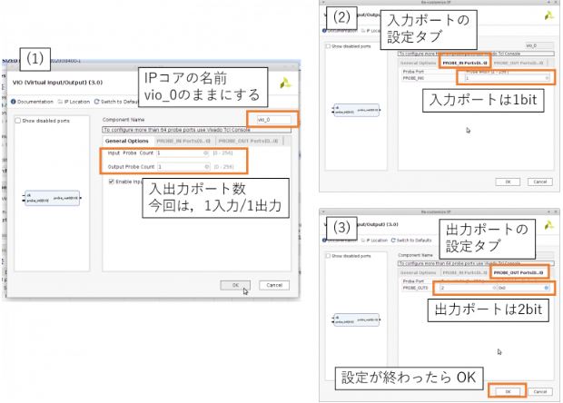

OKをクリックして設定ダイアログを閉じると、IPコアの合成を確認するダイアログが表示。
→Generateをクリックしてステップを進める。

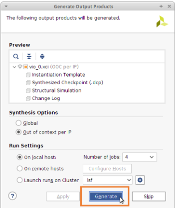

Sources ペインの Hierarchy タブに、vio_0 のモジュールが登録されていることが確認できます。

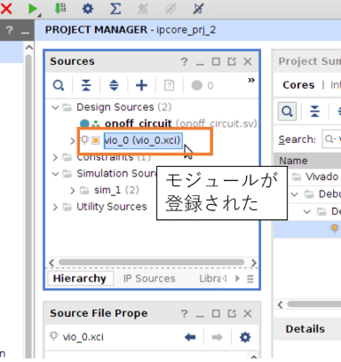

### VIOモジュールのインスタンスを生成
使用したい IP コアのモジュールが用意できたので、このインスタンスをデザインに組み込みます。
IP コアのモジュールを作成すると、インスタンス生成のためのテンプレートも生成されます。
Sources ペインの IP Sources タブを開き、モジュールのツリーから .veo という拡張子のついたテンプレートファイルにアクセスします。

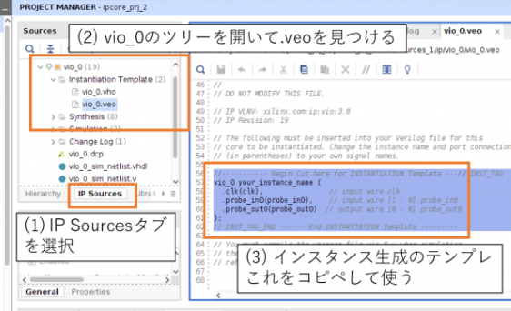

このインスタンス生成の部分を元の SystemVerilog ソースコードに貼りつけます。
入出力ポートに読み書きしたい信号を接続します。今回は、VIO の出力を SW_ON と SW_OFF に、VIO への入力に ON を接続します。

```vhdl
module onoff_circuit (
    input  logic CLK, RST,
    output logic ON
    );
    
    // 入力から内部信号に変更。logicの前の (* KEEP *) で信号を残すようツールに指示
    (* KEEP *) logic SW_ON, SW_OFF; 
    
    typedef enum {
        STATE_OFF,
        STATE_ON
    } state_type;
    state_type state, n_state;

    always_comb begin
        ON      = 1'b0;
        n_state = state;
        if (state == STATE_OFF) begin
            if (SW_ON & ~ SW_OFF) begin
                ON      = 1'b1;
                n_state = STATE_ON;
            end
        end else if (state == STATE_ON) begin
            if (SW_OFF) begin
                n_state = STATE_OFF;
            end
        end
    end

    always_ff @ (posedge CLK) begin
        if (RST) begin
            state <= STATE_OFF;
        end else begin
            state <= n_state;
        end
    end

    // VIO との入出力と接続する信号を定義
    logic [0:0] probe_in0;
    logic [1:0] probe_out0;
    
    // テンプレート(.veoファイル)をコピペして VIO のインスタンスを生成する
    vio_0 vio_0_i_0 (
        .clk(CLK),
        .probe_in0(probe_in0),
        .probe_out0(probe_out0)
    );
    
    // ON を probe_in0 を介して外で読み出せるように接続
    assign probe_in0[0] = ON;
    
    // probe_out0を介して外からSW_ONとSW_OFFの値を設定できるように接続
    assign SW_ON  = probe_out0[1];
    assign SW_OFF = probe_out0[0];

endmodule
```

### 読み書きしてみる
以上で、VIO をデザインに組み込むフローは終了です。あとは、いつものように、Generate Bitstream をクリックして、FPGA のコンフィギュレーションファイル ( bit ファイル ) を作成します。

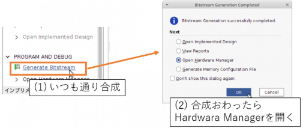

bit ファイルの作成がおわったら Hardware Manager を開いて FPGA に書き込みます。このとき、VIO コアに付随して生成される ltx ファイルも同時にセットします ( bitファイルを選択すると対応する ltx ファイルも自動的に選択されるはず)。ltx ファイルにはコンフィギューションされた FPGA に Hardware Manager からアクセスするための情報が書き込まれています。

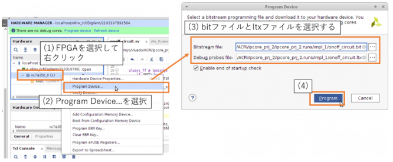

コンフィギュレーションが終わると、VIO インスタンスを操作するためのユーザインターフェースである hw_vio_1 というエントリがあらわれます。ここで + ボタンをクリックすると読み書きしたい信号を選ぶことができます。今回は全部選択して OK をクリックします。

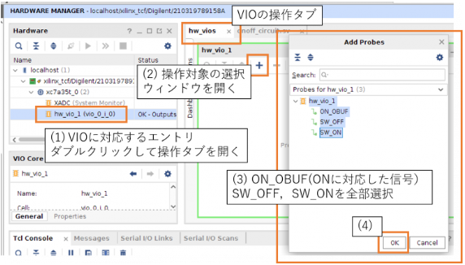

SW_ON や SW_OFF の隣りの 0 を 1 あるいは 1 を 0 に変更すると、ON_OBUF という項目の値が変化する様子を確認できます。

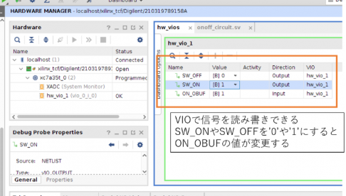

手元にボードがあれば、ON_OBUF の値と LED が連動している様子も確認できるはずです。逆に言えば、手元にないボードの LED の様子をうかがい知ることができるわけです。

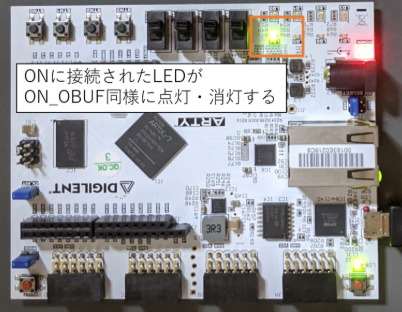

セレクトリストの代わりにボタンを選択することができます。たとえば Toggle Button を選択するとセレクトリストがボタンのアイコンに変わります。

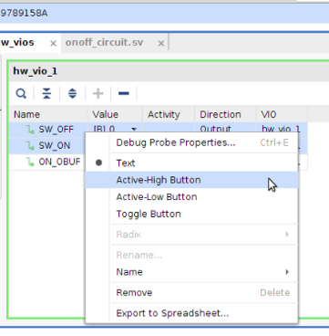

ボタンをクリックするたびに 0 と 1 が反転し、それに応じて ON_OBUF の値も変化します。

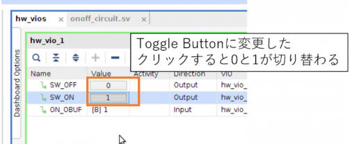

# IPコア使用手順

FPGAのIPコア（Intellectual Property Core）を使う手順は、一般的に以下のような流れになります。  
ここではXilinx（現AMD）のVivadoやIntel（旧Altera）のQuartus Primeなど、主要なFPGA開発環境での共通的な手順を解説します。

---

### 1. IPコアの選択・生成

- **開発ツールを起動**（VivadoやQuartus Primeなど）
- **IPカタログを開く**  
  開発環境の「IP Catalog」や「IP Integrator」などから、使用したいIPコア（例：FIFO、UART、PLL、Ethernet MACなど）を選択
- **IPコアの設定**  
  GUIでパラメータ（データ幅、クロック数、機能など）を設定
- **IPコアの生成**  
  「Generate」や「Create」などのボタンでIPコアを生成  
  → 生成されるファイル：HDL（Verilog/VHDL）ファイル、インスタンス用の例、ドキュメントなど

---

### 2. IPコアのプロジェクトへの組み込み

- **プロジェクトにIPコアを追加**  
  生成されたIPコアをプロジェクトにインポート、または自動で追加される場合もあります
- **トップレベル設計（RTL）にIPコアをインスタンス化**  
  例（Verilog）:
  ```verilog
  my_fifo u_my_fifo (
    .clk(clk),
    .rst(rst),
    .din(data_in),
    .dout(data_out),
    .wr_en(wr_en),
    .rd_en(rd_en),
    .full(full),
    .empty(empty)
  );
  ```
- **必要な信号線を接続**  
  IPコアのポートに、設計中の他の回路やトップモジュールの信号を接続

---

### 3. シミュレーション・検証

- **テストベンチを作成**  
  IPコアを含めた設計全体の動作をテストベンチで検証
- **シミュレーション実行**  
  シミュレータ（Vivado Simulator, ModelSim, Questa, etc.）で動作確認

---

### 4. 合成・実装

- **合成（Synthesis）**  
  設計全体を合成し、論理回路を生成
- **実装（Implementation）**  
  配線・配置を実施
- **ビットストリーム生成**  
  FPGAに書き込むためのbitファイル（またはsofファイル等）を生成

---

### 5. FPGAへの書き込み・動作確認

- **FPGAに書き込み**  
  JTAG等でFPGAにビットストリームを書き込む
- **動作確認**  
  実機で動作を確認（LED点灯、信号波形観測、PCとの通信など）

---

### 6. 必要に応じてデバッグ

- **ILA（Integrated Logic Analyzer）などのデバッグIPを使う**
- **波形観測や信号モニタリングで問題を切り分ける**

---

## まとめ（ポイント）

- **IPコアは設計効率化・高信頼化のために活用される部品**
- **開発ツールのIPカタログから選択・設定・生成**
- **設計に組み込み、シミュレーション・合成・実装・書き込み・動作確認の流れ**
- **ベンダーやIPによって細かい手順や設定画面は異なるので、公式マニュアルやガイドも参照するのが確実です**

---

# IPコアを使う方法
「IPコアを使う方法」というご質問ですが、IPコア（Intellectual Property Core）は、主にFPGAやASICなどのハードウェア開発において、設計の一部として再利用可能な論理回路ブロックのことを指します。IPコアの利用方法は、開発環境や目的によって異なりますが、ここでは**FPGA開発（例：Xilinx, Intel/Altera等）での一般的なIPコア利用の流れ**を説明します。


## 1. IPコアを入手する

- **ベンダー提供のIPコア**  
  Xilinx（現AMD）のVivadoやIntel Quartusなどの開発ツールには、各種IPコア（例：FIFO, UART, DDRコントローラ, DSPブロックなど）が標準で組み込まれています。
- **サードパーティIPコア**  
  他社やオープンソースで配布されているIPコア（例：AXI4周辺回路、Ethernet MACなど）をダウンロードして使うことも可能です。
- **自作IPコア**  
  自分で設計したVerilog/VHDLモジュールもIPコアとして扱えます。


## 2. 開発ツールでIPコアを生成

### 例：Xilinx Vivadoの場合

1. **Vivadoを起動**
2. 「IPカタログ」から目的のIPコアを選択（例：Block Memory Generator）
3. 「カスタマイズ」してパラメータ設定（ビット幅、深さ、インターフェースなど）
4. 「Generate」ボタンでIPコアを生成  
   → HDLファイルやラッパーファイルがプロジェクトに追加されます


## 3. IPコアを設計に組み込む

- **HDL（Verilog/VHDL）上でインスタンス化**  
  例（Verilog）:
  ```verilog
  my_fifo u_my_fifo (
    .clk(clk),
    .rst(rst),
    .din(data_in),
    .wr_en(wr_en),
    .dout(data_out),
    .rd_en(rd_en),
    .full(full),
    .empty(empty)
  );
  ```
- **Block Design（IP Integratorなど）で接続**  
  VivadoやQuartusのGUI上でブロック図を描き、IPコア同士やユーザー回路と接続


## 4. シミュレーション／合成

- **シミュレーション**：IPコアの動作をテストベンチで検証
- **合成**：FPGA用のビットストリームを生成


## 5. 実機で動作確認

- FPGAに書き込み、IPコアを含む回路が期待通り動作するか確認


## 参考資料

- [Xilinx Vivado Design Suite User Guide: Creating and Packaging Custom IP (UG1118)](https://www.xilinx.com/support/documentation/sw_manuals/xilinx2019_2/ug1118-vivado-creating-packaging-custom-ip.pdf)
- [Intel Quartus Prime Standard Edition Handbook Volume 1: Design and Synthesis](https://www.intel.com/content/www/us/en/programmable/documentation/mwh1391807516407.html)


### 補足

- IPコアによってはライセンスが必要な場合があります。
- サードパーティIPコアは動作保証やサポート範囲に注意してください。


もし、**具体的なFPGAメーカーや開発環境、使いたいIPコアの種類**などが分かれば、さらに詳しい手順をお伝えできます。  
どの環境・ツールでIPコアを使いたいか、追加情報があれば教えてください。


