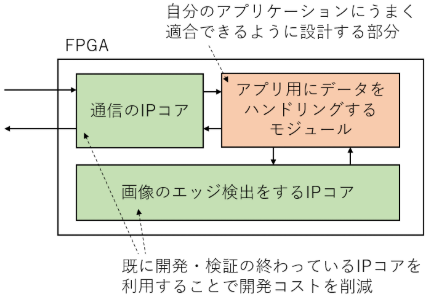
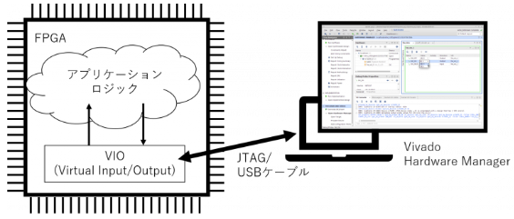

# IPコア

FPGAを使って実用的なパウリケーションを実装するために必要なIPコア。
IPコアを使いこなせるようになると、既に開発されているモジュールの流用で開発コストを低く抑え、自分のアプリケーションの開発に注力できるようになる。

## IPコアとは？
IP コアの IP は Intellectual property (知的財産) の略。
FPGA や ASIC 開発の界隈では、既に開発・検証されて流用できる部品を IP コアと呼ぶ。

__ソフトウェアの開発では__

ゼロから自分で実装することはほとんどなくライブラリを積極的に利用する。

例. Python でプログラミングをするときに数値計算の numpy やグラフ描画用の matplotlib を利用

ソフトのライブラリと同様にFPGAでアプリケーションを実装する際に、必要な処理のすべてを自分で実装する代わりに利用できるものがIPコア。

応用例. 画像のエッジを検出するアプリケーションを実装したい場合に、ちょうどよい通信とエッジ検出の IP コアがあれば，データをハンドリングするモジュールだけ実装すればよくなります。

## IPコアの種類
ソフトウェアプログラミングのために様々なソフトウェアライブラリが存在しているように、IP コアにもたくさんの種類。

また、FPGAベンダが提供するIPコアのほかに様々なメーカが開発、販売しているIPコアや、OSSのIPコアがある。

割り算や掛け算といった基本的な数値演算に相当する IP コアから、画像処理や CNN 計算といった高機能の IP コアまで、さまざまな IP コアが、それぞれの FPGA 向けに用意されている。

演算処理だけではなく、パソコンでおなじみの Ethernet や PCIe、マイコンなどでおなじみの I2C 、UART 、 といった通信処理用の IP コアもベンダから多数リリースされている。

FPGA上に何かのアプリケーションを実装する場合にFPGAのみで実装することはなく、PCやネットワークに接続されることがほとんど。

### IPコアの利用方法
ソフトウェアはライブラリの呼び出しにABIのように守るべきインターフェースが規定されている。
他方、FPGA用のIPコアの場合、必ず守るべきIFは存在しない

いろいろな開発者が好き勝手に IP コアを開発していると、ユーザはそれぞれにあわせた使い方を調べて対応する必要があり不便です。そのため、2020年現在では共通の接続方式に集約されつつあります。代表的なものに、AXI 、Avalon 、Wishbone といった方式があります。

### 特に重要なIPコア
IP コアを利用すると FPGA でアプリケーションを開発するときの手間を省くことができます。実装したいアプリケーションに応じて便利なコアを探してきて使えばよいのですが、実用的なアプリケーションに不可欠なコアも存在します。

それが、入出力、クロック管理およびメモリの IP コアです。ソフトウェアプログラムを書く場合でも、入出力とメモリ、データ管理は必須ですね。一方で、クロック管理はソフトウェアプログラミングではあまり馴染みがないかもしれません。

パソコンのプロセッサでは負荷に応じてクロックの動作周波数が高くなったり低くなったりします。 FPGA を使う場合には、ハードウェアが適切に動作するように積極的にクロックの値を設定する必要があります。 

### VIO コア
https://www.acri.c.titech.ac.jp/wordpress/archives/43

FPGA を使うときには、JTAG というインターフェースを通じてコンフィギュレーションします。
この JTAG を使って動作中の FPGA 内部のレジスタの値を読み書きする機能を提供するIPコアが VIO (Virtual Input/Output) (PG159)です。

