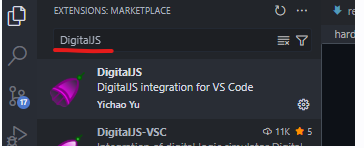
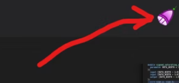
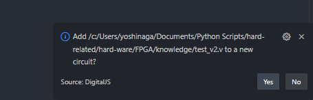
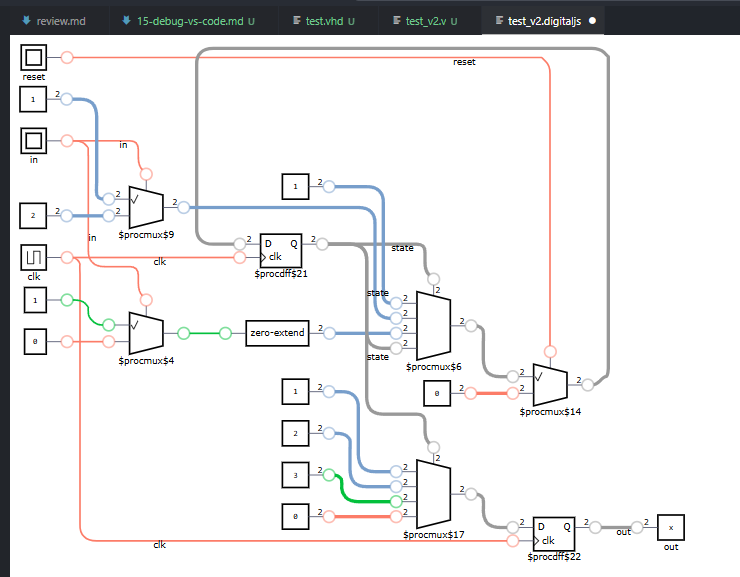

## 目的

VS CodeでVHDLをデバッグ出来るようにする。

でないと、トライが結構しんどく感じたことがあった。。。


## ザックリ


## [VHDLをVSCodeで使用する方法](https://www.bing.com/ck/a?!&&p=b76cc4c4e43a041749e2699d973920f66af576c8f8a149635b55a79a7bd44db2JmltdHM9MTc1ODQ5OTIwMA&ptn=3&ver=2&hsh=4&fclid=05959615-f31c-6eb3-3934-99b8f2f66f49&psq=vscode+vhdl+%e3%83%87%e3%83%90%e3%83%83%e3%82%b0&u=a1aHR0cHM6Ly9xaWl0YS5jb20vdG9yaXVtaXlvc2hpL2l0ZW1zLzM3ODViYjFkZjYwODYyYWVjZjMw&ntb=1)

Visual Studio Code (VSCode) は、VHDLやVerilogHDLなどのハードウェア記述言語を効率的に記述・デバッグするための強力なエディタとして利用できます。以下に、VSCodeをVHDL開発環境として設定する手順を説明します。

必要な準備

まず、VSCodeをインストールします。公式サイトからお使いのOSに対応したインストーラをダウンロードしてインストールしてください。その後、VHDLのサポートを追加するために、VSCodeの拡張機能を設定します。

1. VSCodeを起動し、左側の拡張機能アイコンをクリックします。
2. 検索ボックスに「VHDL」と入力し、表示される拡張機能の中から「VHDL Snippets, Syntax Highlighting, Code Completion」などを選択してインストールします。
3. 必要に応じて、日本語環境を整えるために「Japanese Language Pack」をインストールします。

VHDLコードの作成

VSCodeを使用してVHDLコードを記述します。以下は、4ビットカウンタの例です。

```vhd
library IEEE;

use IEEE.std_logic_1164.all;

use IEEE.std_logic_unsigned.all;

entity COUNT4 is

generic (SEC1_MAX : integer := 50000000); -- 50 MHz

port (

CLK, RESET : in std_logic;

COUNT : out std_logic_vector(3 downto 0)

);

end entity;

architecture RTL of COUNT4 is

signal tmp_count : std_logic_vector(25 downto 0); -- 1秒のカウンタ

signal ENABLE : std_logic;

signal COUNT_TMP : std_logic_vector(3 downto 0);

begin

COUNT <= COUNT_TMP;

process(CLK, RESET)

begin

if (RESET = '0') then

tmp_count <= (others => '0');

elsif (CLK'event and CLK = '1') then

if (ENABLE = '1') then

tmp_count <= (others => '0');

else

tmp_count <= tmp_count + '1';

end if;

end if;

end process;

ENABLE <= '1' when (tmp_count = (SEC1_MAX - 1)) else '0';

process(CLK, RESET)

begin

if (RESET = '0') then

COUNT_TMP <= X"0";

elsif (CLK'event and CLK = '1') then

if (ENABLE = '1') then

COUNT_TMP <= COUNT_TMP + '1';

end if;

end if;

end process;

end RTL;
```


このコードを「COUNT4.vhd」として保存します。

シミュレーションとコンパイル

VHDLコードをシミュレーションするには、ModelSimなどのツールを使用します。以下の手順でVSCodeのターミナルからシミュレーションを実行できます。

* ターミナルを開き、VHDLコードが保存されているディレクトリに移動します。
* ModelSimのパスを設定します。 Windowsの場合: $ENV:Path="C:\intelFPGA_lite\20.1\modelsim_ase\win32aloem;" + $ENV:Path Linuxの場合: export PATH=/tools/intelFPGA_lite/20.1/modelsim_ase/bin:$PATH
* 必要な「doファイル」を作成し、以下のコマンドを実行します。

vsim -do COUNT4.**do**


FPGAへのプログラム

Quartusを使用してFPGAにプログラムをダウンロードします。以下の手順を参考にしてください。

* Quartusのパスを設定します。 Windowsの場合: $ENV:Path="C:\intelFPGA_lite\20.1\quartus\bin64;" + $ENV:Path Linuxの場合: export PATH=/tools/intelFPGA_lite/20.1/quartus/bin:$PATH
* プロジェクトファイル（.qpf）と制約ファイル（.qsf）を作成します。
* 以下のコマンドでコンパイルを実行します。

quartus_sh --flow compile COUNT4


* FPGAボードにプログラムをダウンロードします。

quartus_pgm -c DE-SOC[USB-1] -m jtag -o **"p;output_files/COUNT4.sof@2"**


まとめ

VSCodeを使用することで、VHDLの記述、シミュレーション、コンパイル、FPGAへのプログラムを効率的に行うことができます。拡張機能やターミナルを活用することで、統一された開発環境を構築できる点が大きな利点です。


## DigitalJS

Javascriptで論理シミュレーションを実装しているプロジェクトを利用すれば、手軽に回路のシミュレーションができる。

これにより、テストベンチを書かずとも記述した回路のシミュレーションが可能かつ、論理回路図も確認することができる。



VS codeの右上にアイコンが登場。



画面右下に同期のお伺いが表示される→Yse



論理回路が表示される。




回路はシミュレーションもできる

画面の下に波形のビューがある。→見やすくする。


