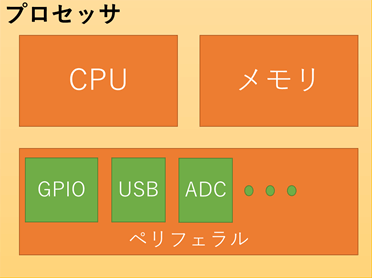
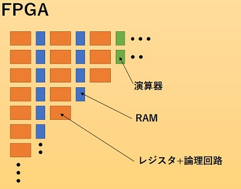
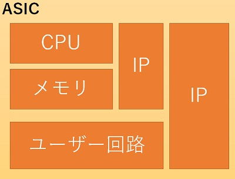

# FPGAの性能
## FPGAの主な性能指標

### 1. **ロジックセル（LUT：Look-Up Table）数**
- FPGA内部の基本的な論理回路素子の数
- **多いほど複雑で大規模な回路が実装可能**
- データシートなどでは「LUT数」や「ロジック要素数」として表記

### 2. **フリップフロップ（FF）数**
- 記憶素子（1ビットの情報を記憶する回路）の数
- **多いほど多くの信号や状態を保持できる**

### 3. **ブロックRAM容量**
- FPGA内蔵の高速メモリ（RAM）の容量
- **画像処理やバッファ用途に重要**

### 4. **DSPスライス数**
- 乗算器や加算器など、信号処理に特化した演算ブロックの数
- **AIやデジタル信号処理用途で重要**

### 5. **I/Oピン数と種類**
- 外部と接続できる端子の数や種類（LVDS, SPI, I2C, GPIOなど）
- **多いほど多様な機器と接続しやすい**

### 6. **クロック周波数（最大動作周波数）**
- FPGAの回路が動作可能な最大クロック速度（MHzやGHz単位）
- **高速処理が必要な用途で重要**

### 7. **消費電力**
- 動作時の電力消費（ワットやミリワット単位）
- **組み込みやバッテリー駆動で重要**

### 8. **パッケージ種類・サイズ**
- 実装できる基板サイズや形状に影響
- **小型化や放熱設計に関係**

### 9. **内蔵機能**
- PLL（クロック生成回路）、SerDes（高速シリアル通信）、内蔵CPU（ARMコアなど）など
- **用途によってはこれらの有無が大きな差になる**

## まとめ

FPGAの性能指標は主に「どれだけ複雑な回路を作れるか」「どれだけ高速に動作できるか」「どんな周辺機能があるか」などがポイントです。  
用途によって重視すべき指標が異なりますので、目的に合わせて選定することが大切です。

---
# FPGAの周辺機器
はい、FPGAにはさまざまな周辺機能（ペリフェラル）が内蔵されている場合があります。代表的なものを以下に挙げます。

## FPGAによくある周辺機能

### 1. **PLL（Phase Locked Loop）／クロックジェネレータ**
- クロック信号の生成・分周・位相調整を行う回路
- 複数の異なるクロック周波数を内部で生成できる

### 2. **ブロックRAM（BRAM）／分散RAM**
- 高速な内蔵メモリ
- 画像処理やデータバッファなどに利用

### 3. **DSPスライス（乗算器・加算器などの演算ユニット）**
- デジタル信号処理やAI計算に最適化された演算回路

### 4. **SerDes（Serializer/Deserializer）**
- 高速シリアル通信（PCI Express, SATA, Ethernetなど）を実現する回路

### 5. **I/O標準対応（LVDS, LVCMOS, SSTLなど）**
- さまざまな電圧・規格の外部インターフェースをサポート

### 6. **ハードウェアマクロ（IPコア）**
- UART, SPI, I2C, CANなどの通信コントローラ
- Ethernet MAC, USBコントローラなど

### 7. **内蔵プロセッサコア（SoC FPGAの場合）**
- ARM Cortex-A9/A53などのCPUコアを内蔵したFPGAもある（例：Xilinx Zynq, Intel SoC FPGA）

### 8. **アナログ機能**
- 一部のFPGAではADC（アナログ-デジタル変換器）やDAC（デジタル-アナログ変換器）を内蔵

### 9. **クロック管理ユニット（MMCM, DCMなど）**
- クロック生成・分周・位相調整をさらに高度に制御

### 10. **セキュリティ機能**
- 暗号化エンジン、ブート時の認証機能など

## まとめ

FPGAは単なるロジック回路だけでなく、**多様な周辺機能**を内蔵している場合が多く、これらを活用することでより高機能なシステム設計が可能になります。  
使用するFPGAのグレードやシリーズによって、搭載されている周辺機能は異なるので、目的に合わせて選定することが大切です。

---

## プロセッサの構成
CPU + メモリ + ペリフェラル  

__CPU__  
メモリから命令を読み出し、データの演算、移動、コピーを行う。  
__ペリフェラル__  
GPIOやADC、SPI、USBなどのあらかじめ、ハードウェアが用意されている。
それらにはレジスタンスというメモリが内臓されていて、値を変更して、内部回路を切り替えてCPUにより制御される。

CPUは命令を1つずつしか処理を行わないため、CPUが動作する元となるクロック信号を高速化させたり、CPUを複数コアにすることで、性能の向上を図ります。

## FPGAの構成

現場で書き換え可能な論理回路の多数配列となる。
プロセッサがソフトウェアで動作させることに対して、ハードウェアで動作する。

FPGAは無数の論理回路の多数配列で構成されていて、ハードウェア言語というものを使って論理回路を設計する。

FPGA内にも書き開け可能なメモリが含まれているため、回路を自由に書き換えながら動作させることができる。
ハードウェア自体を変更できるため、非常に柔軟性があると言える。
CPUについても論理回路によって構成することができるため、ソフトウェア制御と混合することも可能。

## ASICの構成
ASICはユーザーにあわせてカスタマイズされた集積回路のIC。
プログラマブルではないため変更が聞かない。
多くの開発費と、開発期間を要する。

途中書き換えは不可能だが、論理回路を用途に併せて構成するため、非常に高い性能が得られたり、コスト削減が可能。

### 直近の発展
__FPGA__  
FPGAはデジタル回路を構成して開発をするため、FPGAの基本構造だけではアナログ信号を使用するA/DコンバータやD/Aコンバータ等は構成することができませんし、ARMなどの汎用CPUで動作する商用OS等も載せることができません。
そこで最近はARMコアやA/Dコンバータなども内蔵したSOCタイプも出てきています。

__プロセッサ__  
汎用的に使用できるペリフェラルが搭載されており、様々な分野で使用できますが、独自のシリアル通信やネットワークなどは対応できないことが多く、その場合はたいてい、専用ASICやFPGAを使用します。しかしながら、最近のプロセッサでは小型のFPGAのようなプログラマブルロジックや、ソフトウェアで通信等の細かいハードウェアの制御ができるコアを内蔵したプロセッサも出てきています。

