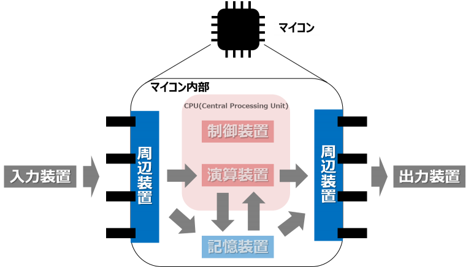
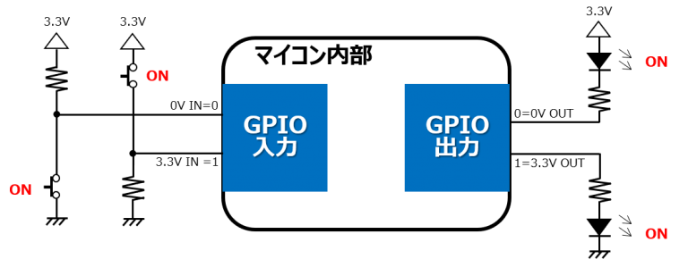
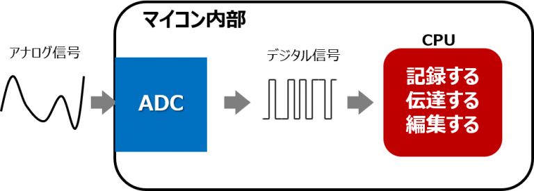
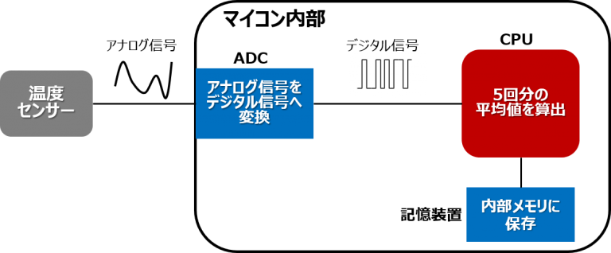

## FPGAボードで遊ぼう！- UART でテキスト通信 -

### 
UART (Universal Asynchronous Receiver Transmitter) はシリアル通信の方式の一つです[1][2][3]．FPGA から PC にログを送ったり[3]，デバイスにデータを送ったりすることができます[4]．

### ペリフェラル
ペリフェラルとは、直訳では周辺機器となりますが、マイコンにおいては内蔵された様々な装置を意味します。中には、マイコンの内部だけで使用される機能もありますが、基本的にはマイコンの外部と接続するための入出力機能として使用されます。

マイコンの基本的な機能を実現する部分を、演算・制御装置、記憶装置とすると、ペリフェラルはマイコンの機能を拡張することが出来る部分だと分かります。内蔵しているペリフェラルが多いほど、多機能なマイコンと言えることになります。しかし、一般的にすべての機能を使用するわけではないので、使用したいペリフェラルの数が含まれているマイコンを選定することがポイントとなります。

#### GPIO
GPIOとは、General Purpose Input Outputの略で、汎用I/Oポートと呼ばれます。
その名の通り、汎用的なI/Oポートで、マイコンから外部に接続されているピンより1と0のデジタル信号を自由に入力/出力することが出来ます。
例えば、マイコンの電源電圧が3.3Vの場合、0を0Vとし、1を3.3Vとします。この0と1の定義はデバイスによって異なりますのでデータシートを確認する必要があります。
GPIOを出力として使用することで、LEDのONとOFFをユーザーの任意で切り替えることが出来ます。

#### ADC
ADCとは、Analog to Digital Converterの略で、アナログ信号をデジタル信号に変換することが出来ます。

世の中には熱や光、速度、音などのアナログ信号が多数ありますが、アナログ信号はそのままでは信号の処理が難しい状態となります。

ADCを使うことで信号処理のしやすいデジタル信号に変換することが出来ます。

一般的には、温度や加速度などの様々なセンサー機器に接続されます。センサー機器からは現在の測定結果を電圧値のようなアナログ信号で出力します。
この出力をADCへ入力することで、測定結果の平均値の計算や、ノイズの影響による誤差を除去するなど、様々な演算を行うことが出来るようになります。

#### タイマー
その名の通り、時間を計測することが出来ます。タイマーを使用することで、一定の正しい間隔で特定の処理を実行することが出来、マイコンのシステム（ソフトウェア）に時間の概念を持たせることが出来ます。

また、タイマーを使用することでPWM(Pulse Width Modulation)という信号を生成することが出来、出力する電圧を0~100%に制御することが出来ます。

例えば、出力する電圧が0~3.3Vの場合、0%=0V、50%=1.65V、100%=3.3Vというようにマイコンから出力される電圧を柔軟に制御することが出来ます。PWMの概要を下図に示します。

