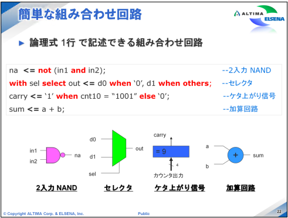
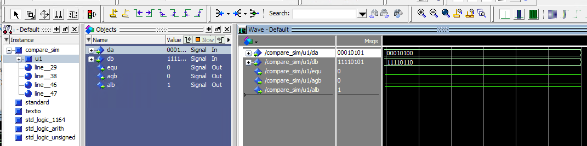
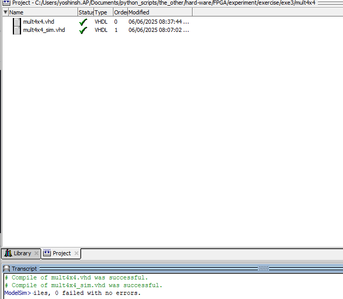

## HDLとは
ハードウェアを記述するための言語。  
ハードウェア＝論理回路で、アナログ回路ではない。  

回路図でASICを開発する場合は、ASICベンダとシリーズを決めて設計作業が必要だった。
回路図で利用するライブラリがベンダ/シリーズごとに異なっていたため。

HDLを利用すれば機能設計が終わった後、もしくは、FPGAでプロトタイプを動作させた後、選定を変えることが可能となる。

VHDL は米国国防省によって、VHSIC プログラムで規定された標準言語であり、早い段階から IEEE で標準化されていました。

Verilog-HDL は個人により発案され、Open 環境で磨かれてきた標準言語です。

VHDL、Verilog-HDL どちらも各種合成ツールやシミュレータで対応されています。

### 論理合成
HDLで記述された論理機能を実際のゲート回路に変換。
変換の際に冗長な記述を最適化。
論理合成の出力は、ASICやFPGA用のネットリスト
>ネットリスト
回路部品の接続関係をテキストで表現したもの

>RTL
HDLで記述された論理回路

実際にデバイス上に構築していくには、ゲート回路に変換する必要がある。
この作業を論理合成と呼び、一般的には論理合成ツールなるソフトウェアが使用される。


論理合成ツールにはいくつかの種類がある。
MentorGraphics 社の Precisiton Synthesis や Synopsys 社の SynplifyPro などがあります。
論理合成ツールを用いて、ASICやFPGA用のネットリストを生成する。

  

```Mermaid
flowchart TD
A[設計仕様の検討] --> B[HDLの設計]
B --> C{内部遅延を含めない論理的なシミュレーション}
C -- Yes --> D[論理構成]
C -- No --> B[論理構成]
D --> E[配置配線]
E --> F[タイミング検証]
F -→G[ボード書き込み]
```
※D以降はツールが自動で行ってくれる


**タイミング**
FPGA/CPLD内部のスタティックなタイミング解析を指す。
配置配線結果がユーザーの満足するタイミング仕様となっているかを検証する。

最後に、ボードに実装されている FPGA/CPLD へデータを書き込んで、実機検証（デバッグ）を行います


## 書式のルール
1. 1つのステートメント（処理）の終了には、セミコロン (;)
2. 指定されている予約語を使用します。（if, then, in, out など、次ページに記載しています）
3. VHDL では、コンポーネント間の接続などの配線 (signal) や各種変数(variable) などが使用されますが、これらは必ずデータタイプを指定して使用する必要があります。
4. データタイプには、標準で定義されているものや、ユー
ザが新しくデータタイプを定義して使用することができます。
5. VHDL ではデータタイプを重視した言語であり、同じデータタイプでないとデータ代入することができません。
6. 最初の文字は必ず英字で始めるようにしなければならず、数字や記号を使用することはできません。
7. 使用できる文字は、英字、数字、記号は ‘_’（ア
ンダーバー）で、それ以外の記号などは使用することが出来ません。’_’ は2個以上続けて使用することはできません。
8. 予約語を信号名やピン名に使用することはできません。たとえば、ピンに “in” という名前を付けることはできません
9. 1つのステートメントが長くなる場合などには、複数行に分けて記述することができます。
10. コメントを入れる場合には、コメントの開始位置に ‘—’ (ダブル・ハイフン)を付けます。ダブル・ハイフンを付けるとそれ以降、その行が改行されるまでがコメントと認識されます。
11. VHDL には複数行をまとめてコメントアウトする記述方法がありませんので、1行ずつダブル・ハイフンを付ける必要があります。

## 基本構造
- パッケージ呼び出し：演算子や標準的な関数を仕様できるようにする
- エンティティ宣言部：回路のシンボルのようなもの
- アーキテクチャ宣言：エンティティの中の回路

```
パッケージ呼び出し

entity エンティティ名 is
    ポート宣言など
end エンティティ名;

architecture アーキテクチャ名 of エンティティ名 is
    各種宣言
begin
    回路記述部
end アーキテクチャ名;
```

## パッケージ呼び出し
### パッケージ
論理値、演算子や標準関数が定義されたもの。  
これらを呼び出すことによって、演算子や標準関数を使用できるようになる。

VHDLの各種パッケージは、論理合成ツールやシミュレータでは設定済みの状態で組み込まれているため、ユーザはパッケージを宣言するだけで使用することができる。


- std_logic_1164
基本パッケージです。std_logic データタイプや関数が定義されています。
- std_logic_unsigned
符号なし整数として std_logic_vector タイプを扱うために std_logic_arith を拡張した
ものです。算術演算子（+, -, *)、比較演算子 (<, <=, >, >=, =, /=)、シフト演算子
(>>, <<) などが含まれます。
- std_logic_signed
符号つき整数として std_logic_vector タイプを扱うために std_logic_arith を拡張し
たものです。算術演算子、比較演算子、シフト演算子などが含まれます。
std_logic_unsigned と std_logic_signed を同時に使用することはできません。
- std_logic_atith
基本的な算術演算子が定義されています。

### ライブラリ
いくつかの標準パッケージがあるが、呼び出し時にはライブラリから指定する必要がある。

ライブラリ=複数のパッケージをまとめて1つのディレクトリに格納したもの。
IEEEライブラリ＝IEEEによって承認されたライブラリで、std_logic_1164やstd_logic_arithなどが含まれている。

このライブラリやパッケージを使用するためにパッケージの呼び出しが必要となる。
ライブラリ、パッケージを呼び出す前に、以下のようにライブラリの宣言を行う。
```
library ライブラリ名;
use ライブラリ名.パッケージ名.all;
```

例. std_logic_1164を定義する場合
```
library ieee;
use ieee.std_logic_1164.all;
```


### エンティティ
ライブラリやパッケージの呼び出しができたら、回路に関する記述をしたいところですが、その前に、エンティティ宣言が必要です。

エンティティ宣言では作成するエンティティの**入出力ポートの一覧**、**属性**や**データタイプ**を記述します。
VHDL（VHSIC Hardware Description Language）における**エンティティ（entity）**の宣言は、設計したい回路（モジュール）の**外部インターフェース**（入出力ポートなど）を定義する部分です。  
エンティティは「この回路はどんな名前で、どんな入出力端子を持っているか」を記述します。

エンティティ宣言の記述方法としては、entity から始まり、任意のエンティティ名が続き、is と続きます。この後に、エンティティのポート一覧を記述します。最後に end エンティティ名; で終了です。

```vhdl
entity エンティティ名 is
    port (
        ポート名1 : モード1 型1;
        ポート名2 : モード2 型2;
        -- 必要なだけポートを宣言
    );
end エンティティ名;
```

例. 2入力ANDゲート  
```vhdl
entity and_gate is
    port (
        a : in std_logic;
        b : in std_logic;
        y : out std_logic
    );
end and_gate;
```
- 入力：`a`, `b`
- 出力：`y`


例. 8ビット加算器

```vhdl
entity adder8 is
    port (
        a   : in  std_logic_vector(7 downto 0);
        b   : in  std_logic_vector(7 downto 0);
        sum : out std_logic_vector(7 downto 0)
    );
end adder8;
```
- 8ビット入力：`a`, `b`
- 8ビット出力：`sum`

#### 要点
- **エンティティ宣言は「回路の外から見た窓」**です。内部の動作（アーキテクチャ）はこの後ろに記述します。
- モードは必ず指定します。
- 型は設計内容に応じて選びます（std_logicやstd_logic_vectorがよく使われます）。

### アーキテクチャ
エンティティの宣言ができたら、回路の動作や構造を記述していく。
回路記述部は組み合わせ回路や順序回路、下位ブロックを呼び出して、回路の動作や構造を記述する。

アーキテクチャはエンティティ宣言で指定したシンボル内の回路を表現している。
アーキテクチャ名 of エンティティ名 is というようにどのエンティティにふくまれるという記述で始まり、回路記述部分をbeginとendで囲った中に記述します。
endのあとには再度アーキテクチャ名を記述します。

```vhdl
architecture アーキテクチャ名 of エンティティ名 is
    -- （必要なら）内部信号などの宣言
begin
    -- 回路の動作や構造を記述
end アーキテクチャ名;
```
- アーキテクチャ名：任意の名前
- エンティティ名：対象となるエンティティの名前

__記述方法の主な種類__  
1. **動作記述（behavioral）**
   - `process`や`if`文などで**動作（アルゴリズム）**を記述
2. **構造記述（structural）**
   - 複数のコンポーネント（下位回路）を**接続して構成**する


例1：2入力ANDゲート（動作記述）

```vhdl
entity and_gate is
    port (
        a : in std_logic;
        b : in std_logic;
        y : out std_logic
    );
end and_gate;

architecture behavioral of and_gate is
begin
    y <= a and b;
end behavioral;
```


例2：8ビット加算器（プロセス文を使った記述）

```vhdl
entity adder8 is
    port (
        a   : in  std_logic_vector(7 downto 0);
        b   : in  std_logic_vector(7 downto 0);
        sum : out std_logic_vector(7 downto 0)
    );
end adder8;

architecture rtl of adder8 is
begin
    process(a, b)
    begin
        sum <= std_logic_vector(unsigned(a) + unsigned(b));
    end process;
end rtl;
```

### 回路
論理式1行で記述できる組み合わせ回路  

```
2入力 NAND : na <= not (in1 and in2);
セレクタ : with sel select out <= '0' when '0', '1' when others;
ケタ上がり信号 : carry <= '1' when cnt10 = "1001" else '0';
加算回路 : sum <= a + b;
```



2入力 NAND の記述例で、論理演算子（and や not ）を使用しています。
優先順位を付ける場合には、このように括弧を付けて指定します。
in1 と in2 の and をとり、not を付けて na に代入していますので、出力側に not が付きます。

### 演算子

論理演算子は、and や or などの論理をそのまま記述することができます。
算術演算子は、加算や減算、乗算を記述することができます。


演算子を使用してゲート回路を記述することができます。
オペランド1つに対し使用して、not を使用して反転、and を使用して各オペランドのand を左辺に代入します。


論理演算子と算術演算子はVHDL標準パッケージで以下のように定義される。

- 論理演算子はbitでのみ使用可
- 算術演算子はintegerでのみ使用可

**演算の許可を定義しているパッケージを宣言**
1. std_logic_arith: 演算ファンクション
2. std_logic_signed: 符号つき演算ファンクション
3. std_logic_unsigned: 符号なし演算ファンクション


## 演習1

**お題**  
加算器をコーディングする。


__コーディング__  
```VHDL
library IEEE;
use IEEE.STD_LOGIC_1164.ALL;
use IEEE.STD_LOGIC_ARITH.ALL;
use IEEE.STD_LOGIC_UNSIGNED.ALL;

entity adder is
    Port ( a : in STD_LOGIC_VECTOR(15 downto 0);
           b : in STD_LOGIC_VECTOR(15 downto 0);
           sum : out STD_LOGIC_VECTOR(15 downto 0));
end adder;

architecture Behavioral of adder is
begin
    sum <= a + b;
end Behavioral;
```

__解説__  
- ライブラリは標準ライブラリをインポート
- エンティティは入力ポート: a, b　出力ポート：sum
- データタイプはそれぞれstd_logic_vector
- アーキテクチャは加算器の定義通り: sum<=a +b


インストールした後、アプリケーションより選択できるようになる。  
  

コンパイルまで進めると以下の画面になる。  


__シミュレーション__  
Simulator メニュー ⇒ Start Simulation を選択し、Start Simulation ダイアログ・ボックスを起動  


## 演習2
__お題__  
- when-elseで比較器
- ファンクション-シミュレーションを実行


>**エンティティ**
>ポートの定義
>**アーキテクチャ**
>アーキテクチャのふるまい定義
>**ライブラリ**
>利用するライブラリ→パッケージの定義

今回は一からコーディングするみたい。

__信号の出力__  



## 演習3
コンパイル通りました！




## 演習4


