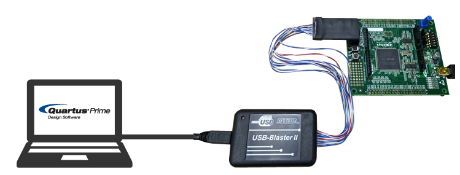
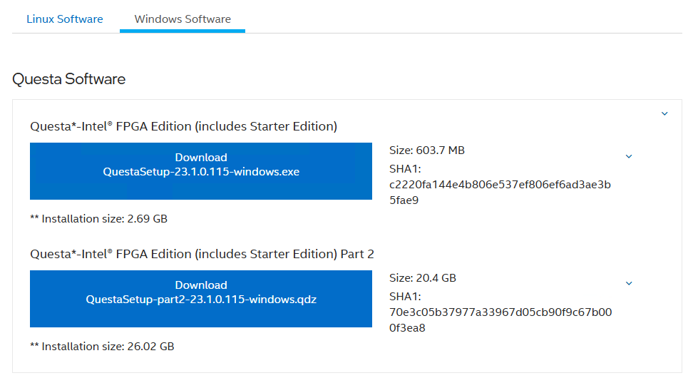
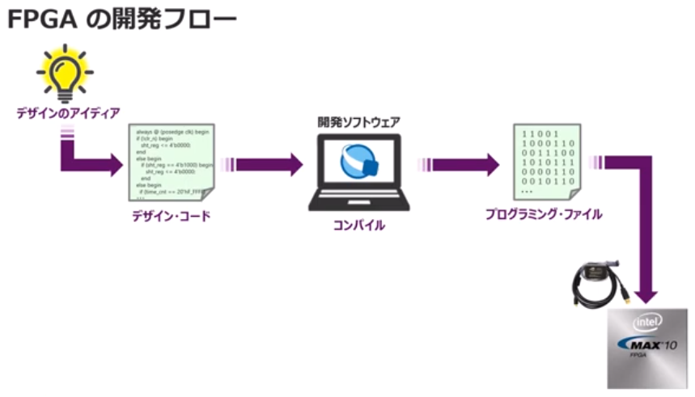
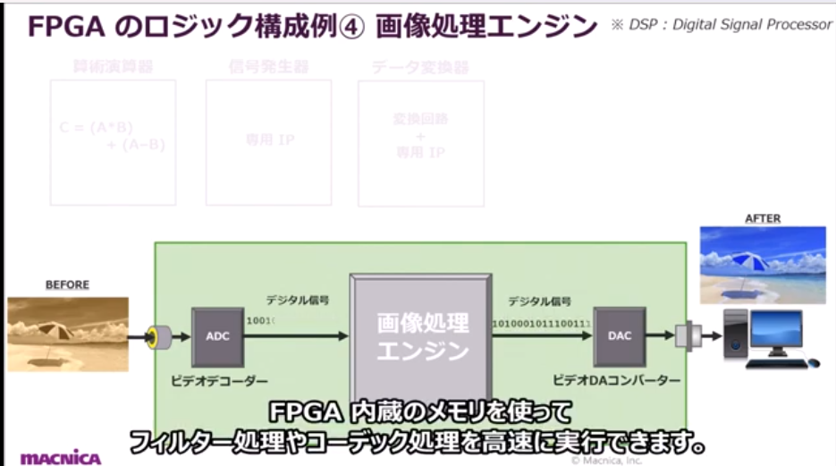
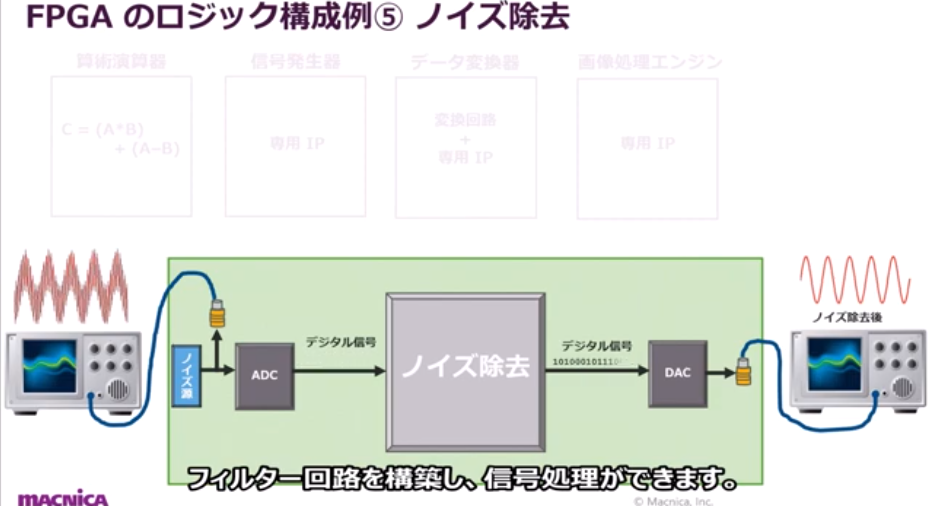

FPGAの開発ツール（FPGA開発環境、FPGA設計ツール）は、FPGAを使った回路設計・開発を行うためのソフトウェア群です。代表的なツールとしては、Xilinx（現AMD）のVivado、Intel（旧Altera）のQuartus Primeなどがあります。  
これらのツールには主に以下のような機能があります。

---

### 1. **HDLエディタ／設計入力**
- VHDLやVerilog、SystemVerilogなどのハードウェア記述言語(HDL)の記述・編集機能。
- テキストエディタだけでなく、ブロック図（回路図）エディタ、ステートマシンエディタなども含まれる場合があります。

### 2. **論理合成（Synthesis）**
- HDLで記述した回路を「論理ゲートレベル（ネットリスト）」に変換する機能。
- 設計を物理的な論理回路に変換します。

### 3. **論理シミュレーション**
- 設計した回路が正しく動作するか、シミュレーションで動作検証できる機能。
- テストベンチを用いた機能検証やタイミング検証が可能です。

### 4. **配置配線（Place & Route, Implementation）**
- 合成後の回路をFPGA内部の具体的な素子（LUT, FF, 配線など）に割り当てて、実際のFPGA上で動く形に変換する機能。

### 5. **タイミング解析**
- 回路が動作周波数やタイミング制約を満たしているかどうかを解析する機能。
- Setup/Hold違反の検出、クリティカルパスの特定など。

### 6. **デバイスプログラミング（書き込み）**
- 実際にFPGAデバイスに設計データ（ビットストリーム）を書き込む機能。
- JTAGやUSB経由でFPGAに書き込みます。

### 7. **デバッグ・解析機能**
- 実機上での動作を観測するためのロジックアナライザ（ILA, SignalTapなど）や、デバッグ用のIPコアの挿入、波形観測など。

### 8. **IPコア生成・管理**
- メモリコントローラやDSP、AXIバスなどの各種IPコアをGUIで生成・カスタマイズできる機能。

### 9. **プロジェクト管理・バージョン管理支援**
- 複数の設計ファイルや設定を一元管理するプロジェクト管理機能。
- 最近ではGitなどのバージョン管理との連携機能も。

### 10. **ソフトウェア開発支援（SoC用）**
- FPGAにCPUコア（Arm Cortexなど）が内蔵されている場合、ソフトウェア開発・デバッグ機能も統合されていることが多いです。

---

### 代表的なFPGA開発ツール例

- **Vivado**（AMD/Xilinx）
- **Quartus Prime**（Intel/Altera）
- **Lattice Diamond**（Lattice Semiconductor）
- **Microsemi Libero**（Microchip/Microsemi）

**まとめ：**  
FPGA開発ツールは、設計入力・合成・シミュレーション・配置配線・タイミング解析・デバイス書き込み・デバッグ・IP生成など、FPGA開発の全工程をサポートする多機能な統合開発環境です。

[Vivado MLのインストール](https://www.acri.c.titech.ac.jp/wordpress/archives/12916)

---

## Altera® の FPGA を開発するためには
Quartus® Prime （クォータス・プライム）と、Questa* - Intel® FPGA Edition （クエスタ・インテル・エフピージーエー・エディション）いうソフトウェア（主にツールと呼びます。）が必要です。まずは、このツールをパソコンにインストールします。
2つということですよ。
- Quartus® Prime （クォータス・プライム）
- Questa* - Intel® FPGA Edition

https://www.macnica.co.jp/business/semiconductor/articles/intel/110109/

1. 環境構築はここをまず見て  
開発に必要なツールについて説明されてます。  
https://www.macnica.co.jp/business/semiconductor/articles/intel/110109/

Questa* - Intel® FPGA Editionのインストールは2こともっぽい。  
  

2. ツールの説明
https://www.macnica.co.jp/business/semiconductor/articles/intel/110113/

Quartus® Prime
開発用ソフトウェア。
>Quartus® Prime Lite Edition は、無料かつ無期限で使用できるソフトウェアです。開発できるデバイスのラインナップや最適化オプションなどに一部使用制限はありますが、FPGA 開発に必要な最低限の機能をカバーしています。
>論理回路の設計入力から基板上のデバイスを動作させるところまで作業可能なので、Lite Edition でも十分に FPGA 開発に使用できます

Questa* - Intel® FPGA Edition は、Siemens EDA 社の Questa ソフトウェアを、Altera® のデバイスを限定対象とした製品で、設計した自分のデジタル論理回路が意図した通りの動作をしているかをソフトウェア上で確認するためのシミュレーター・ツールです。

#### 評価用ボード
通常は、ユーザーの仕様に合った FPGA 搭載基板をユーザーが製造します。
でも、その基板を作るには時間と手間とコストがかかります。ですから、まずは評価用基板でFPGA を動かして、ツールの使い方や FPGA の特徴にいち早く触れてみましょう。

#### Altera® FPGA ダウンロード・ケーブル II
Altera® FPGA ダウンロード・ケーブル II (別称 USB-Blaster™ II （ユーエスビー・ブラスター・ツー)) という専用のダウンロード・ケーブルを使用し、Quartus® Prime （パソコン） で設計した自分のデジタル論理回路のデータを対象の Altera® のデバイスへ転送します。パソコンとのインターフェースは USB ポートで、データを転送するためのユーティリティーは Quartus® Prime に付属した Programmer （プログラマー） と言うツールを使用します。

3. 必要な知識

- デジタル論理回路についての知識
FPGA ではデジタル回路を設計します。ちなみに、FPGA の業界ではデジタル回路を 論理回路 と言うのが一般的です。
AND、OR、NOT、フリップフロップなどの基本論理回路  
2進数、2進数演算  
組み合わせ回路、順序（フリップフロップ）回路  
同期式順序回路、非同期式順序回路  

- ハードウェア記述言語とのコーディング能力

論理回路を設計するためには、ハードウェア記述言語のコーディング能力が必要です。ハードウェア記述言語は通称 HDL (Hardware Description Language) と言われ、現在では主に以下の3種類が使用されています。

VHDL（ブイエイチディーエル）  
Verilog-HDL（ベリログ・エイチディーエル）  
SystemVerilog（システム・ベリログ）  

- I/O規格についての知識
FPGA はデジタル IC です。I/O ピンに入力してきた信号（受信）に対して、それが「High（1）」なのか「Low（0）」なのかを判断し、接続先の IC に信号を出力（送信）することで、「High（1）」か「Low（0）」かを判断させ、周辺デバイスと通信します。

High、Low とひとことで言っても、実際基板上では電圧値が関係します。“何V（ボルト）以上が High、何V以下が Low” と言うような電圧値の範囲に規定を設け、それぞれに名称を付けたもの、それが I/O 規格 です。

- 静的タイミング解析（STA:スタティック・タイミング・アナライザー）についての知識

タイミング解析とは、自分が作成した論理回路が要求するクロック周波数で“正しく”動作するか、など タイミング仕様を満足するかどうかを確認することを言います。
その解析手法のうち、QuestaSim などのシミュレーターを使い、入力信号データ（テスト・パターンあるいはテストベンチとも言います。）を用いて回路を疑似動作させるシミュレーションとは対照的に、テスト・パターンを使用せず、ユーザーが設定したタイミング要求（制約）に対して解析（比較検証）する手法を “スタティック（静的な）タイミング解析” と言います。
FPGA の回路素子には固有の遅延があるため、要求するクロック周波数が高速だったり論理回路の規模が大きいと、論理回路の一部が動かない可能性があります。そこでタイミング解析をおこない、仕様通り正しく動くことを確認しなければなりません。タイミング解析を「はぁ、面倒くさい。」と怠ると、FPGA はまず実機では動かないと言っても言い過ぎではないくらい、STA は現在の FPGA 開発において重要な作業の一つです。

## FPGAでできること

FPGA（Field Programmable Gate Array）は、実機制御において**柔軟かつ高速なハードウェアロジックを実現できる半導体デバイス**です。FPGAを使って実機（例：ロボット、産業機械、計測装置など）を制御する場合、主に以下のような役割を果たします。

---

## 1. **リアルタイム制御の実現**

- FPGAは、並列処理が得意で、**決められたクロックで必ず処理が終わる**ため、ミリ秒・マイクロ秒単位の厳密なタイミング制御が必要なシステムで活躍します。
- 例：モーターのPWM制御、センサー信号のリアルタイム処理、通信プロトコルのタイミング制御

---

## 2. **高速な信号処理・前処理**

- センサーやカメラからの大量データを**リアルタイムに並列処理**できます。
- 例：画像処理、フィルタリング、A/D変換後のデータ補正、エンコーディング処理

---

## 3. **カスタムI/Oインターフェースの実装**

- UART、SPI、I2C、Ethernetなど、**多様な通信インターフェースを柔軟に実装**できます。
- 既存のマイコンやPCでは対応しきれない独自プロトコルにも対応可能です。

---

## 4. **ハードウェアアクセラレータとしての利用**

- 機械学習推論や暗号処理、画像認識など、**計算量の多い処理の一部をFPGAで高速化**できます。
- CPUやGPUでは遅い・消費電力が大きい処理を、低遅延・省電力で実現できます。

---

## 5. **安全性・信頼性の向上**

- ソフトウェアよりも**予測可能な動作**が可能で、産業機器や医療機器など安全要求の高い分野でも使われます。
- ハードウェアロジックなので、OSやアプリのクラッシュの影響を受けにくいです。

---

## 6. **システムの柔軟性・拡張性**

- FPGAは**現場で回路を書き換え可能**（リコンフィギュラブル）なので、仕様変更や機能追加にも柔軟に対応できます。

---

## まとめ

FPGAは実機制御において、
- **リアルタイム性・高速性**
- **並列処理能力**
- **カスタムI/O・プロトコル対応**
- **ハードウェアアクセラレーション**
- **高い信頼性・安全性**
- **柔軟な機能拡張**

といった役割を果たします。  
特に「ソフトウェアでは間に合わない」「ハードウェアの柔軟性が必要」といった現場で強みを発揮します。

## 今話題のFPGAって何？AIを爆速で動かそう！

https://zenn.dev/nekoallergy/articles/5b0677796ba6a1

### 従来技術の課題
FPGAとは、回路を自由にカスタマイズできるIC です。つまり、AI専用の回路に特化（カスタマイズ）させることで、高速化＆省電力化をすることができます。

#### 「FPGAって？」

1. FPGAは、自分で自由に回路をカスタマイズできるIC
2. 設計次第で、マルチプレイヤーにもプロプレイヤーにも変身できる
3. 最短経路で回路パターンを繋げられるので、高効率＆超高速＆低消費電力が期待できる
4. 製造をメーカーに依頼しないので、ICの開発期間が短縮できる
5. 設計費用や製造費用を抑えることができる

## FPGAの動画
開発フロー  

波形の良し悪しをシミュレータで確認
コンパイル

何ができるかはここが分かりやすいかも。  
https://www.bing.com/videos/riverview/relatedvideo?q=fpga%20youtube&mid=185300348CF1D665AFD4185300348CF1D665AFD4&ajaxhist=0

- 信号発生器→簡単に実装できる
- データ変換器→I/O規格の異なるデバイスと通信できる
- DSPを活用して画像処理できる

- ローパスフィルタ

