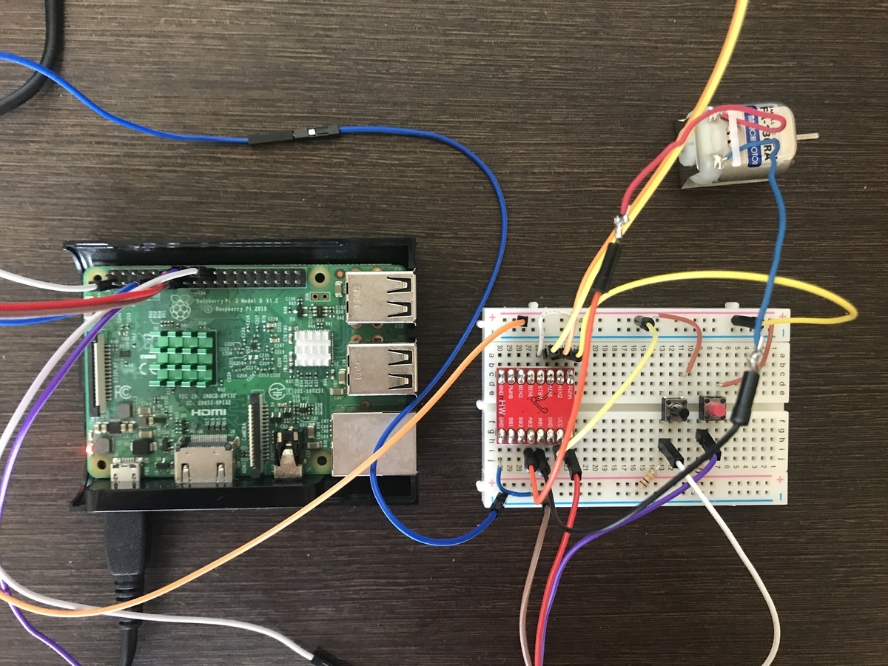
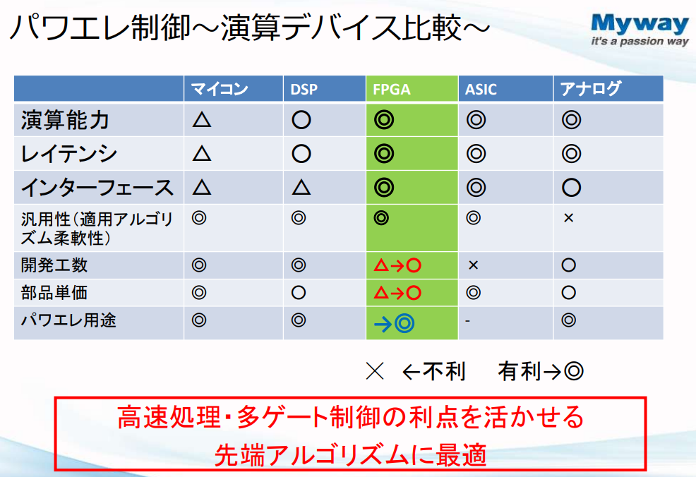

## FPGAの特徴

### FPGAの基本的な機能

1. **プログラム可能な回路** : FPGAは、ユーザーが回路を自由にプログラムできる集積回路です。これにより、特定のニーズに応じたカスタマイズが可能です。 [**2**](https://www.bing.com/ck/a?!&&p=f6c7a49bc7623c809de80dd83bb73fc0274bc3ab344eca5afba826d6f7f62afaJmltdHM9MTc0OTUxMzYwMA&ptn=3&ver=2&hsh=4&fclid=05959615-f31c-6eb3-3934-99b8f2f66f49&psq=FPGA+%e3%81%a7%e3%81%8d%e3%82%8b%e3%81%93%e3%81%a8&u=a1aHR0cHM6Ly93d3cub2xpbmFzLmNvLmpwL21lZGlhL2NvbHVtbi9GUEdB&ntb=1)
2. **高速処理** : FPGAは、CPUやGPUと比較しても高速なデータ処理が可能であり、リアルタイム処理が求められるアプリケーションに適しています。 [**1**](https://www.bing.com/ck/a?!&&p=62a5e77bf5ca9d38e592739f86bcb2a461a5cc8ce96241e6a88c51e1b8e4a58dJmltdHM9MTc0OTUxMzYwMA&ptn=3&ver=2&hsh=4&fclid=05959615-f31c-6eb3-3934-99b8f2f66f49&psq=FPGA+%e3%81%a7%e3%81%8d%e3%82%8b%e3%81%93%e3%81%a8&u=a1aHR0cHM6Ly9zdGFmZi5wZXJzb2wteHRlY2guY28uanAvaGF0YWxhYm8vbW9ub19lbmdpbmVlci83MDAuaHRtbA&ntb=1)
3. **再プログラミング** : 一度設計した回路は、何度でも再プログラムできるため、製品の仕様変更や新しい機能の追加が容易です。 [](https://www.bing.com/ck/a?!&&p=f6c7a49bc7623c809de80dd83bb73fc0274bc3ab344eca5afba826d6f7f62afaJmltdHM9MTc0OTUxMzYwMA&ptn=3&ver=2&hsh=4&fclid=05959615-f31c-6eb3-3934-99b8f2f66f49&psq=FPGA+%e3%81%a7%e3%81%8d%e3%82%8b%e3%81%93%e3%81%a8&u=a1aHR0cHM6Ly93d3cub2xpbmFzLmNvLmpwL21lZGlhL2NvbHVtbi9GUEdB&ntb=1)

### FPGAの使用例

* **通信機器** : FPGAは、通信機器においてデータの処理や変換を行うために広く使用されています。 [**1**](https://www.bing.com/ck/a?!&&p=ec585060306a41ab2fa572144d375b7b88c77266d335481f435f50798d2b54efJmltdHM9MTc0OTUxMzYwMA&ptn=3&ver=2&hsh=4&fclid=05959615-f31c-6eb3-3934-99b8f2f66f49&psq=FPGA+%e3%81%a7%e3%81%8d%e3%82%8b%e3%81%93%e3%81%a8&u=a1aHR0cHM6Ly93d3cuc2JiaXQuanAvYXJ0aWNsZS9jb250MS8zNzY1OQ&ntb=1)
* **自動運転技術** : 自動運転車のセンサーからのデータをリアルタイムで処理するために、FPGAが活用されています。 [**1**](https://www.bing.com/ck/a?!&&p=62a5e77bf5ca9d38e592739f86bcb2a461a5cc8ce96241e6a88c51e1b8e4a58dJmltdHM9MTc0OTUxMzYwMA&ptn=3&ver=2&hsh=4&fclid=05959615-f31c-6eb3-3934-99b8f2f66f49&psq=FPGA+%e3%81%a7%e3%81%8d%e3%82%8b%e3%81%93%e3%81%a8&u=a1aHR0cHM6Ly9zdGFmZi5wZXJzb2wteHRlY2guY28uanAvaGF0YWxhYm8vbW9ub19lbmdpbmVlci83MDAuaHRtbA&ntb=1)
* **AI技術** : AIアルゴリズムの実行に特化した回路を構築することで、高速化と省電力化を実現しています。 [**2**](https://www.bing.com/ck/a?!&&p=901b3c22fead5ee95496c492fa60f20b380a4a3ba9a07a0611e1af7338982f98JmltdHM9MTc0OTUxMzYwMA&ptn=3&ver=2&hsh=4&fclid=05959615-f31c-6eb3-3934-99b8f2f66f49&psq=FPGA+%e3%81%a7%e3%81%8d%e3%82%8b%e3%81%93%e3%81%a8&u=a1aHR0cHM6Ly96ZW5uLmRldi9uZWtvYWxsZXJneS9hcnRpY2xlcy81YjA2Nzc3OTZiYTZhMQ&ntb=1)
* **プロトタイピング** : 新製品の開発において、FPGAを使用して迅速にプロトタイプを作成し、テストを行うことができます。 [**1**](https://www.bing.com/ck/a?!&&p=f6c7a49bc7623c809de80dd83bb73fc0274bc3ab344eca5afba826d6f7f62afaJmltdHM9MTc0OTUxMzYwMA&ptn=3&ver=2&hsh=4&fclid=05959615-f31c-6eb3-3934-99b8f2f66f49&psq=FPGA+%e3%81%a7%e3%81%8d%e3%82%8b%e3%81%93%e3%81%a8&u=a1aHR0cHM6Ly93d3cub2xpbmFzLmNvLmpwL21lZGlhL2NvbHVtbi9GUEdB&ntb=1)

### FPGAのメリット

* **コスト効率** : FPGAは、少量生産に適しており、専用LSIと比較して製造コストが低く抑えられます。 [**1**](https://www.bing.com/ck/a?!&&p=f6c7a49bc7623c809de80dd83bb73fc0274bc3ab344eca5afba826d6f7f62afaJmltdHM9MTc0OTUxMzYwMA&ptn=3&ver=2&hsh=4&fclid=05959615-f31c-6eb3-3934-99b8f2f66f49&psq=FPGA+%e3%81%a7%e3%81%8d%e3%82%8b%e3%81%93%e3%81%a8&u=a1aHR0cHM6Ly93d3cub2xpbmFzLmNvLmpwL21lZGlhL2NvbHVtbi9GUEdB&ntb=1)
* **柔軟性** : 設計者が現場で回路の構成を変更できるため、迅速な対応が可能です。 [**1**](https://www.bing.com/ck/a?!&&p=ec585060306a41ab2fa572144d375b7b88c77266d335481f435f50798d2b54efJmltdHM9MTc0OTUxMzYwMA&ptn=3&ver=2&hsh=4&fclid=05959615-f31c-6eb3-3934-99b8f2f66f49&psq=FPGA+%e3%81%a7%e3%81%8d%e3%82%8b%e3%81%93%e3%81%a8&u=a1aHR0cHM6Ly93d3cuc2JiaXQuanAvYXJ0aWNsZS9jb250MS8zNzY1OQ&ntb=1)
* **多様な用途** : FPGAは、さまざまな分野での応用が可能であり、特にデジタル化が進む現代においてその重要性が増しています。 [**2**](https://www.bing.com/ck/a?!&&p=f6c7a49bc7623c809de80dd83bb73fc0274bc3ab344eca5afba826d6f7f62afaJmltdHM9MTc0OTUxMzYwMA&ptn=3&ver=2&hsh=4&fclid=05959615-f31c-6eb3-3934-99b8f2f66f49&psq=FPGA+%e3%81%a7%e3%81%8d%e3%82%8b%e3%81%93%e3%81%a8&u=a1aHR0cHM6Ly93d3cub2xpbmFzLmNvLmpwL21lZGlhL2NvbHVtbi9GUEdB&ntb=1)

  FPGAは、その柔軟性と高性能から、今後ますます多くの分野での利用が期待されています。

### マイコンとの違い

マイコン（マイクロコントローラーユニット：MCU／マイクロプロセッサユニット：MPU）とは、電気機器を制御するための演算用LSIです。機器の制御やセンサー信号の処理、通信、画面表示などの処理を実行できます。

メモリ内のプログラムを「順番に」読み込み、処理を実行するマイコンは汎用性が高く、一般的な家電製品から自動車まで、さまざまな電気製品に用いられています。**並列処理を実行できるFPGAと比較すると、処理を終えるまでの時間が長くなる**ことが特徴です。

### CPUとの違い

CPU（Central Processing Unit）とは、パソコンなどにおける「頭脳」の役割を担う、周辺機器やソフトウェアからの指示の処理や、メモリの制御などを実行するプロセッサです。日本語では「中央演算処理装置」と訳されます。

CPUとFPGAは、さまざまな種類の回路がはじめから組み込まれている点においては類似しています。ただし**CPUは回路構成が定められており、FPGAのように自由に組み替えることはできません。**

また、CPUでは必要な機器に必要な回路を搭載するため、FPGAと比較して柔軟性は低くなります。

### GPUとの違い

GPU（Graphics Processing Unit）とは、主に画像処理を行うための装置です。

GPUは画像や映像をできるだけ迅速かつ美しくモニターに映し出すために必要な計算を処理しています。また、並列処理能力に優れており、ビッグデータのような大量のデータを計算する処理にも用いられています。

**GPUが画像処理を主な目的として使用されるのに対し、FPGAはどのような用途にも利用できます。**

### ASICとの違い

ASIC（Application Specific Integrated Circuit）とは、特定のアプリケーションに最適化され設計・製造されたICのことです。特定の機器や用途に対して、必要な機能を組み合わせて設計・製造されるため、個別のタスクにおいては高速処理がなされる特徴があります。

ただし**FPGAとは異なり、一度設計されたASICはその後に処理内容を変更できません。**

## 用途

#### FPGAが使われる電子機器

液晶パネル、通信機器、メモリカード、パソコンなど

#### 用途

音声、映像、振動などの入力データの低遅延処理が可能

従来、自動ブレーキシステムにはASICが用いられていました。しかし、ADASの開発スピードの速さから、設計・製造に数年単位を要するASICでは対応しきれない状況となり、FPGAが活用されるようになった経緯があります。

液晶テレビにおいては、製品の高機能化や開発期間の短縮を目的にFPGAが導入されています。表示する映像の画質にかかわる画像処理性能は、競合優位性を高めるためにも重要な部分です。FPGAを用いることで、画像処理能力の向上やデータ伝送の高速化を図れます。

> __低遅延処理__
>
> レイテンシーとは、**データの伝送や処理の遅延のこと**で物理的要因、ハードウェア、環境要因など、多岐にわたる原因によって発生します。
>
> これらの遅延はビジネスの様々な面で影響を及ぼし、特にオンラインサービスのユーザー体験や企業の生産性などに大きな影響を与えるため、レイテンシーが高い場合には改善が必要です。
>
> レイテンシーとは、**データが一点から別の点へ移動する際に生じる時間的遅延**を指します。
>
> この遅延は、インターネット通信、データベースのクエリ処理、またはコンピューター間のデータ転送など、あらゆる情報技術システムにおいて発生する可能性があります。
>
> レイテンシーは、単に「遅れ」とも言い換えられますが、ビジネスや技術の文脈では、この「遅れ」がユーザー体験、生産性、最終的には収益に与える影響を深刻に考慮する必要があります。

処理能力が高く、開発スピードを速くすることが出来る

## モータ制御

https://uuktuv.hateblo.jp/entry/2020/05/21/132741



__モータドライバ__
連続最大1.2 Aのモーターを2個接続できるモータードライバモジュールです。ピンヘッダ実装済み。
チャンネルあたり、連続最大1.2 A、ピーク時3.2 Aです。A、Bの各チャンネル毎に、入力が3本あります。うち2本のデジタル入力（IN1とIN2）で、正転、逆転、ブレーキ、空転を選びます。

https://www.switch-science.com/catalog/3586/

```vhdl
library ieee;
use ieee.std_logic_1164.all;
use ieee.std_logic_unsigned.all;

entity MOTOR is
port( CLK :         in  std_logic;
      IN1, IN2, PWMA:     out std_logic  );
end MOTOR;


architecture RTL of MOTOR is

 -- 5000カウントで0.1ms(10kHz), 50000カウントで1ms(1kHz)
signal CNT_PWMA:  integer range 0 to 4999999;  
signal PWMA_TR : std_logic; 

begin
  
    process( CLK )
    begin
       if( CLK'event and CLK = '1') then
           if( CNT_PWMA < 50000 ) then
               PWMA_TR <= '1';
                CNT_PWMA <= CNT_PWMA + 1;
            elsif (  50000 <= CNT_PWMA and CNT_PWMA < 50000*2  ) then
               PWMA_TR <= '0';
                CNT_PWMA <= 0;
                CNT_PWMA <= CNT_PWMA + 1;
            else
                CNT_PWMA <= 0;
            end if;
        end if;
    end process;
  
  
    process(PWMA_TR)
    begin
        if(PWMA_TR = '1') then
            IN1 <= '1';
            IN2 <= '0';
            PWMA <= '1';
        else
            IN1 <= '0';
            IN2 <= '0';
            PWMA <= '0';
        end if;
    end process;
  
end RTL;
```



---

「多ゲート制御（たげーとせいぎょ、Multi-Gate Control）」という言葉は、文脈によって意味が異なることがありますが、一般的には**複数の「ゲート（gate）」を用いてシステムや情報の流れ、制御信号などを柔軟にコントロールする方式**を指します。

以下、代表的な分野ごとに解説します。

## 1. デジタル回路における多ゲート制御

- **ゲート**とは、AND、OR、NOTなどの論理回路素子のことです。
- **多ゲート制御**は、複数の論理ゲートを組み合わせて、複雑な制御や条件分岐を実現する設計手法です。
- 例：複数の入力条件をANDやORで組み合わせて、特定の出力制御を行う。

## 2. 機械や工場の自動化における多ゲート制御

- **物理的なゲート（門やバルブ）**を複数持つシステムで、それぞれのゲートを個別または連動して開閉・制御する方式。
- 例：工場の搬送ラインで複数のゲートを制御し、製品の流れや分岐を管理する。

## 3. 機械学習・深層学習での「ゲート」

近年、**ニューラルネットワーク（特にRNNやAttentionモデル）**でも「ゲート」という用語がよく使われます。

- **LSTMやGRU**などのRNNでは、「入力ゲート」「出力ゲート」「忘却ゲート」など複数のゲート機構を持ち、情報の流れを制御します。これを「多ゲート制御」と呼ぶこともあります。
- **Multi-gate Mixture-of-Experts（MMoE）**のようなモデルでは、複数のゲートを使って異なるタスクやエキスパートを動的に選択する仕組みを導入しています。

## 4. 通信やネットワーク制御

- 通信ネットワークで複数のゲートウェイ（gate）やスイッチを制御して、トラフィックの流れやアクセス制御を行う場合も「多ゲート制御」と呼ばれることがあります。

## まとめ

**多ゲート制御**とは、「複数のゲート（論理的・物理的・情報的）を用いて、システムの状態や情報の流れを柔軟かつ複雑に制御する手法や概念」です。
具体的な意味は分野によって異なるため、文脈に注意が必要です。

もし特定の分野や文脈（例：深層学習、回路設計など）があれば、より詳細に解説できますので教えてください。
------------------------------------------------------------------------------------------------------

### 設計で注意すべきポイント

- クロック
  同期制御、クロックソース
- リセット
  起動シーケンス
- 電源
  起動シーケンス、ノイズ、安定動作
- I/O
  バンク設定、初期値、同期設計
- RAM
  ブロックメモリ・IP、使用率
- HW回路設計
  TTL/CMOS, 電源, インターフェース
- ロジック設計
  論理回路, 真理値表
- C言語
  プログラミングの基礎


Q.FPGAのMAX10でモータを制御することは可能でしょうか？

MAX10には内蔵のADCやNios IIプロセッサが搭載されているモデルもあり、PWM信号を生成してモータを制御したり、センサーのデータを読み取ったりするのに適しています[ ^1^ ]。特にシングル電源設計やコンフィグイメージ機能が便利ですよ。


* **FPGA本体** : MAX10 FPGA。内部ADCやNios IIプロセッサを利用可能。
* **ドライバ回路** : モータに電流を流すためのドライバIC（例えばL298など）。
* **センサー** : エンコーダや電流センサーでモータの状態を監視。
* **電源** : FPGAとモータ用の適切な電源。
* **ソフトウェア** : Quartus Primeなどを使用してFPGAに回路を書く。
