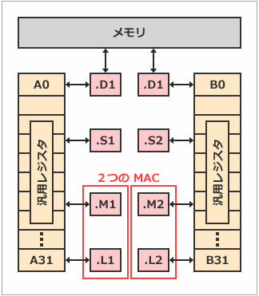

## DSP
Digital Signal Processor
Digital Signal Processing
2つの意味がある。

その名の通りデジタル信号処理に特化したプロセッサです。

自然界にある信号（光、音、震動など）はすべてアナログの信号であり、DSPはこれらのアナログ信号をデジタルサンプルリングした情報として入力する必要があります。また、DSPは四則演算をはじめとした特定の演算処理が、より高速に処理できるよう設計されています。

## DSPコアは積和演算が得意
DSPの大きな特長はハードウェアとして乗算器を持たせたことです。一般的なマイコンで乗算を実行する場合は加算を何度も実行しなくてはなりませんが、DSPは乗算器を使用することにより1サイクルで実行できます。

デジタル信号処理技術にはデータ圧縮・伸張、デジタルフィルタ、制御、認識がある。
これらのアルゴリズムには積和演算が多様されている。
積和＝乗算＋加算の演算のこと。
DSPは、この演算処理をより高速化するために作られた回路。

### 高速転送が可能なデータ転送方式
多くのDSPデバイスの内部バス構成は、ハーバード・アーキテクチャが採用されています。

プログラムメモリとデータメモリが共有となっているデータバスのノイマン・アーキテクチャと比べて、専用のデータバスを持たせることにより、高速なデータスループットが行えます。

なお、ノイマン・アーキテクチャは、ハーバード・アーキテクチャと比べ、必要なデータバスが少なく構成できることから安価に実現できるため、コスト重視のマイコン製品に採用されます。

はい、「DSP（Digital Signal Processor）」と「FPGA（Field Programmable Gate Array）」は**別物**です。  
以下のような違いがあります。

---

### DSP（デジタルシグナルプロセッサ）

- **概要**: デジタル信号処理に特化したプロセッサ（CPUの一種）。
- **特徴**: 乗算や加算などの演算を高速に行う命令セットを持つ。  
- **開発**: プログラム（ソフトウェア）を書いて動かす。
- **用途**: 音声・画像処理、通信機器、産業機器など。

---

### FPGA（フィールド・プログラマブル・ゲート・アレイ）

- **概要**: ユーザーが回路構成を自由に書き換えられるハードウェアチップ。
- **特徴**: 論理回路を自分で設計して実装できる。  
- **開発**: ハードウェア記述言語（VHDLやVerilog）で回路設計を行う。
- **用途**: 高速な信号処理、制御回路、プロトタイピング、AI推論など。

---

### まとめ

- **DSP**は「ソフトウェアで動作する演算専用CPU」  
- **FPGA**は「自分で設計できるハードウェア」

**別物ですが、どちらも信号処理などの分野で使われます。**  
FPGAの中にDSP回路を実装したり、DSPプロセッサとFPGAを組み合わせて使うこともありますが、基本的な仕組みは異なります。

---

**結論:**  
「DSPとFPGAは別物」→ **正しいです。**

## ＤＳＰ（Digital Signal Processor）　：　ディジタル演算処理装置でCPUの一種

ディジタル信号処理を行うための演算処理装置でＣＰＵの一種です。過去においては、信号処理で非常に多く使われる積和演算を高速処理する為、乗算＋加算機能を別のハードウェアで構成して高速化を実現していましたが、CPUモジュールの高速化にともない積和演算をCPU自体で実行する方向に変化してきました。

ＤＳＰは、一般的に入出力段に高速のＡＤ変換器やＤＡ変換器などを搭載し、信号処理系や制御系などの中核として使われます。また、ＨＤＤやROMなどからプログラムを書き換えるだけで、多種多様な機能を実現することが可能となります。使用目的の変更や機能を追加したい場合など、ソフトウェアの変更・追加で目的の演算処理が実現できるよう柔軟性をもってます。