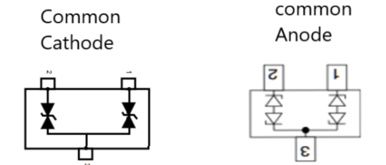

## 共通カソードとアノードの経緯

初期段階では、LED ディスプレイは主に、より大きなピッチの製品を使用した屋外用途に使用されていました。 これらは静的スキャン ドライブとして設計されているため、ドライバー IC の物理的なスペースの制限はありませんでした。 しかし、LED ディスプレイが屋内用途で使用され始め、ピッチの小さい製品が使用されると、電子部品を配置できるスペースが圧迫されます。 そこで、時分割多重（TDM）によるダイナミックスキャン駆動（ラインスキャン駆動）が登場します。 ラインスキャン駆動モードでは、LED ディスプレイはコモンカソードとコモンアノードの XNUMX つのタイプに分類できます。

## 共通カソードとは

共通カソードは、LED ディスプレイやその他の半導体デバイスで使用される構成で、各 LED のカソード (負極) が共通のグランドまたは共通の負極に接続されます。この設定は、7 セグメント ディスプレイや RGB LED などのマルチセグメント ディスプレイで特に一般的です。

### 一般的なカソード構成の仕組み

共通カソード構成では、複数の LED のカソード (負の端子) が共通のグランドに接続され、回路設計が簡素化されます。

各 LED のアノード (正の端子) は、個別の制御ラインに接続されます。LED を点灯するには、正の電圧がアノードに印加され、電流がアノードからカソードに流れ、LED が点灯します。

この設定は、共通のグランド基準で LED を制御するのに効率的であり、7 セグメント ディスプレイや RGB LED など、個別の LED 制御が必要なアプリケーションに最適です。

### 共通カソード構成の利点
共通カソード構成には、さまざまな電子アプリケーションで人気のある選択肢となるいくつかの利点があります。これらの利点には、グランド管理の簡素化、制御の容易さ、潜在的な電力効率などがあります。それぞれの利点を詳しく見てみましょう。

- よりシンプルな地上管理: すべてのカソードが共通のグランドに接続されているため、特に共通のグランド基準を使用するマイクロコントローラやその他のデジタル ロジック回路とインターフェイスする場合に、回路の設計が簡素化されます。
- 操作のしやすさ: 個々の LED への正電圧の制御がより簡単な回路では、管理が容易になります。
- 潜在的な電力効率: 共通グランド間の電圧降下が減少するため、特定のアプリケーションでは電力効率が向上する場合があります。

共通カソードは共通のグランドのこと。
構成はLEDのアノードが個別の制御ラインに接続され、カソードは全て共通とする。
個別のLED制御が必要なアプリケーションに最適。

## 共通アノード
共通アノードは、LED ディスプレイやその他の半導体デバイスで使用される構成で、各 LED のアノード (正極端子) が共通の正電圧に接続されます。この設定は、7 セグメント ディスプレイや RGB LED などのマルチセグメント ディスプレイで特に一般的です。

### 共通アノード構成の仕組み
共通アノード構成では、複数の LED のアノード (正極端子) が共通の正電圧源に接続されます。各 LED のカソード (負極端子) は個別の制御ラインに接続されます。LED を点灯するには、カソードに負電圧を印加し、共通アノードからカソードに電流を流して LED を点灯させます。この設定は、共通の正電圧を使用する回路に最適で、各 LED を個別に制御できます。

### 共通アノード構成の利点
共通アノード構成には、多くの電子アプリケーションで好まれるいくつかの明確な利点があります。これらの利点には、正論理システムとの互換性、電源設計の簡素化、設計の柔軟性などがあります。それぞれの利点を詳しく見てみましょう。

- ポジティブロジックシステムとの互換性: この構成は、共通アノードを正の電源電圧に直接接続できる正論理を使用する制御システムとのインターフェースが容易になることがよくあります。
- 簡素化された電源設計: 共通アノード構成により、共通の正電圧を利用するシステムの電源および制御回路の設計が簡素化されます。
- 設計の柔軟性: 共通アノード構成は、特に複数の LED を直列に接続したり、複雑なディスプレイ マトリックスを使用したりする場合など、特定のアプリケーションではより柔軟になります。

