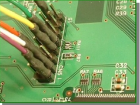
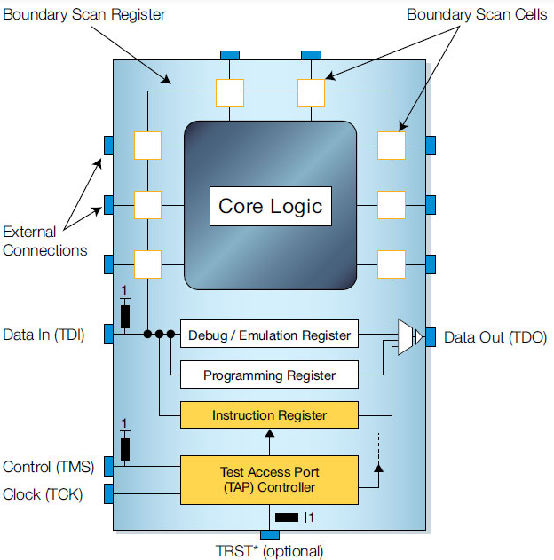
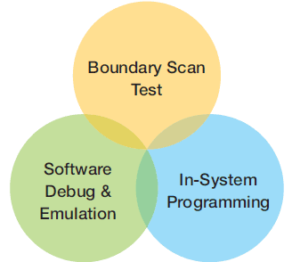
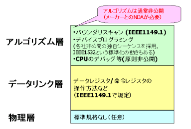

# JTAG
シリアル通信でICの内部回路と通信する仕組み。
最初にJTAGが登場したのは1990年代。基盤調査のための標準規格。

手軽に利用できたため、各メータがオプション機能やプライベート命令を使って自由に拡張し、いつのまにが統合デバッグインターフェースとして使われるようになった。
IFの仕様はIEEE1149.1で定義されている。
実際には半導体メーカがプライベート命令やオプションレジスタを使って拡張している。

JTAGによるデバッグやプログラミングは、JTAG技術の中から4本のJTAG信号接続からなる通信プロトコルのみを、単に利用しているに過ぎません。

## JTAGの由来
JTAGとは、企画を策定した団体の名称。
JTAGのGはGroupの意味。

## JTAGの信号線

- TCK: クロック
- TDI: データ入力
- TDO: データ出力
- TMS: 状態制御

これら4つのJTAG信号は、Test Access PortまたはTAPと呼ばれ、IEEE Std 1149.1の一部です。
この規格は、プローブ治具（ネイルベッド治具）の物理的アクセスを削減して、機能テストのカスタム開発を軽減する、プリント回路板アセンブリ（PCBA）のテスト技術を提供するために開発されました。

## JTAGの電気的な特性

これらの信号の電気的特性は、規格では定められていません。
各デバイスごとに、CMOSだったり、LVTTLだったり、LVCMOS18だったり、まちまちです。

## できること
- FPGAの書き込み
- CPUのデバッグ
- 基盤検査
- ICの内部回路とPC間の通信

## JTAGのプロトコルは公開されている?
JTAGの規格(IEEE1149.1)で定められているのは、JTAGのごく基本の手順のみ。
最近のJTAG対応Iデバイス、各ICメーカーがプライベート命令を使って拡張し、いろいろなオプション機能をつけている。

例えば、FPGA、CPLDの書き込みやCPUのデバッグはプライベート命令を使って実現
それらの拡張機能はデバイスメーカーが公開していないことが多いため、その使い方は簡単にはわかりません。

デバイスプログラミングの標準化規格には「IEEE1532」というのもありますが、全く普及する気配はありません。原則としてデバイスメーカーは不揮発性デバイスの書き込みアルゴリズムは公開したがりません。

## 今後の展望
基本的にFPGAメーカーやCPUメーカーは、JTAGの詳細情報を出したがりません。

かつては書き込みアルゴリズムを共通化しようとしたIEEE1532や、CPUのデバッグを共通化しようとしたNexusなどという動きもありましたが、全く普及していません。わざわざ競合他社と共通のプロトコルで何かをする必要性がないためです。FPGAやCPUのプライベート命令やプライベートレジスタは、今後ますますプライベート化していくでしょう。

## JTAGのソフトウェア
JTAGはあくまでも「規格」なので、使うためにはソフトウェアが必要になります。

JTAGはFPGAの書き込みや、CPUのデバッグ、基板検査、ICの内部回路とパソコン間での通信などができますが、それぞれ別のソフトウェアを使わなければなりません。

やりたいこと	使うソフトウェア	参考価格（他社製品）
CPUのデバッグ	JTAG-ICEと呼ばれるソフトウェア	A社 100万円　B社 100万円
基板検査	基板検査ソフトウェア	C社 150万円　D社1000万円
端子可視化	端子可視化ソフトウェア	E社 150万円
FPGAの書き込み	FPGA設計ツールに付属	F社 0円
ロジックアナライザ	FPGA設計ツールに付属	F社 0円
FPGAとPCの通信	市販されていない	-

# JTAG
JTAG（ジェイタグ、**Joint Test Action Group**）とは、主に**電子回路のデバッグやプログラミング、テストのために使われる標準化されたインターフェースとプロトコル**です。正式名称は「IEEE 1149.1 標準バウンダリスキャン」です。

---

## 主な特徴

- **デバッグや書き込み（プログラミング）用のインターフェース**
  - FPGA、マイコン、SoC、ASICなど多くのICでサポート
- **数本（通常4～5本）の信号線で接続**
  - TCK（テストクロック）、TMS（テストモードセレクト）、TDI（テストデータイン）、TDO（テストデータアウト）、（TRST：リセット、は省略されることも）
- **シリアル通信方式で、低ピン数・低コスト**

---

## 代表的な用途

1. **デバッグ**
   - 内部レジスタや信号の読み書き
   - ブレークポイントの設定やステップ実行（マイコンの場合）

2. **プログラミング**
   - FPGAやマイコンの書き込み（ファームウェア、ビットストリーム、ROMデータなど）

3. **バウンダリスキャンテスト**
   - 実装基板上の配線やIC間の接続確認
   - ハードウェアの製造検査

---

## 仕組み（簡単なイメージ）

- JTAG対応ICには「テストアクセスポート（TAP）」が内蔵
- TAPコントローラでシリアルにデータを受け取り、内部レジスタやI/Oピンの状態を制御
- 複数ICを「デイジーチェーン」で直列に接続できる

---

## 具体例

- **FPGA開発**  
  開発用PCとFPGAボードをJTAGケーブルで接続し、FPGAへの書き込みやデバッグ、内部信号の観測（Signal Tapなど）を行う
- **マイコン開発**  
  JTAG経由でプログラムを書き込んだり、ステップ実行や変数監視などのデバッグを行う

---

## まとめ

JTAGは、**電子回路のデバッグ・テスト・プログラミングのための標準的なインターフェース**であり、FPGAやマイコンなど多くのデバイスで広く利用されています。

