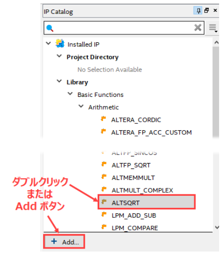
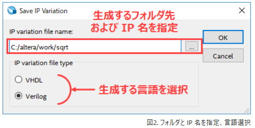
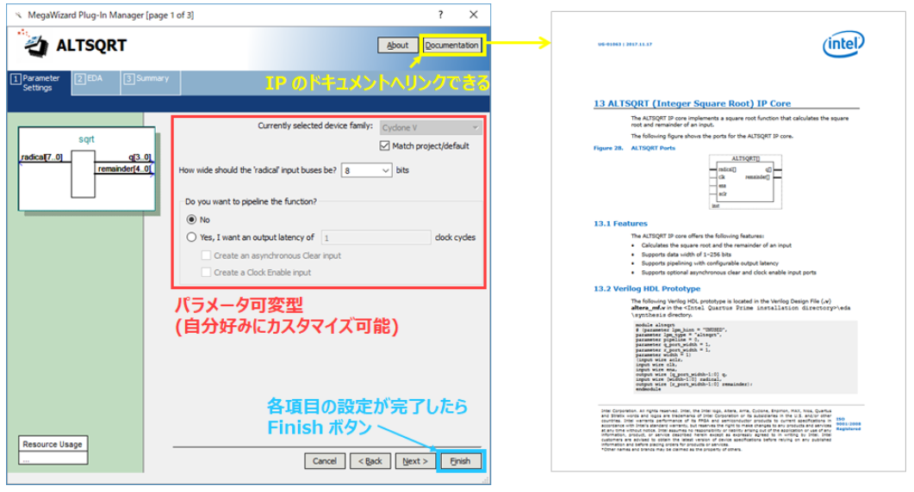
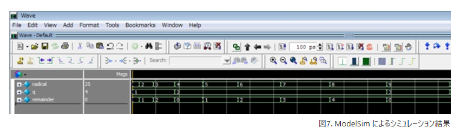
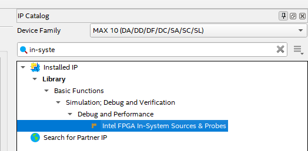

## QuartusでIP

https://www.macnica.co.jp/business/semiconductor/articles/intel/133360/


## IPの使い方

1.  Quartus の IP Catalog (Tools メニュー) から生成したい IP を選び、ダブルクリック もしくは Add ボタンを押します。



2. 生成するフォルダ先とその末尾に IP のファイル名 (今回は sqrt ) を指定し、生成する言語の種類 (今回は Verilog) を選択　(図2)



3. 選択した IP の画面 (ウィザード) が表示されます。

このウィザードを用いて自分の仕様を満たす IP を簡単にパラメータ設定できます。　(図3)

また、この IP の詳細情報は、右上の Documentation ボタンをクリックすることで、ユーザーガイドが表示されます。



この ALTSQRT という IP の機能は「入力値を平方した値を出力する」というものです。
設定が完了したら Finish をクリックします。

なんと、コードが出現しました！　(図8)

私の想いが伝わったのかもしれません。

 

…でも実は、(後から先輩に教わったのですが)

図4 の Open (File メニュー) で sqrt.v ファイルを指定した後に

"Open as オプション" を "Auto" から "Text" に切り替えて [開く(O)] ボタンをクリックすれば、sqrt.v がテキスト・エディタで開くのだそうです。

あぁ、私が無知なだけでした。お恥ずかしい…。

 

コードを下にスクロールすると module 宣言、ポート接続、インスタンス化を行っている HDL コードも確認できました。

sqrt.v をプロジェクトの最上位デザインとして登録し、コンパイルを実行します。



# デバッグ用IPコア

Quartus（Intel/Altera FPGA開発環境）で、**VIO（Virtual Input/Output）と同様にFPGAのデバッグに使えるIPコア**として代表的なものは、**「Signal Tap Logic Analyzer」**です。

---

## Signal Tap Logic Analyzer とは？

- **FPGA内部の信号をリアルタイムで観測できるロジックアナライザ機能**をFPGA内にIPコアとして組み込むことができます。
- JTAG経由でPCと通信し、QuartusのGUI上で信号の波形や値を確認できます。
- VIOのように「値を書き込む」機能はありませんが、**内部信号の観測やトリガ設定・波形取得**が可能です。

---

## VIOのような信号の書き換え（入力）もしたい場合

Intel FPGA（Quartus）には、XilinxのVIOと全く同じ機能を持つ純正IPはありませんが、**「In-System Sources and Probes」**というIPコアが近い用途で使えます。

### In-System Sources and Probes

- **In-System Sources**：外部（PC）からFPGA内部に値を入力（書き込み）できる
- **In-System Probes**：FPGA内部の信号値を外部（PC）から観測できる
- これらを組み合わせることで、**VIOとほぼ同じように、内部信号の入力・観測が可能**です
- 使い方はQuartus Primeの「Tools」→「In-System Sources and Probes Editor」から設定

---

## まとめ

QuartusでVIOと同様にデバッグに使えるIPコアは以下の2つです。

1. **Signal Tap Logic Analyzer**  
   → 内部信号の観測・波形表示

2. **In-System Sources and Probes**  
   → 内部信号の観測と、外部からの値の書き込み（VIOに近い機能）

---

どちらもJTAG経由でPCから操作可能です。  
**VIOと同じことをしたい場合は「In-System Sources and Probes」を使うのが最も近い方法**となります。



# debugコード

はい、In-System Sources and Probesを使った簡単なVHDLデバッグ例を示します。  
ここでは、**FPGA内部の8ビットレジスタに外部PCから値を書き込み、その値をLEDに表示する**というシンプルなサンプルを作ります。

---

## 1. In-System Sources and Probesの概要

- **Source**：外部から値を書き込むためのIP（入力）
- **Probe**：内部信号を外部へ観測するためのIP（出力）

---

## 2. VHDL例

ここでは、`in_system_source` から値を受け取り、それを `led` 出力に接続する例です。

```vhdl
library ieee;
use ieee.std_logic_1164.all;
use ieee.numeric_std.all;

entity debug_test is
    port (
        clk : in std_logic;
        led : out std_logic_vector(7 downto 0)
    );
end entity;

architecture rtl of debug_test is

    -- In-System Source 信号宣言（Quartus IPで自動接続される）
    signal source_data : std_logic_vector(7 downto 0);

begin

    -- 受け取った値をLEDへ出力
    led <= source_data;

    -- In-System Source IPコアのインスタンス化
    in_system_source_inst : entity work.in_system_source
        port map (
            source_clk  => clk,
            source      => source_data
        );

end architecture;
```

---

## 3. 実際の手順（概要）

1. **QuartusのIP Catalogから「In-System Sources and Probes」を生成**  
   - 幅（ここでは8ビット）やポート名を設定し、VHDLファイルを生成
2. **上記のようにVHDLにインスタンス化して接続**
3. **コンパイルしてFPGAに書き込み**
4. **Tools → In-System Sources and Probes Editor**  
   - ここから`source`に値を書き込むと、LEDがその値に変化します

---

## 注意

- `in_system_source`のエンティティ名やポート名は、IP生成時の設定に合わせて修正してください。
- Probe機能も使いたい場合は、`probe`信号も追加し、内部信号を接続してください。

---


