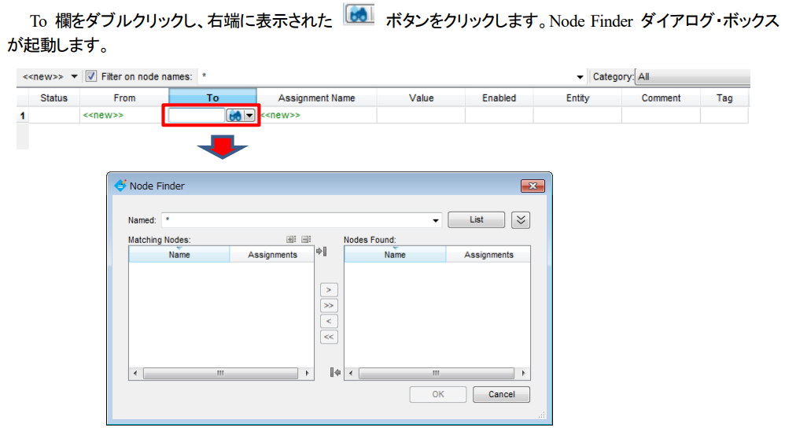
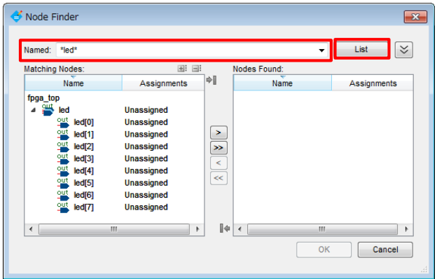

# 制約を設定する
https://www.macnica.co.jp/business/semiconductor/articles/pdf/ELS1414_Q1510_10__1.pdf#:~:text=%E6%9C%AC%E8%B3%87%E6%96%99%E3%81%AF%E3%80%81Quartus%C2%AE%20Prime%20%E9%96%8B%E7%99%BA%E3%82%BD%E3%83%95%E3%83%88%E3%82%A6%E3%82%A7%E3%82%A2%E3%81%AB%E3%81%8A%E3%81%91%E3%82%8B%E5%90%84%E7%A8%AE%E5%88%B6%E7%B4%84%E3%82%92%E8%A1%8C%E3%81%86%E3%81%9F%E3%82%81%E3%81%AE%20Assignment%20Editor%20%E3%81%AE%E4%BD%BF%E7%94%A8%E6%96%B9%E6%B3%95%E3%82%92%E7%B4%B9%E4%BB%8B%E3%81%97%E3%81%BE%E3%81%99%E3%80%82,Assignment%20Editor%20%E3%81%A8%E3%81%AF%E3%80%81%E3%81%82%E3%82%8B%E3%83%97%E3%83%AD%E3%82%B8%E3%82%A7%E3%82%AF%E3%83%88%E3%81%AB%E3%81%8A%E3%81%91%E3%82%8B%E3%83%A6%E3%83%BC%E3%82%B6%E3%81%8C%E8%A8%AD%E8%A8%88%E3%81%97%E3%81%9F%E5%9B%9E%E8%B7%AF%E3%81%AE%E3%83%94%E3%83%B3%E3%82%84%E3%82%A8%E3%83%B3%E3%83%86%E3%82%A3%E3%83%86%E3%82%A3%E3%81%AB%E5%AF%BE%E3%81%97%E3%81%A6%E3%80%81%E7%89%B9%E5%AE%9A%E3%81%AE%E8%A8%AD%E5%AE%9A%E3%82%84%E5%88%B6%E7%B4%84%E3%82%92%E8%A8%AD%E3%81%91%E3%82%8B%E3%81%9F%E3%82%81%E3%81%AE%20Quartus%20Prime%20%E9%96%8B%E7%99%BA%E3%82%BD%E3%83%95%E3%83%88%E3%82%A6%E3%82%A7%E3%82%A2%E3%81%AE%E3%82%B9%E3%83%97%E3%83%AC%E3%83%83%E3%83%89%E3%83%BB%E3%82%B7%E3%83%BC%E3%83%88%E3%81%A7%E3%81%99%E3%80%82

ご質問ありがとうございます。

## Quartusにおける「制約」とは

**Quartus（クアルタス）**は、Intel（旧Altera）社製のFPGA開発用統合設計環境（IDE）です。「制約（constraints）」とは、**FPGA設計において設計者がツールに対して与える“設計上の条件や要件”**のことを指します。


### 1. 制約の種類

主に以下のような制約があります：

#### ① ピン配置制約（ピンアサイン）
- **FPGAのどのピンに、どの信号（クロック、リセット、I/Oなど）を割り当てるか**を指定します。
- 例：どの物理ピンがLEDやスイッチ、クロック入力に対応するかを決める。
- 通常、「*.qsf」ファイル（Quartus Settings File）に記述します。

#### ② タイミング制約
- **信号のタイミング要件（クロック周波数、遅延、セットアップ/ホールドタイムなど）**を指定します。
- 例：「このクロックは100MHzで動作する」「このパスは10ns以内で伝播しなければならない」など。
- 「*.sdc」ファイル（Synopsys Design Constraints）に記述します。

#### ③ その他の制約
- **I/O規格の指定**（LVTTL、LVCMOSなど）
- **マルチサイクルパスやFalse Pathの指定**
- **エリア制約**（特定のロジックをFPGAの特定領域に配置する場合など）


### 2. 制約の目的

- **FPGAの物理的な配線と論理設計を正しく結びつける**
- **設計の動作保証（タイミング違反や誤動作の防止）**
- **ツールによる自動配置・配線（P&R）の最適化をガイドする**


### 3. 制約ファイルの例

#### ピン配置制約（QSFファイル例）

```
set_location_assignment PIN_A9 -to clk
set_location_assignment PIN_B8 -to rst_n
set_location_assignment PIN_C7 -to led[0]
```

#### タイミング制約（SDCファイル例）

```
create_clock -name clk -period 10.0 [get_ports clk]   # 100MHzクロック
set_input_delay 2.5 -clock clk [get_ports rst_n]
```


## Assignment Editor
Assignment Editorとは、あるプロジェクトにおけるユーザーが設計した回路のピンやエンティティに対して、特定の設定や製薬を設けるためのQuartus Prime 開発ソフトウェアのスプレッド・シート


>スプレッドシート  
>データを表形式で管理するためのソフトウェア

デバイス特有の機能を有効にすつあめのオプション設定やピンアサイン、I/O規格の指定が1枚のシート上で行えるツール

>ピンアサイン
>チップやこねくったには外部の端子に接触あるいは雪像させるための金属性のピンｈが並んでおり、内部の特定の回路や信号線や電力線につながっている
>それぞれのピンの役割や電話つなどの仕様は決まっていて、これをピンアサインという

ユーザー回路に対してオプションを設定するため、ユーザー回路の情報が必要

※ 既にコンパイルが完了している場合には、これら以下の操作は不要です。
ユーザ回路の論理合成前の情報を取り込む場合
－ Processing メニュー ⇒ Start ⇒ Start Analysis & Elaboration を実行します。
ユーザ回路の論理合成後の情報を取り込む場合
－ Processing メニュー ⇒ Start ⇒ Start Analysis & Synthesis を実行します。

## オプションの設定方法

### オプション
FPGA設計や各種フローや動作に対してユーザーが設定できる動作パラメータや選択肢のこと。

__オプションの概要__  
- 制約が設計の要件や条件を指定するのに対して、オプションはツール動作や処理方法をユーザーが選択・調整できる設定項目。
- オプションはQuartusのGUIやコマンドラインから設定します

__オプションの主な種類__  
1. 合成・配置配線（Synthesis/Place&Route）に関するオプション
合成の最適化レベル（高速化重視か、面積削減重視か）
論理最適化の有無
配置配線アルゴリズムの選択

2. コンパイルやビルド全体のオプション
使用するデバイスファミリや型番の選択
コンパイル時の警告・エラーの扱い
インクリメンタル・コンパイルの有効化

3. シミュレーションやテストベンチ関連のオプション
シミュレータの種類
シミュレーション波形の出力設定

4. 出力ファイルやプログラミングに関するオプション
出力するビットストリーム（.sof, .pofなど）の種類
JTAGプログラミングオプション


|      | 制約（Constraint）                | オプション（Option）                         |
|------|-----------------------------------|----------------------------------------------|
| 目的 | 設計の要件や動作条件を指定        | ツールの動作や処理方法・パラメータを指定    |
| 例   | ピン配置、タイミング制約など      | 合成最適化モード、デバイス選択、警告制御等  |
| 設定 | SDC, QSFファイル等                | QSFファイル、GUI、コマンドライン等           |


1. ノードの設定


NodeFinderでじょうけん指定すると検索しやすいです




