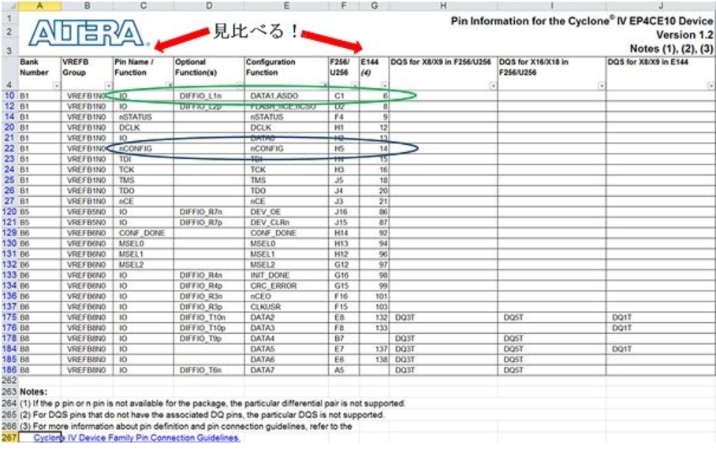

https://www.macnica.co.jp/business/semiconductor/articles/intel/95585/

__資料__

[ELS1411_Q1510_10__1.pdf](https://www.macnica.co.jp/business/semiconductor/articles/pdf/ELS1411_Q1510_10__1.pdf)

「Quartus Prime はじめてガイド - ピン・アサインの方法 ver.15.1」（ツール・バージョン：Ver.15.1 用ドキュメント）

ELS1364_Q1400_20__1.pdf

「Quartus II はじめてガイド - ピン・アサインの方法 ver.14」（ツール・バージョン：Ver.14.0 用ドキュメント（Rev.2））


## Live I/O Check
※ 事前に Analysis & Synthesis（Processing メニュー ＞ Start ＞ Start Analysis & Synthesis）以上のプロセスが実行されている必要があります。

 

Live I/O Check 機能の操作は、以下のとおりです。

 

① Pin Planner を起動します。（Assignments メニュー ＞ Pin Planner）

 

② View メニュー ＞ Live I/O Check Status Window を選択し、ウィンドウを表示させます。

 

③ Live I/O Check Status ウィンドウ内の Turn On Live I/O Check ボタン、

　 または Pin Planner 上の Processing メニュー ＞ Enable Live I/O Check ボタンをクリックし、ピン・アサインのチェックを実行します。


④ デザインで使用するユーザー I/O ピンや未使用ユーザー I/O ピンのアサイン (ピン番号、I/O 規格、Reserved オプションなど) を行います。

　 その都度チェックが行われ、I/O ルールに違反している場合は、Live I/O Check ウィンドウにエラーまたはワーニング・メッセージの数が

　 表示されます。同時に Pin Planner 上に現れた Messages ウィンドウ (System タブ) に、その内容がアナウンスされます。

　 メッセージの内容を確認し、メッセージのヘルプを活用しながら問題を回避します。


⑤ Live I/O Check ですべてのエラーを回避したら、I/O Assignment Analysis を実行し、さらに I/O ルールの検証を行います。

　 (I/O Assignment Analysis による検証後は、コンパイルを必ず実行してください。)

### ピンの性質

https://www.macnica.co.jp/business/semiconductor/articles/intel/218/



nCONFIG とは、LOW → HIGH と遷移させることによってコンフィギュレーションが開始される機能のピンで、コンフィギュレーション関連ピンの一つです。

nSTATUS や DCLK 、 DATA0 などコンフィギュレーションに必要なピンがどこにあるのか確認できます。


FPGAのピン配置（ピンアサイン）を考える手順は、以下のように進めると効率的で確実です。

---

### 1. **要件の整理**
- **回路図やシステム図を見て、FPGAと外部機器との接続信号（バス、クロック、制御信号など）をリストアップ**します。
- 必要な信号本数、I/O規格（電圧レベル）、クロックやリセットなどの特別な信号も整理します。

### 2. **FPGAのピン情報を確認**
- 使用するFPGAの**データシートやピン配置図（ピンアウト）**を入手します。
- **ユーザI/Oピン、専用ピン（クロック、JTAG、電源など）、I/Oバンクごとの電圧や対応規格**を確認します。

### 3. **信号グループごとに割り当て候補を決める**
- データバスやアドレスバスなど**まとまりのある信号は、できるだけ近くの連続したピンに割り当てる**と配線が楽になります。
- 差動信号（LVDSなど）は、**ペアで使えるピン**を選びます。

### 4. **基板レイアウトを意識して配置する**
- **基板上で配線が短く、交差が少なくなるようにピン配置を工夫**します。
- 外部コネクタやデバイスの位置も考慮し、**物理的に近い場所に関連する信号を割り当てる**と配線がシンプルになります。

### 5. **FPGAの制約を確認・反映**
- **I/Oバンクごとの電圧、許容電流、対応I/O規格**などFPGAの制約を満たしているかチェックします。
- クロック入力やリセットなど、**専用ピンが必要な信号**は必ず指定のピンに割り当てます。

### 6. **ピンアサインツールや制約ファイルで管理**
- **Xilinx VivadoのI/O Planning、Intel QuartusのPin Plannerなどのツール**を使うと、視覚的にピン配置を確認・編集できます。
- **制約ファイル（.xdc, .qsf, .ucfなど）**にピン割り当て情報を記述して管理します。

### 7. **電気的・論理的なチェック**
- **ツールのDRC（Design Rule Check）機能**で、競合や規格違反がないか確認します。
- 必要に応じて、**基板設計者と連携して最終調整**を行います。

### 8. **将来の拡張やデバッグも考慮**
- 予備ピンやデバッグ用信号も、余裕があれば割り当てておきます。

---

#### まとめ
1. **要件整理**
2. **FPGAピン情報確認**
3. **信号グループごとに割り当て候補決定**
4. **基板レイアウトを意識して配置**
5. **FPGAの制約反映**
6. **ツール・制約ファイルで管理**
7. **DRCでチェック＆調整**
8. **拡張・デバッグも考慮**

## ピンアサインの理解
PinAssignmentに存在するピンタイプは以下です。

**Pin Legend**

FPGAのPin Assignment（ピン割り当て）図における各アイコンや色の意味について、以下に解説します。  
各シンボルや色分けは主にIntel（旧Altera）やXilinxなどのツール（Quartus, Vivado等）でよく使われています。


### 1. **User I/O（白い円）**
- **意味**：ユーザーが自由に入出力として利用できる一般的なI/Oピンです。
- **用途**：任意の信号線（データバス、制御線など）としてFPGA設計者が割り当て可能。

---

### 2. **User assigned I/O（赤い円）**
- **意味**：ユーザーが明示的に割り当てたI/Oピンです。
- **用途**：設計者がピン配置ファイルやツールで指定したI/O。

---

### 3. **Fitter assigned I/O（緑の円）**
- **意味**：ツールのFitter（論理合成・配置配線ツール）が自動的に割り当てたI/Oピンです。
- **用途**：ユーザーが指定しない場合、ツールが自動で最適なピンに割り当てる。

---

### 4. **Unbonded pad（灰色の円）**
- **意味**：パッケージ上は存在するが、実際には基板や外部と接続されていない（ボンディングされていない）パッドです。
- **用途**：未使用、またはパッケージのバリエーションによるもの。信号の入出力には使えません。

---

### 5. **Reserved pin（紫の円）**
- **意味**：FPGA内部で予約されているピンです。ユーザーは利用できません。
- **用途**：内部用途や将来の拡張、テスト用など。

---

### 6. **DIFF_n（赤いアウトラインのnシンボル）**
- **意味**：差動信号のネガティブ（-）側ピンです。
- **用途**：LVDSなどの差動インターフェース用。通常ペアで使います（n: negative）。

---

### 7. **DIFF_p（赤いアウトラインのpシンボル）**
- **意味**：差動信号のポジティブ（+）側ピンです。
- **用途**：LVDSなどの差動インターフェース用（p: positive）。

---

### 8. **DIFF_n output（ピンクの塗りつぶし＋赤いアウトラインのnシンボル）**
- **意味**：差動出力のネガティブ（-）側ピンです。
- **用途**：FPGAから外部へ出力する差動信号のネガティブ側。

---

### 9. **DIFF_p output（ピンクの塗りつぶし＋赤いアウトラインのpシンボル）**
- **意味**：差動出力のポジティブ（+）側ピンです。
- **用途**：FPGAから外部へ出力する差動信号のポジティブ側。

---

### 10. **CLK_n（白い塗りつぶし＋黒いアウトラインのnシンボル）**
- **意味**：クロック入力の差動ネガティブ（-）側ピンです。
- **用途**：差動クロック（例：LVDSクロック）のネガティブ側入力。

---

### 11. **CLK_p（白い塗りつぶし＋黒いアウトラインのpシンボル）**
- **意味**：クロック入力の差動ポジティブ（+）側ピンです。
- **用途**：差動クロック（例：LVDSクロック）のポジティブ側入力。

---

### 12. **GX_X*n（緑のボックス内のX*nシンボル）**
- **意味**：高速シリアルトランシーバ（GX）の差動ネガティブ（-）側ピンです。
- **用途**：PCI ExpressやSFP+などの高速シリアル通信用のネガティブ側。

---

### 13. **GX_X*p（緑のボックス内のX*pシンボル）**
- **意味**：高速シリアルトランシーバ（GX）の差動ポジティブ（+）側ピンです。
- **用途**：高速シリアル通信用のポジティブ側。

---

### 14. **MSEL 0（黄色のボックス内の0）**
- **意味**：モード選択用ピン（Mode Select, MSEL）の0番ピンです。
- **用途**：FPGAの起動モード（例：JTAG, Active Serial, Passive Serial等）を設定するためのピン。


## 差動クロックの使い方
CLK_pとCLK_nは、FPGAの差動クロック入力に用いる信号線です。

__1. 基本的な使い方__

CLK_p：差動クロックのポジティブ（+）側信号
CLK_n：差動クロックのネガティブ（−）側信号
これらは必ずペアで使い、「クロック信号の電圧差（CLK_p − CLK_n）」としてFPGA内部で認識されます。

__2. どんなときに使う？__

高速クロックが必要な場合
ノイズの影響を受けやすい環境
ジッタ（タイミングのばらつき）を小さくしたい場合
LVDSやCMLなどの差動クロックドライバから入力を受ける場合


__3. 配線の注意点__

CLK_pとCLK_nは必ず同じ長さ・同じ経路で配線（ペア配線、インピーダンスマッチング）
隣接する差動ペアとのクロストークに注意
終端抵抗（一般的に100Ω）をペア間につける（LVDSの場合）

## Lチカ用のI/O

LEDのLチカ（LED点滅）をFPGAで行う場合、**一般的なユーザーI/Oピン（User I/O）**を使うべきです。


## 【理由とポイント】

1. **User I/Oピンとは？**
   - FPGAのピンアサイン図やデータシートで「User I/O」や「General Purpose I/O」と記載されているピンです。
   - これらのピンは入出力の設定が自由で、LEDなどの制御に適しています。

2. **使ってはいけないピン**
   - **差動信号用ピン（例：CLK_p, CLK_nなど）**  
     → これらは高速信号やクロック専用であり、LED点灯には向きません。
   - **電源ピン（VCC, GNDなど）や予約ピン（Reserved）**
     → 絶対に使用しないでください。
   - **特殊機能ピン（JTAG, MSEL, コンフィグレーション用など）**
     → FPGAの書き込みや設定に使うピンなので避けてください。

3. **配線の注意点**
   - FPGAのI/Oピンから直接LEDを駆動する場合、**直列に電流制限抵抗（330Ω～1kΩ程度）**を必ず入れてください。
   - FPGAのI/Oピンの**最大電流定格（通常8mA～24mA程度）を超えないように**注意してください。

4. **ピン割り当て例（Quartus/Vivado等）**
   - 例えば、LED1をFPGAの「PIN_A1」に接続した場合：
     ```
     set_location_assignment PIN_A1 -to LED1
     ```
     または
     ```
     set_property PACKAGE_PIN A1 [get_ports LED1]
     ```


## 【まとめ】

- **User I/Oピン（一般入出力ピン）を使う**
- 差動入力ピンやクロック専用ピンは使わない
- 電流制限抵抗を必ず入れる
- ピンの電流定格を守る

## 分かった
1. ピンアサインメントを考える場合、機器の要件を理解する
2. 要件に合うピンを、回路図より見つける
3. 2で見つけたピンをアサインする

