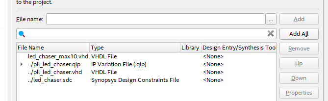
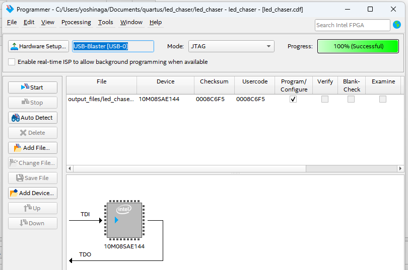

## **MAX10のPLL機能**

### **1. PLL種類**

* **フラクショナルPLL (Fractional PLL)** : 高精度な周波数合成
* **インテジャーPLL (Integer PLL)** : 整数倍の周波数生成

### **2. 主な機能**

* **周波数逓倍・分周** : 入力クロックから任意の周波数生成
* **位相シフト** : クロック位相の調整
* **デューティサイクル調整** : 50%以外のデューティ比設定
* **ジッタ除去** : クロック品質の向上

## **具体的な使用方法**

### **Quartus Prime での設定**

1. **IP Catalog** から "ALTPLL" または "Altera PLL" を選択
2. **PLL Configuration Wizard** で設定：
   * 入力周波数
   * 出力周波数（複数出力可能）
   * 位相設定
   * デューティサイクル

### **設定例**

```vhd
// 50MHz入力から100MHzと25MHzを生成
altpll pll_inst (
    .inclk0(clk_50mhz),    // 50MHz入力
    .c0(clk_100mhz),       // 100MHz出力
    .c1(clk_25mhz),        // 25MHz出力
    .locked(pll_locked)    // PLL ロック信号
);
```

## **利用上の注意点**

### **1. PLL数の制限**

* MAX10ファミリによってPLL数が異なる
* 一般的に1～2個のPLLが利用可能

### **2. 周波数範囲**

* **入力周波数** : 通常5MHz～800MHz
* **出力周波数** : デバイスにより異なる
* **VCO周波数** : 内部制約あり

### **3. ロック時間**

* PLL安定化に時間が必要
* `locked` 信号でPLL安定を確認

## **実用的な応用例**

### **1. システムクロック生成**

```vhd
// 外部50MHzから内部100MHzシステムクロック生成
wire sys_clk_100mhz;
wire pll_locked;

pll_100mhz pll_inst (
    .refclk(clk_50mhz),
    .rst(reset),
    .outclk_0(sys_clk_100mhz),
    .locked(pll_locked)
);
```

### **2. 複数クロックドメイン**

```vhd
// 1つのPLLから複数の異なる周波数を生成
wire clk_cpu;      // 100MHz
wire clk_memory;   // 133MHz  
wire clk_peripheral; // 50MHz
```

## **設計時の推奨事項**

1. **リセット設計** : PLL安定後にシステムリセット解除
2. **クロック分配** : 専用クロックネットワーク使用
3. **電源ノイズ対策** : アナログ電源の安定化
4. **熱設計** : PLL動作による発熱考慮

## led-chaiser

MAX10の内部PLLを使用したLED chaserのVHDLコードを生成しました。以下の3つのファイルを作成しています：

## **作成ファイル**

### **1. led_chaser_max10.vhd**

* メインのLED chaser実装
* 50MHz入力から1MHzクロックを生成するPLLを使用
* 8個のLEDを1秒間隔で順次点灯

### **2. pll_component_template.vhd**

* PLLコンポーネントのテンプレート
* Quartus PrimeのIP Catalogで実際のPLLを生成する際の参考

### **3. README.md**

* プロジェクトのセットアップガイド
* Quartus Primeでの設定方法
* ピン配置例とカスタマイズ方法

## **主な特徴**

### **PLL活用**

* 50MHz入力クロックから1MHzを生成
* PLLロック検出による安全なリセット制御
* クリーンなクロック分配

### **LED制御**

* 1秒間隔でLED0からLED7まで順次点灯
* モジュラー設計で簡単にパターン変更可能
* リセットボタンでパターン初期化

### **設計の特徴**

* 同期リセット設計
* PLL安定化待ち機能
* 拡張しやすい構造

実際に使用する際は、Quartus PrimeでPLL IPコアを生成し、ボードに合わせてピン配置を調整してください。

## 実装手順

## **Step 1: Quartus Primeプロジェクトの作成**

### **1-1. 新規プロジェクト作成**

1. Quartus Primeを起動
2. **File → New Project Wizard** を選択
3. プロジェクト設定：
   * **Project Directory** : `C:\led_chaser_project`
   * **Project Name** : `led_chaser_max10`
   * **Top-level entity** : `led_chaser_max10`

### **1-2. デバイス選択**

1. **Family** : MAX 10
2. **Device** : 使用するボードに応じて選択

* DE10-Lite: `10M50DAF484C7G`
* その他のMAX10ボード: 適切なデバイスを選択

---

## **Step 2: PLLコアの生成**

### **2-1. IP Catalogでの操作**

1. **Tools → IP Catalog** を開く
2. **Basic Functions → Clocks; PLLs and Resets → PLL** を選択
3. **ALTPLL** をダブルクリック

### **2-2. PLL設定**

**General/Clock Settings**タブ:

* **What is the frequency of the inclk0 input?** : `50.0 MHz`
* **Create an 'areset' input to asynchronously reset the PLL** : チェック
* **Create a 'locked' output** : チェック

**Output Clocks**タブ:

* **Use this clock** : チェック
* **Clock name** : `c0`
* **Frequency** : `1.0 MHz`
* **Phase shift** : `0 deg`
* **Duty cycle** : `50%`

### **2-3. IPコア生成**

1. **Entity name** : `pll_led_chaser` に変更
2. **Finish** をクリック
3. ファイルが生成される：
   * `pll_led_chaser.vhd`
   * `pll_led_chaser.qip`

---

## **Step 3: VHDLファイルの追加**

### **3-1. メインファイル追加**

1. 先ほど作成した `led_chaser_max10.vhd` をプロジェクトフォルダにコピー
2. **Project → Add/Remove Files in Project** を選択
3. `led_chaser_max10.vhd` を追加
4. **Set as Top-Level Entity** を選択

### **3-2. ファイル構成確認**

プロジェクトに以下が含まれていることを確認：

* `led_chaser_max10.vhd` (Top-level)
* `pll_led_chaser.qip` (自動追加)
* `pll_led_chaser.vhd` (自動追加)

---

## **Step 4: ピン配置**

### **4-1. Pin Planner起動**

1. **Assignments → Pin Planner** を開く

### **4-2. ピン配置設定**

 **DE10-Liteボードの例** :

| Signal Name | Location | I/O Standard |
| ----------- | -------- | ------------ |
| clk_50mhz   | PIN_P11  | 3.3-V LVTTL  |
| reset_n     | PIN_B8   | 3.3-V LVTTL  |
| led_out[0]  | PIN_A8   | 3.3-V LVTTL  |
| led_out[1]  | PIN_A9   | 3.3-V LVTTL  |
| led_out[2]  | PIN_A10  | 3.3-V LVTTL  |
| led_out[3]  | PIN_B10  | 3.3-V LVTTL  |
| led_out[4]  | PIN_D13  | 3.3-V LVTTL  |
| led_out[5]  | PIN_C13  | 3.3-V LVTTL  |
| led_out[6]  | PIN_E14  | 3.3-V LVTTL  |
| led_out[7]  | PIN_D14  | 3.3-V LVTTL  |

### **4-3. 制約ファイル作成**

SDCファイル (`led_chaser.sdc`) を作成：

```sdc
# Clock constraints
create_clock -name clk_50mhz -period 20.000 [get_ports clk_50mhz]

# PLL derived clocks
derive_pll_clocks -create_base_clocks

# Input/Output delays
set_input_delay -clock clk_50mhz 2.0 [get_ports reset_n]
set_output_delay -clock [get_clocks {pll_led_chaser|altpll_component|auto_generated|pll1|clk[0]}] 2.0 [get_ports led_out[*]]
```



## **Step 5: コンパイル**

### **5-1. 解析とシンセシス**

1. **Processing → Start → Start Analysis & Synthesis** をクリック
2. エラーがないことを確認

### **5-2. フルコンパイル**

1. **Processing → Start Compilation** をクリック
2. コンパイル完了まで待機（数分）

### **5-3. 結果確認**

**Compilation Report**で以下を確認：

* **Flow Summary** : 成功していること
* **Resource Utilization** : リソース使用量
* **Timing Analyzer** : タイミング制約が満たされていること

---

## **Step 6: プログラミング**

### **6-1. プログラマー起動**

1. **Tools → Programmer** を開く

### **6-2. 設定ファイル追加**

1. **Add File** をクリック
2. `output_files/led_chaser_max10.sof` を選択

### **6-3. ハードウェア接続**

1. **Hardware Setup** をクリック
2. **USB-Blaster** を選択
3. ボードがUSBで接続されていることを確認

### **6-4. プログラミング実行**

1. **Program/Configure** にチェック
2. **Start** をクリック
3. プログラミング完了を待機

---

## **Step 7: 動作確認**

### **7-1. 期待される動作**

* LED0からLED7まで順次点灯
* 各LEDが1秒間点灯
* リセットボタンでLED0に戻る

### **7-2. トラブルシューティング**

**LEDが点灯しない場合:**

1. ピン配置を確認
2. ボードの電源を確認
3. プログラミングが成功したか確認

**タイミングが正しくない場合:**

1. PLL設定を再確認
2. COUNT_MAX値を確認
3. クロック制約を確認

---

## **Step 8: 追加機能（オプション）**

### **8-1. SignalTap Logic Analyzer**

デバッグ用に内部信号をモニタ：

1. **Tools → SignalTap Logic Analyzer** を開く
2. 監視したい信号を追加：
   * `pll_locked`
   * `led_counter`
   * `led_position`

### **8-2. カスタマイズ**

速度変更や異なるパターンの実装が可能

## **ファイル構成（最終）**

```
led_chaser_project/
├── led_chaser_max10.vhd          # Top-level entity
├── led_chaser_max10.qpf          # Project file
├── led_chaser_max10.qsf          # Settings file
├── led_chaser.sdc                # Timing constraints
├── pll_led_chaser.qip            # PLL IP file
├── pll_led_chaser.vhd            # Generated PLL
└── output_files/
    └── led_chaser_max10.sof      # Programming file
```





## **OSC_OUTの基本的な特性**

### **一般的な用途**

* **外部クロック出力** : 他の回路へのクロック供給
* **システムクロック分配** : 複数のデバイス間での同期
* **テスト用クロック** : デバッグやテスト目的

### **内部での再利用**

OSC_OUTを内部クロックとして使用する場合：

## **可能な接続方法**

### **方法1: 外部ループバック**

**FPGA内部 → OSC_OUT → 外部配線 → CLK_IN → FPGA内部**

* []()
* []()
* []()
* []()

**利点:**

* 確実な信号品質
* 外部でのバッファリング可能
* 標準的なクロック入力として認識

**欠点:**

* 外部配線が必要
* 基板スペースが必要
* 伝搬遅延が増加

### **方法2: 内部フィードバック**

**-- VHDL例（概念的）**

**component oscillator**

**    port (**

**        osc_out : out std_logic**

**    );**

**end component;**

**signal internal_clk : std_logic;**

**-- オシレータのインスタンス**

**osc_inst : oscillator**

**    port map (**

**        osc_out => internal_clk**

**    );**

**-- 内部クロックとして使用**

**process(internal_clk)**

**begin**

**    if rising_edge(internal_clk) then**

**        -- クロック同期処理**

**    end if;**

**end process;**

* []()
* []()
* []()
* []()

## **技術的な考慮事項**

### **1. クロック品質**

* **ジッタ** : OSC_OUTは専用クロック入力よりジッタが大きい可能性
* **スキュー** : 内部配線による遅延のばらつき
* **駆動能力** : 内部での駆動能力制限

### **2. タイミング制約**

**# SDCファイルでの制約例**

**create_clock -name osc_internal -period 20.000 [ge**t_nets internal_clk]

**# 遅延を考慮した制約**

**set_input_delay -clock osc_internal -max 3.0 [get_**ports input_signals*]

**set_output_delay -clock osc_internal -max 3.0 [get**_ports output_signals*]

* []()
* []()
* []()
* []()

### **3. 信号完整性**

* **負荷容量** : 内部での負荷が信号品質に影響
* **ノイズ耐性** : 専用クロックピンより劣る可能性
* **EMI** : 放射ノイズの増加

## **推奨される実装方法**

### **最適解: PLLを使用**

**-- OSC_OUTをPLLの入力として使用**

**component pll_from_osc**

**    port (**

**        inclk0  : in  std_logic;  -- OSC_OUT入力**

**        c0      : out std_logic;  -- クリーンなクロック出力**

**        locked  : out std_logic**

**    );**

**end component;**

**signal osc_clk : std_logic;**

**signal clean_clk : std_logic;**

**signal pll_locked : std_logic;**

**-- OSC_OUTをPLL入力に接続**

**pll_inst : pll_from_osc**

**    port map (**

**        inclk0 => osc_clk,     -- OSC_OUTから**

**        c0     => clean_clk,   -- クリーンなクロック**

**        locked => pll_locked**

**    );**

* []()
* []()
* []()
* []()

## **設計上の注意点**

### **1. クロックドメイン設計**

* OSC_OUTクロックは別のクロックドメインとして扱う
* CDC（Clock Domain Crossing）対策が必要
* 同期化回路の実装

### **2. パワー考慮**

* 内部でのクロック使用は消費電力増加
* クロックゲーティングの検討
* 不要時のクロック停止

### **3. テスト性**

* クロック経路の可視性確保
* デバッグ用の信号取り出し
* タイミング解析の複雑化

## **実用的な推奨事項**

### **推奨される用途**

✅ **低速制御クロック** (< 10MHz) ✅ **非クリティカルなタイミング** ✅ **テスト・デバッグ用途**

### **避けるべき用途**

❌ **高速データ処理** (> 50MHz) ❌ **クリティカルなタイミング** ❌ **高精度が必要なアプリケーション**

## **結論**

OSC_OUTを内部クロックとして使用することは技術的に可能ですが、以下の対策を推奨します：

1. **PLLを経由**してクロック品質を向上
2. **適切なタイミング制約**を設定
3. **低速・非クリティカル用途**に限定
4. **十分なテスト**でタイミングを検証

最も安全で推奨される方法は、専用のクロック入力ピンを使用することです。
