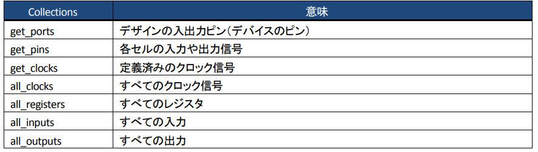

### SDC用語

| 用語 | 定義 |
| --------- | ----------------------------------------- |
| Cell | ロジックを構成するブロック(LUTやレジスタ、乗算器、メモリ) |
| Pin | Cellの入出力 |
| Net | Pin間の接続 |
|Port | 最上位層の入力と出力。例:デバイスピン |

Name Finderで指定するCollectionsとはPortやPinなどの名前のリストをデザインのネットリストから検索して中sh通するために使用する。

