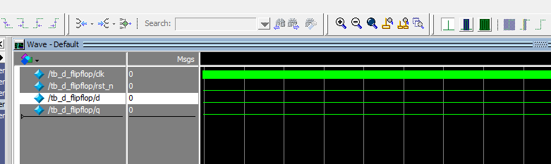

# 問題

SystemVerilogの簡単な例題として、一般的なデジタル回路の基本要素である**Dフリップフロップ（D Flip-Flop）**の実装コードをしてください。

Dフリップフロップは、クロック（`clk`）の立ち上がりエッジでデータ（`d`）を保持し、リセット（`rst_n`）で状態を初期化する基本的なメモリ要素です。

Dフリップフロップの挙動について、ご提示いただいたSystemVerilogコード（`d_flipflop.sv`）に基づき、その基本的な動作原理を言語化して解説します。

Dフリップフロップは、デジタル回路における\*\*「記憶（メモリ）」\*\*の最小単位であり、「クロック」という信号に完全に制御される点が特徴です。

## Dフリップフロップの挙動の言語化

ご提示のコードが実装しているDフリップフロップは、**非同期リセット付きのエッジトリガ方式**です。その挙動は、以下の2つの主要な状態によって制御されます。

### 1\. リセット状態（非同期リセット）

* **条件:** リセット信号 `rst_n` が **'0' (Low)** になったとき。
* **挙動:** `rst_n` が '0' になると、**クロック信号 (`clk`) の状態に関係なく、即座に** 出力 `q` が '0' にクリアされます。
* **コード該当箇所:**
  ```system-verilog
  if (rst_n == 1'b0) begin
      q <= 1'b0; // qを即座に0にリセット
  end
  ```

  *（非同期リセットとは、クロックに同期せず、リセット信号が入った瞬間に動作することを意味します。）*

### 2\. データ保持/転送状態（通常動作）

* **条件:** リセット信号 `rst_n` が **'1' (High)** であり、かつ **クロック信号 `clk` が立ち上がった瞬間 (posedge clk)** のみ。
* **挙動:** クロックが立ち上がった瞬間に、入力 `d` の信号がどうなっていたかを「スナップショット」のように捉え、その値を出力 `q` に転送し、保持します。
  * **クロックが立ち下がる**、または**クロックが高い/低い状態を維持している間**は、入力 `d` がいくら変化しても、出力 `q` は**変化しません**（直前の状態を保持します）。
* **コード該当箇所:**
  ```system-verilog
  else begin
      q <= d; // クロックの立ち上がりエッジでdの値をqに転送
  end
  ```

### まとめ：記憶と制御

Dフリップフロップの役割は、入力データ `d` を\*\*「いつ」**出力 `q` に反映するかを**クロック信号で厳密に制御\*\*することにあります。

* **記憶機能:** クロックエッジ間で `q` の値を変化させないことで、1ビットの情報を「記憶」し続けます。
* **制御機能:** クロックという共通のタイミング信号を用いることで、システム内のすべての記憶素子が一斉にデータを更新することを可能にし、回路全体の同期を確立します。

### SystemVerilogの基本例：エッジトリガDフリップフロップ

このコードは、SystemVerilogで**ハードウェア記述言語（HDL）**として論理動作を記述する際の基本的な構文を示しています。

Dフリップフロップの実装

11月16日 13:45

### テストベンチ（Testbench）の例

上記の `d_flipflop`モジュールが意図通りに動作するか検証するためのテストベンチコードも示します。テストベンチは、ハードウェアのシミュレーション環境でのみ使用され、実際の合成（回路生成）には使われません。

Dフリップフロップのテストベンチ

### SystemVerilogの主要な要素解説

| **要素**                                | **説明**                                                                                                             | **Dフリップフロップの例での役割**                                                      |
| --------------------------------------------- | -------------------------------------------------------------------------------------------------------------------------- | -------------------------------------------------------------------------------------------- |
| **`module`**                          | デザインの論理的な境界。ポート（入出力）を定義します。                                                                     | `d_flipflop`の本体。                                                                       |
| **`input logic`/`output logic`**    | 信号の方向（入力/出力）とデータ型を定義します。                                                                            | `clk`,`d`,`q`などの信号定義。                                                          |
| **`always_ff`**                       | **順序回路** （フリップフロップ、レジスタなど）を記述するためのブロック。                                            | `q`の値がクロックエッジでのみ更新されることを保証します。                                  |
| **`@(posedge clk or negedge rst_n)`** | `always_ff`ブロックを実行するトリガ（イベント）を指定します。                                                            | `clk`の立ち上がりエッジ、または `rst_n`の立ち下がりエッジ。                              |
| **`<=`**                              | **非ブロッキング代入（Non-Blocking Assignment）** 。順序回路では必須であり、クロックエッジの直後に値が更新されます。 | `q <= d;`は、次のクロックサイクルで `q`に `d`の値をセットすることを意味します。        |
| **`$display / $monitor`**             | シミュレーション中にメッセージを出力するシステム関数。                                                                     | テストベンチ内で、デバッグや結果確認のために使用されます。                                   |
| **`#n`**                              | シミュレーション時間単位の遅延（n時間単位待つ）。                                                                          | テストベンチで、クロックを刻んだり、信号変化のタイミングを調整したりするために使用されます。 |


## 出力


