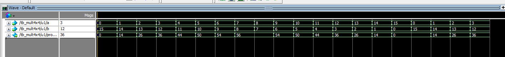

とても良い例です！

このコードは Verilog で書かれた **4×4bit 乗算器のテストベンチ**ですね。

SystemVerilog に修正する際のポイントは以下の3つです👇

---

## ✅ SystemVerilogへの主な修正点

| 修正箇所                                            | 理由                                                                         |
| --------------------------------------------------- | ---------------------------------------------------------------------------- |
| `reg`→`logic`                                  | SystemVerilogでは汎用的に `logic`を使用します。                            |
| `always #()`→`always_ff`または `always_comb` | 意図に応じて区別しますが、今回は単なる時間進行なのでそのままでOKです。       |
| 型推論・記述の明確化                                | SystemVerilogでは `timeunit/timeprecision`推奨 (`timescale`は古い記法)。 |

---

## 🧾 修正版 SystemVerilog コード

```systemverilog
`timescale 1ps/1ps

module mult4x4_sim;

    // 時間単位指定 (SystemVerilog推奨構文)
    timeunit 1ps;
    timeprecision 1ps;

    // 定数
    parameter CYCLE = 20000ps;

    // 入出力信号
    logic [3:0] a;
    logic [3:0] b;
    logic [7:0] product;

    // DUT（被テストデバイス）インスタンス
    mult4x4 u1 (
        .a(a),
        .b(b),
        .product(product)
    );

    // --- a のカウントアップ ---
    initial begin
        a = 4'b0000;
        forever #(CYCLE) a <= a + 1;
    end

    // --- b のカウントダウン ---
    initial begin
        b = 4'b1111;
        forever #(CYCLE) b <= b - 1;
    end

    // --- 波形出力＆終了処理 ---
    initial begin
        $dumpfile("mult4x4_sim.vcd");  // 波形ファイル名
        $dumpvars(0, mult4x4_sim);     // 全信号を記録
        #(CYCLE * 20);                 // 20サイクル分シミュレーション
        $finish;
    end

endmodule
```

---

## 💡 修正のポイント解説

1. **`logic` の導入**

   SystemVerilogでは `reg` / `wire` の使い分けを意識せず、

   原則として **`logic`** を使うのが推奨です。

   * `logic` は「レジスタにもゲートにも使える安全な型」です。
2. **`forever` 文の利用**

   Verilog の `always #()` でも動きますが、SystemVerilogでは

   `initial begin ... forever #(CYCLE)` の方が意図が明確です。
3. **`timeunit` / `timeprecision` の明示**

   `timescale` の代わりにこれを使うと、階層をまたぐシミュレーションで

   タイミング精度の不一致を防げます。
4. **波形出力 (`$dumpfile`, `$dumpvars`)**

   ModelSim や Verilator, Icarus Verilog で波形観察を行うための定番。

---

## 🔍 実行例（波形の想定）

| シミュレーション時間 | `a` | `b` | `product`（=a×b） |
| -------------------- | ----- | ----- | -------------------- |
| 0ps                  | 0     | 15    | 0                    |
| 20000ps              | 1     | 14    | 14                   |
| 40000ps              | 2     | 13    | 26                   |
| 60000ps              | 3     | 12    | 36                   |
| ...                  | ...   | ...   | ...                  |

---

もし希望があれば、この `mult4x4` モジュール本体も含めて

ModelSimで動かせる完全プロジェクト構成（`.sv` ファイル2枚構成）を出すこともできます。

出してみましょうか？



