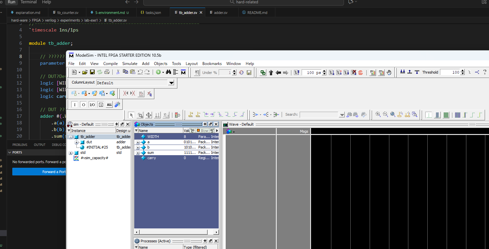

## system-verilogの実行環境

VS Code（Visual Studio Code）で SystemVerilog の開発／シミュレーション環境を整える手順をお伝えします。エディタとして VS Code を使う＋外部シミュレータを併用する形が一般的です。

---

## ✅ 環境構成の概略

1. VS Code 本体をインストール
2. SystemVerilog 用の拡張機能を入れる（シンタックスハイライト・補完など）
3. シミュレータを用意する（例： Verilator、または ModelSim／QuestaSim など）
4. VS Code のターミナルかタスクを使い、シミュレーション実行できるように設定
5. 必要に応じて波形ビューアや lint／フォーマッタなども追加

---

## 🛠 手順詳細

### 1. VS Code のインストール

公式サイトから最新版をダウンロードしてインストールします。

（Windows, macOS, Linux どれでも OK）

### 2. 拡張機能のインストール

VS Code の「拡張機能」ビューで、例えば以下をインストールすると良いです：

* “SystemVerilog – Language Support” 拡張（シンタックスハイライト、定義移動など） ([marketplace.visualstudio.com](https://marketplace.visualstudio.com/items?itemName=eirikpre.systemverilog&utm_source=chatgpt.com "SystemVerilog - Language Support - Visual Studio Marketplace"))
* “Verilog/SystemVerilog Tools” 拡張（補完・lint・フォーマッタ対応） ([marketplace.visualstudio.com](https://marketplace.visualstudio.com/items?itemName=AndrewNolte.vscode-system-verilog&utm_source=chatgpt.com "Verilog/SystemVerilog Tools - Visual Studio Marketplace"))
* “SystemVerilog and Verilog Formatter” 拡張（フォーマット用） ([marketplace.visualstudio.com](https://marketplace.visualstudio.com/items?itemName=bmpenuelas.systemverilog-formatter-vscode&utm_source=chatgpt.com "SystemVerilog and Verilog Formatter - Visual Studio Marketplace"))

### 3. シミュレータの準備

* 無料／オープンソース例としては Verilator が有名です。 ([ウィキペディア](https://en.wikipedia.org/wiki/Verilator?utm_source=chatgpt.com "Verilator"))
* 学生版やベンダ付属版として ModelSim／QuestaSim も選択肢となります。 ([Stack Overflow](https://stackoverflow.com/questions/15439710/modelsim-support-for-sv?utm_source=chatgpt.com "Modelsim support for SV - system verilog - Stack Overflow"))
* シミュレータをインストールして、VS Code のターミナルから実行できるようにパスを通しておきます。

### 4. VS Code との連携（タスク設定など）

* VS Code の `tasks.json` を使い、「シミュレート」タスクを作成すると便利です。

  例：

  ```json
  {
    "label": "Simulate SystemVerilog",
    "type": "shell",
    "command": "verilator -Wall -sv your_module.sv tb_module.sv && ./a.out",
    "group": {
      "kind": "build",
      "isDefault": true
    },
    "problemMatcher": []
  }
  ```
* もしくは、ターミナルで手動で `vlog -sv …` や `vsim` などを実行しても構いません。

### 5. 波形ビューア・Lint などの追加

* 波形ファイル（.vcd など）を生成できるようにし、GTKWave などで表示する流れを組むと便利。
* Lint（静的チェック）を拡張機能で有効化することで、コーディングミスや組合せ／順序回路の混在エラーなどを早めに発見できます。 ([Reddit](https://www.reddit.com/r/FPGA/comments/y3axnn/systemverilog_linting_in_vscode/?utm_source=chatgpt.com "(System)Verilog Linting in VSCode? : r/FPGA - Reddit"))

---

## 🧠 注意点／補足

* VS Code 自体は「編集環境」であり、 **シミュレータを内蔵しているわけではありません** 。つまり、シミュレーション実行には外部ツールが必須です。 ([Reddit](https://www.reddit.com/r/Verilog/comments/15vndsa/vs_code_and_modelsim_for_verilog/?utm_source=chatgpt.com "VS Code and Modelsim for Verilog - Reddit"))
* Windows環境ではパス指定（スペースや日本語が含まれないフォルダ）や権限などで動作がうまくいかないことがあります。
* SystemVerilog の特定の機能（UVM, coverage など）は使用するシミュレータによってサポート状況が異なるため、目的に応じて選定が必要です。

## Task.jsonとは

`tasks.json` は **Visual Studio Code (VSCode)** の設定ファイルの1つで、

VSCode から外部のコマンドやスクリプトを自動実行するための「タスク」定義ファイルです。

---

## ✅ 何のために使う？

たとえば SystemVerilog を VSCode で使うときに

* コンパイルコマンド（例：`vlog file.sv`）
* シミュレーションコマンド（例：`vsim work.testbench`）

を **VSCodeのショートカットで実行**できるようにします。

ターミナルで毎回手入力せずに済む、という仕組み。

---

## ✅ どこにある？

ワークスペースの `.vscode` フォルダ内に置きます。

```
.your_project/
 └─ .vscode/
     └─ tasks.json
```

VSCodeが自動で作ってくれることもあります。

---

## ✅ 内容例（ModelSimをタスク化）

例：`vlog` を実行するタスク

```json
{
  "version": "2.0.0",
  "tasks": [
    {
      "label": "Compile SystemVerilog",
      "type": "shell",
      "command": "vlog *.sv",
      "group": "build",
      "problemMatcher": []
    }
  ]
}
```

このタスクを使うと VSCode で

**Ctrl + Shift + B** だけでコンパイルできます。

---

## ✅ 簡単なイメージ

| 項目           | 意味                                               |
| -------------- | -------------------------------------------------- |
| tasks.json     | 「ボタンを押したら何を実行するか」設定するファイル |
| task           | 実行する処理（例：コンパイル・シミュレーション）   |
| VSCodeでの操作 | コマンドパレット `> Run Task`/`Ctrl+Shift+B`   |

---

## ✅ よくある用途

| 用途                     | コマンド例                               |
| ------------------------ | ---------------------------------------- |
| SystemVerilog コンパイル | `vlog *.sv`                            |
| シミュレーション開始     | `vsim -c work.tb -do "run -all"`       |
| Verilator 実行           | `verilator --cc top.sv --exe test.cpp` |
| Makefile の実行          | `make`                                 |

---

## ✅ 一言でまとめ

> **tasks.json = VSCodeでコマンドを自動化する設定ファイル**

コマンドラインの作業をワンキーで実行できるようにする便利機能です。

## エラー

```
Reading C:/intelFPGA/18.1/modelsim_ase/tcl/vsim/pref.tcl

# 10.5b

# vsim -c work.mult4x4_sim -do "run -all; quit"
# Start time: 13:59:47 on Nov 03,2025
# ** Error (suppressible): (vsim-19) Failed to access library 'work' at "work".
# No such file or directory. (errno = ENOENT)
# Error loading design
Error loading design
# End time: 13:59:47 on Nov 03,2025, Elapsed time: 0:00:00
# Errors: 1, Warnings: 0

```

エラーの原因は以下です：

```
Failed to access library 'work'
```

つまり、**ModelSim でコンパイルして "work" ライブラリが作られていない**ために、`vsim` がシミュレーション対象を見つけられていません。

---

## ✅ 必要なステップ

### 1) 初回だけ `vlib` で work ライブラリを作る

ModelSimでは最初に `work` ライブラリを作る必要があります。

手動で実行するならコマンド:

```
vlib work
vmap work work
```

---

## ✅ VSCode `tasks.json` の修正版

`vlib` → `vlog` → `vsim` の3段階にします。

```json
{
  "version": "2.0.0",
  "tasks": [
    {
      "label": "ModelSim: Create work",
      "type": "shell",
      "command": "C:\\intelFPGA\\18.1\\modelsim_ase\\win32aloem\\vlib.exe",
      "args": ["work"],
      "problemMatcher": []
    },
    {
      "label": "ModelSim: Compile (vlog)",
      "type": "shell",
      "command": "C:\\intelFPGA\\18.1\\modelsim_ase\\win32aloem\\vlog.exe",
      "args": ["*.sv"],
      "group": "build"
    },
    {
      "label": "ModelSim: Run Simulation",
      "type": "shell",
      "command": "C:\\intelFPGA\\18.1\\modelsim_ase\\win32aloem\\vsim.exe",
      "args": ["-c", "work.mult4x4_sim", "-do", "run -all; quit"],
      "group": "test"
    }
  ]
}
```

---

## ✅ 実行手順

1️⃣ **ModelSim: Create work**

2️⃣ **ModelSim: Compile (vlog)**

3️⃣ **ModelSim: Run Simulation**

順番に実行してください。

---

## ✅ ワンポイント

* `vlog *.sv` は **.svファイルがプロジェクト直下にある**前提
* モジュール名が `module mult4x4_sim` と一致している必要あり
* パス内に日本語があるとトラブルになりやすいので注意

---

## ✅ もしまだダメな場合

教えてください：

* `project` のフォルダ構成
* `.sv` ファイルの名前
* モジュール名

例：

```
project/
 ├─ .vscode/
 │   └─ tasks.json
 ├─ mult4x4.sv
 └─ mult4x4_sim.sv
```

## エラー

SystemVerilog（というより ModelSim / vsim）では、**実行時に作業ディレクトリ（カレントディレクトリ）を変更**できます。

---

## ✅ 方法1：VSCode Task でカレントを変更する（推奨）

`tasks.json` の各タスクに `options.cwd` を追加します。

例：SystemVerilogを置いているフォルダをワークディレクトリにしたい場合

```json
{
  "version": "2.0.0",
  "tasks": [
    {
      "label": "vlog compile",
      "type": "shell",
      "command": "C:\\intelFPGA\\18.1\\modelsim_ase\\win32aloem\\vlog.exe",
      "args": [
        "mult4x4.sv",
        "mult4x4_sim.sv"
      ],
      "options": {
        "cwd": "${workspaceFolder}"
      }
    },
    {
      "label": "vsim run",
      "type": "shell",
      "command": "C:\\intelFPGA\\18.1\\modelsim_ase\\win32aloem\\vsim.exe",
      "args": [
        "-c",
        "work.mult4x4_sim",
        "-do",
        "run -all; quit"
      ],
      "options": {
        "cwd": "${workspaceFolder}"
      }
    }
  ]
}
```

これで task 実行時のカレントが `.sv` のある場所になります。

---

## ✅ 方法2：PowerShell/Bash で `cd` してから実行

タスク内のコマンドを

```json
"command": "cd ${workspaceFolder} && C:\\intelFPGA\\18.1\\modelsim_ase\\win32aloem\\vsim.exe"
```

にする。

※ ただし **Windows CMD / PowerShell と WSL で書き方が変わるので非推奨**

`options.cwd` の方が安定します。

---

## ✅ 方法3：ModelSim TCL で変更

`vsim` の doスクリプト内で

```tcl
cd <your_directory>
```

例：

```tcl
cd C:/Users/.../project
vlib work
vlog *.sv
vsim work.mult4x4_sim
run -all
```

`.do` で1コマンドにまとめると便利。

---

## ✅ 補足：ModelSimは基本「実行場所前提」

ModelSimは

* `vlib`
* `vlog`
* `vsim`

のファイルを**カレントディレクトリに作る前提**で動いています。

なので

**.sv を直接フルパスで指定するより カレントを合わせる方が便利**です。

---

## 🔎 もしまだ困っているなら

回答できるので教えてください：

* 現在のフォルダ構成
* `.vscode/tasks.json`
* `.sv` のファイル名と場所

（スクショでもOK）


成功




## 実行手順

1. ctr + shift + P
2. run を選択
3. continue
