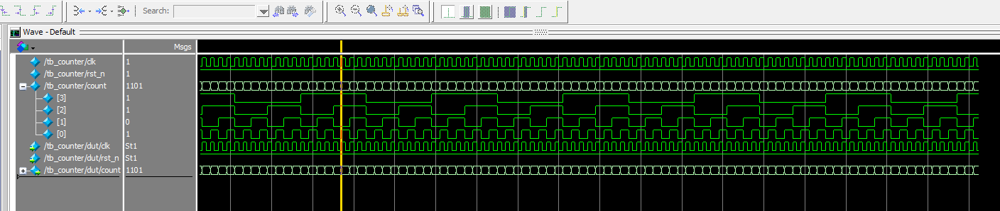
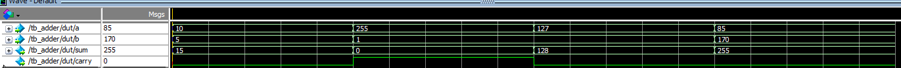
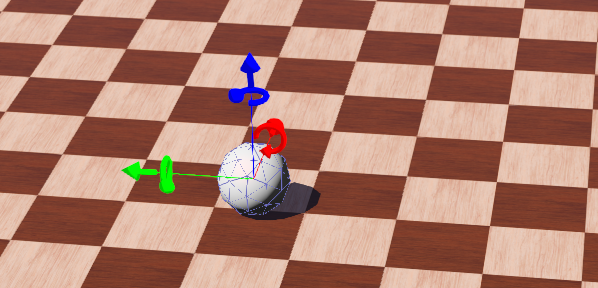
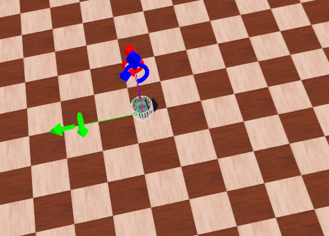

## 本レポジトリについて

ハード関連の知識や手を使ったワークに関するとりまとめを行う。

## 本レポジトリの目的

デジタル回路と、FPGA & ペリフェラル実物の知見を磨くこと。

## 本レポジトリのスコープ

1. FPGA
2. 汎用プロセッサ
3. デジタル回路
4. CPU
5. ロボビジョン

## ロボビジョン

画像データを使って空間を予測する技術。
VisualSlamなどの技術がある。

## FPGA実験の優良サイト

https://tetsufuku-blog.com/adc-max10-fpga/

評価ボードのスペックシート

https://cdrdv2-public.intel.com/666923/ug-max10m50-fpga-dev-kit-j-683460-666923.pdf

### FPGAのデバッグを行う

<video controls width="600">
  <source src="image/README/motion-robo1.mp4" type="video/mp4" controls="true">
  Your browser does not support the video tag.
</video>

https://www.macnica.co.jp/business/semiconductor/articles/intel/134097/

Quartusの場合、System Consoleを使用することで実現可能。
System Console (システム・コンソール)は、FPGA でデザインを実動作させながら JTAG 経由のデバッグが行える Quartus® Prime に搭載されているデバッグツール。

> JTAG
> シリアル通信によりIC内部と通信できる仕組み。
> 基板検査の標準規格だったが、拡張されて回路の内部を知りたい場合の標準規格のようになった。
> とは言え、統合されずメーカー別にバラバラの使い方しているため、一つのメーカの手法が他でも使えることは基本、ない。

## Robotics

webotsかwokwiでロボット制御の演習を行う。

<video controls width="600">
  <source src="video.mp4" type="video/mp4">
  Your browser does not support the video tag.
</video>

<video src="image/README/motion-robo1.mp4" controls="true">`</video>`

## 参考サイト

電子の性質から、電気が流れることについて理解するならば、このサイトは非常に良い。

[トランジスタ入門](http://www.maroon.dti.ne.jp/koten-kairo/works/transistor/Section1/intro7.html)
