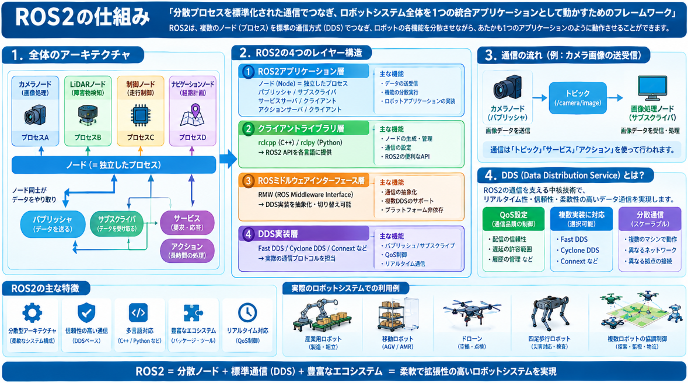

前回ロボット制御の話をしました。
そしてロボットを動作させる場合には複数の要素があることもわかりました。

一人であの制御ロジックを作るのでしょうか？
勿論複数人で開発します。

ですが、複数で作ったロジックを組み込む際に接合はかなりトラブルの温床です。
接合の課題を解決する技術はROS2と呼ばれるものです。

本日テーマ：
>ROS2について説明を行う。

## ROS2とは
ROS2（Robot Operating System 2）は、**ロボットアプリケーションを構築するためのミドルウェア（フレームワーク）** です。

ただし、その根幹には**通信プロトコルとしてDDS（Data Distribution Service）** を採用しているため、通信という観点から整理すると以下のようになります。

### ROS2の通信プロトコル：DDS

ROS2は、各プロセス（ノード）間のデータ通信に **DDS（Data Distribution Service）** という標準ミドルウェアプロトコルを使用しています。

__DDSとは__
- **OMG（Object Management Group）** が標準化した、**分散型のパブリッシュ/サブスクライブ（Pub/Sub）プロトコル**
- 中央サーバーを必要とせず、各ノードが对等（ピアツーピア）に直接通信
- リアルタイム性・高信頼性を重視した設計で、自動車・航空・産業機器で広く使われている実績のあるプロトコル

__ROS1との決定的な違い__
| 項目 | ROS1 | ROS2 |
|------|------|------|
| **通信プロトコル** | 独自実装（TCPROS/UDPROS） | DDS（標準プロトコル） |
| **マスター** | roscore（中央管理）が必須 | 中央管理なし（分散型） |
| **リアルタイム性** | 非対応 | 対応可能（DDSのQoS活用） |
| **セキュリティ** | 基本的な認証のみ | 暗号化・認証・Access Control対応 |
| **プラットフォーム** | Ubuntu中心 | Windows、macOS、組み込みRTOS等 |

### ROS2の通信アーキテクチャ

ROS2では、DDS上に**RMW（ROS Middleware Interface）** という抽象レイヤーを設け、その上にROS2のAPI（rclcpp/rclpy）が乗っています。

```
[ROS2アプリケーション]
      ↓
[rclcpp / rclpy] （C++/Pythonクライアントライブラリ）
      ↓
[RMW] （ROS Middleware Interface）
      ↓
[DDS実装] （Fast DDS、Cyclone DDS、RTI Connext等）
      ↓
[UDP/IP または Shared Memory]
```

__利用可能なDDS実装__

ROS2では複数のDDS実装から選べます。
- **Fast DDS**（eProsima製、デフォルト）
- **Cyclone DDS**（ZettaScale Technology系、軽量・高性能）
- **RTI Connext**（商用だが無料評価版あり）
- **Gurum DDS**（韓国産、組み込み向け）

### ROS2の通信パターン

ROS2ではDDSの上で、以下の3つの通信パターンを提供しています。

__1. トピック（Topic）通信__
- **非同期のPub/Sub型**、センサーデータや連続的な状態情報の流し込みに使用
- DDSのPub/Subをそのまま活用

__2. サービス（Service）__
- **同期のリクエスト/レスポンス型**、短時間で完了する処理（例：現在の姿勢を取得）

__3. アクション（Action）__
- **長時間実行タスクの非同期制御**、途中経過（Feedback）を受け取りながら、キャンセルも可能
- トピック＋サービスの組み合わせで実装

### QoS（Quality of Service）の重要性

ROS2がDDSを採用した最大の利点の一つが **QoS（Quality of Service）ポリシー**です。

| QoSポリシー | 意味 | 使用場面 |
|------------|------|---------|
| **Reliability** | Reliable（必ず届ける） vs Best Effort（尽力配信） | センサーデータはBest Effort、指令値はReliable |
| **Durability** | Volatile（揮発性） vs Transient Local（過去値保持） | マップ等の大きなデータ配信 |
| **Deadline** | 一定周期でデータが来ることを保証 | リアルタイム制御 |
| **Lifespan** | データの有効期限 | 古いセンサーデータを無視 |
| **History** | Keep Last（最新N件） vs Keep All（全件） | メモリ制約のある組み込み機器 |

例えば、LiDARの点群データは「最新1件だけあれば良い（Best Effort + Keep Last）」、制御指令は「絶対に届けて、順序も守る（Reliable）」といった使い分けが可能です。


## 必要性

ロボット制御においてROS2が必要な理由は、**「ロボットを構成する多様なソフトウェアモジュールを、安定してリアルタイムに、かつ柔軟に連携させるための標準的な土台が存在しないと、開発が破綻する」** からです。

以下、具体的な理由を整理します。

### 1. ロボット制御は「多くのモジュールの並行処理」である

ロボットを動かすには、同時に以下のような異なる処理が必要です。

- **センサ駆動層**: LiDAR・カメラ・IMU・エンコーダからのデータ取得
- **認識層**: 物体検出、深度推定、SLAM
- **判断・計画層**: 経路計画（A*, RRT）、タスク計画（Behavior Tree）
- **制御層**: PID/LQR/MPCによるモータ指令生成
- **アクチュエータ駆動層**: モータ・サーボへのPWM出力

これらを1つの巨大なプログラムに書くと、**メンテナンスが不可能**になります。ROS2はこれらを「ノード」という独立プロセスに分割し、標準化されたインターフェース（トピック・サービス・アクション）で連携させることで、**モジュール化された開発**を実現します。

### 2. リアルタイム性とQoSが制御品質を左右する

ロボット制御では、データの「届き方」が安全性に直結します。

- **LiDARデータ**: 10Hzで届けばよいが、最新の1件があれば十分（古いデータは不要）
- **関節トルク指令**: 1kHzで絶対に届く必要があり、順序も守られる必要がある
- **緊急停止信号**: どんな状況でも優先的に届く必要がある

ROS2のDDSベースの **QoS（Quality of Service）** を使えば、センサデータには「Best Effort」、制御指令には「Reliable」、緊急信号には「高優先度」といった使い分けが**通信レベルで設定可能**です。これにより、帯域を浪費せず、かつ重要な指令を確実に届けることができます。

### 3. シミュレーションから実機への移行がスムーズになる

例えば強化学習を実機に載せる際、ROS-2を用いることで **「シミュレータ用コード」と「実機用コード」を別々に書く必要がなくなります**。

- Gazebo（シミュレータ）上のロボットも、実機のロボットも、**同じROS2トピック名・メッセージ型**で制御できる
- 開発時はシミュレータでアルゴリズムを検証し、実機テスト時は同じノードを実機に接続するだけ
- この「**シミュレーションと実機の互換性**」が、ROS2の最大の実用上の価値の一つです

### 4. 複数ロボット・分散システムへの対応

複数のロボット（エージェント）が協調して動作するようば場面における協調を実現する通信手段となります。

- ROS1には「roscore」という中央マスターが必要で、複数機での分散には限界がありました
- ROS2はDDSのピアツーピア通信により**中央管理なし**で複数機が直接通信可能
- 各ロボットが自律的に起動・接続・切断でき、**スケーラブルな協調制御**が実現できます

### 5. セキュリティと産業現場への適用

実機を動かす上で、通信の改ざんや不正指令は致命的です。

- ROS2はDDS-Securityを活用し、**暗号化・認証・アクセス制御**を標準でサポート
- これにより、研究段階から産業現場（工場・物流・インフラ）への移行が現実味を帯びます

### 6. エコシステムの力（既存パッケージの再利用）

ROS2には、世界中の研究者・エンジニアが公開している**数千のパッケージ**があります。

- SLAM（`slam_toolbox`）、ナビゲーション（`Nav2`）、 MoveIt（アーム制御）、カメラドライバ等を**自分で一から実装する必要がない**
- 強化学習の方策ノードをROS2化すれば、これらの既存機能と即座に連携可能

## ROS-2の仕組み

ROS2の仕組みは、**「分散プロセスを標準化された通信でつなぎ、ロボットシステム全体を1つの統合アプリケーションとして動かすためのフレームワーク」** です。

以下、内側から外側へと順に説明します。

### 1. 全体アーキテクチャ

ROS2は大きく4つの層で構成されています。



### 2. ノード（Node）：ROS2の最小単位

ROS2では、ロボットの各機能を**ノード**という独立したプロセス（またはスレッド）として実装します。

__ノードの例__

| ノード名 | 役割 |
|---------|------|
| `camera_driver` | USBカメラから画像を取得しトピックに配信 |
| `object_detector` | 画像を受け取り、YOLO等で物体検出 |
| `path_planner` | 目標位置から経路を計算 |
| `motor_controller` | 速度指令を受け取り、モータPWMを出力 |

各ノードは**単一責任**を持ち、複数ノードが協調してロボット全体を動かします。

### 3. 通信メカニズム：3つのパターン

__3-1. トピック通信（Pub/Sub、非同期・連続）__

最も基本的な通信です。データを「流し続ける」パターンに使います。

```
[Publisherノード]  ──topic──►  [Subscriberノード]
   （センサ等）      /camera     （認識ノード等）
```

- **一対多**が可能：1つのPublisherに対し、複数のSubscriberが同時に購読できる
- **非同期**：SubscriberはPublisherがいつデータを出すかを気にせず待ち受ける
- **QoS設定可能**：Reliable/Best Effort、Keep Last/Keep All等をトピックごとに指定

__3-2. サービス通信（Request/Response、同期・即時）__

「今すぐ答えが欲しい」処理に使います。

```
[Clientノード]  ──request──►  [Serverノード]
                ◄──response──   （処理・計算）
```

- **一対一**通信
- 例：現在のロボット姿勢を問い合わせる、逆運動学を解いてもらう

__3-3. アクション通信（Goal/Feedback/Result、長時間タスク）__

長時間かかる処理を、途中経過を受け取りながら制御するパターンです。

```
[Client]  ──Goal────►  [Server]
          ◄──Feedback──  （「現在ここまで進みました」）
          ◄──Result────  （「完了しました」）
```

- 例：アームで「この物体を掴んでここへ運ぶ」、ナビゲーションで「この部屋まで移動」
- キャンセルも可能：途中で「やめて」と送れる

### 4. メッセージ型（Message Types）：通信の「言語」

ノード同士が通信する際、**どのようなデータ構造で話すか**をROS2が標準化しています。

__標準メッセージ型の例__
| メッセージ型 | 内容 | 用途 |
|------------|------|------|
| `std_msgs/Float64` | 64bit浮動小数点 | 単一の数値（温度等） |
| `geometry_msgs/Twist` | 線形速度(x,y,z) + 角速度(x,y,z) | 移動ロボットの速度指令 |
| `sensor_msgs/LaserScan` | LiDARの距離データ配列 + 角度情報 | 障害物検出 |
| `sensor_msgs/Image` | 画像データ（バイナリ）+ エンコード情報 | カメラ画像 |
| `nav_msgs/Odometry` | 位置・姿勢・速度の推定値 | 自己位置推定 |

独自のメッセージ型も `.msg` ファイルで定義でき、自動生成されます。

### 5. DDSとの連携：ROS2が通信を実現する仕組み

ROS2の通信の実体はDDSが担っています。ROS2はDDSの上に**RMW**という薄いラッパーを被せています。

__トピックがDDSでどう動くか__

```
ROS2層:  Publisher ──"/cmd_vel"──► Subscriber
              ↓                      ↑
RMW層:    write(topic)          read(topic)
              ↓                      ↑
DDS層:   DataWriter ──► [DDS Global Data Space] ──► DataReader
```

1. Publisherがメッセージを書き込むと、DDSの **DataWriter** がそれを受け取る
2. DDSは **Global Data Space**（分散共有メモリのような概念）にデータを配置
3. 同じトピック名を購読する **DataReader** が自動的にデータを受け取る
4. Subscriberのコールバック関数が発火

**ポイント**：DDSは「誰がどこにいるか」を自動発見し、IPアドレスやポートを意識せずに通信できます。これを **DDS Discovery** と呼びます。

### 6. エグゼキュータ（Executor）：イベント駆動の処理ループ

ノードは「何かが起きたら反応する」**イベント駆動型**です。そのイベントを処理するのが **Executor** です。

__Executorの種類__
| 種類 | 特徴 | 用途 |
|------|------|------|
| **Single Threaded Executor** | 1つのスレッドで全イベントを順次処理 | シンプルなノード |
| **Multi Threaded Executor** | 複数スレッドで並行処理 | コールバックが重い場合 |
| **Static Single Threaded** | オーバーヘッド最小化版 | リアルタイム制御 |

__イベントの例__
- トピックが届いた
- サービスリクエストが来た
- タイマーが発火した（制御周期のコールバック）

### 7. ツールチェーン：ROS2を支える周辺機能

__7-1. ビルドシステム：colcon__
- ROS2のパッケージをビルド・テストする標準ツール
- `colcon build` 一発で、C++はCMakeで、Pythonはsetuptoolsでビルド

__7-2. パッケージ管理__
- パッケージは `package.xml` で依存関係を宣言
- `apt` や `pip` とは別に、ROS2専用のパッケージ管理システム（`rosdep`）がある

__7-3. 起動システム：Launchファイル__
- XML/Pythonで記述可能
- 複数ノードを一括起動、引数の受け渡し、条件分岐が可能
- 例：`ros2 launch my_package robot.launch.py`

__7-4. TF（Transform Frame）__
- ロボットの各部位（カメラ、LiDAR、アーム先端）の座標系の関係を管理
- 「カメラ座標系での物体位置」を「世界座標系」に自動変換
- 時系列で座標変換を追跡できる（「1秒前のLiDARデータを今の自己位置に合わせる」等）

__7-5. ros2_control__
- ハードウェア（モータ・サーボ）と制御アルゴリズムを抽象化して接続
- Gazebo（シミュレータ）と実機で**同じ制御コード**を使えるようにする

### 8. 動作の流れ（具体例）

「LiDARで障害物を検出して、速度を減らす」という簡単な例でROS2の動作を追います。

```
[LiDAR Driverノード]
  → sensor_msgs/LaserScan を "/scan" トピックにPublish
       ↓
[Obstacle Detectorノード] (Subscriber)
  → 距離データを解析し、前方障害物距離を計算
  → geometry_msgs/Twist を "/cmd_vel" にPublish（減速指令）
       ↓
[Motor Controllerノード] (Subscriber)
  → Twistを受け取り、左右モータのPWM値に変換
  → 実機 or Gazeboのモータに指令
```

この全てが、**DDSによる自動発見・分散通信**でつながっており、各ノードは他のノードの存在場所（IP等）を知らなくても動作します。

## 総括

ROS2は、**「ロボットを構成する複数のソフトウェアを、標準化された通信でつなぎ、モジュールとして独立開発・統合できるようにする分散ミドルウェア」** です。

### 一望総括

| 観点 | 要点 |
|------|------|
| **本質** | ロボットの各機能（センサ・認識・計画・制御）を「ノード」という独立プロセスに分割し、標準通信で連携させるフレームワーク |
| **通信の実体** | DDS（Data Distribution Service）という産業用標準プロトコル。中央サーバーなしでピアツーピア通信 |
| **3つの通信形態** | **トピック**（Pub/Sub、連続データ）、**サービス**（Request/Response、即時処理）、**アクション**（Goal/Feedback/Result、長時間タスク） |
| **ROS1との違い** | 中央マスター（roscore）不要、リアルタイム対応、QoSで通信品質を制御、セキュリティ標準搭載、マルチプラットフォーム |
| **QoSの役割** | センサデータは「最新1件だけでよい」、制御指令は「絶対に届けて順序も守る」といった通信特性を、トピックごとに設定可能 |
| **実機への橋渡し** | Gazebo（シミュレータ）と実機が**同じトピック名・メッセージ型**で動作するため、シミュレーションで検証したコードをそのまま実機に接続できる |
| **分散・複数機対応** | DDSの自動発見により、複数ロボットが自律的に接続・協調。MARL等の複数エージェント制御に適している |
| **周辺ツール** | TF（座標変換管理）、ros2_control（ハード抽象化）、Launch（複数ノード一括起動）、colcon（ビルド）、rosdep（依存管理） |

### 一言でまとめると

> **ROS2とは、「誰が書いたコードでも、どのOS・どのマシン上でも、標準化された言葉（メッセージ型）と配達方式（DDS/QoS）でつなぎ合わせ、シミュレーションから実機まで一貫して動かせるロボット用の通信基盤」である。**

あなたの強化学習（MARL）の方策を実機に載せる際は、このROS2の「ノード」として実装し、センサトピックをSubscribeして制御指令トピックをPublishする形が、最も標準的で再現性のあるパターンになります。
