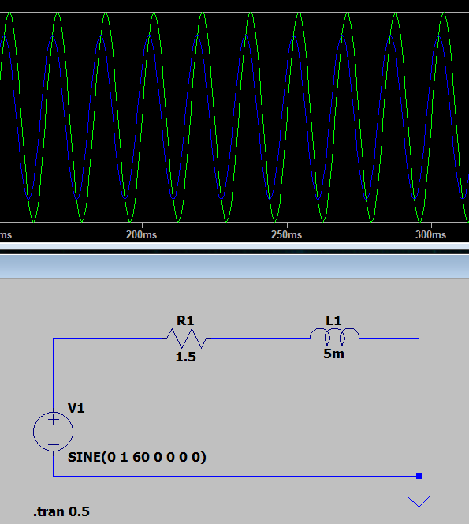
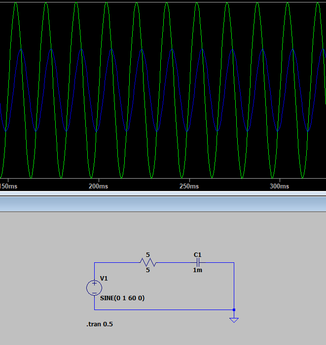
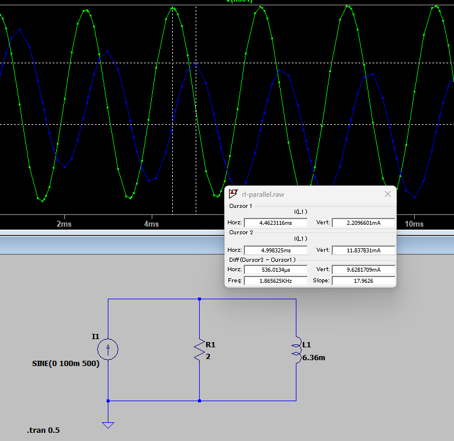
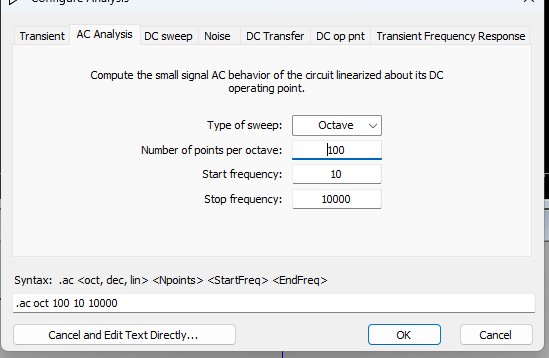
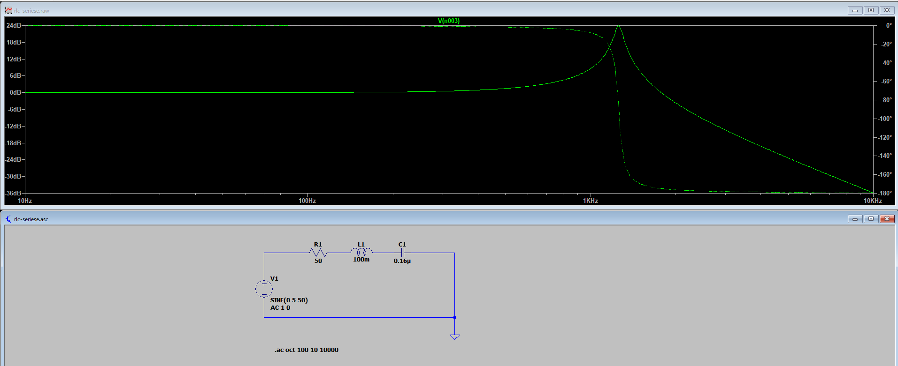
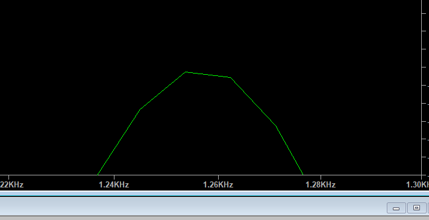
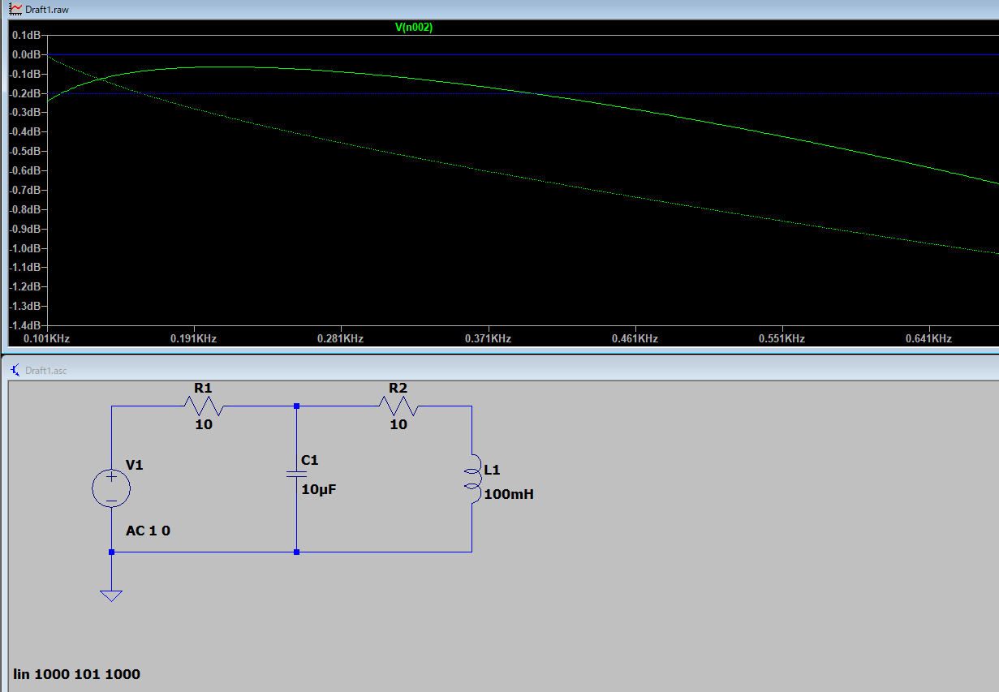

2.1 RL直列回路

f = 60Hz

Z = 1.5 + j 2πfL

= 1.5 + j1.8

遅れ = tan^-1(1.8 / √(1.5^2+1.8^2))

→遅れではなく37deg早まる(1/10程度)

### RC直列

f = 60Hz

Z=1.5+2.65j

φ=-41deg

### RL並列回路

### RLC共振回路

方法

回路の周波数特性を解析したい

その場合、電源sauceは1V0deg

sim条件を以下のように設定する

因みに今回の回路の共振周波数は1.25kHzでした！

