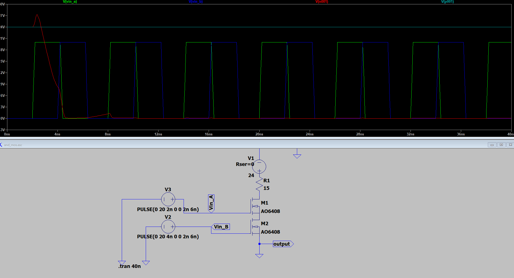
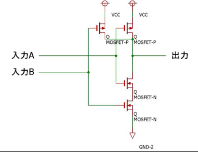
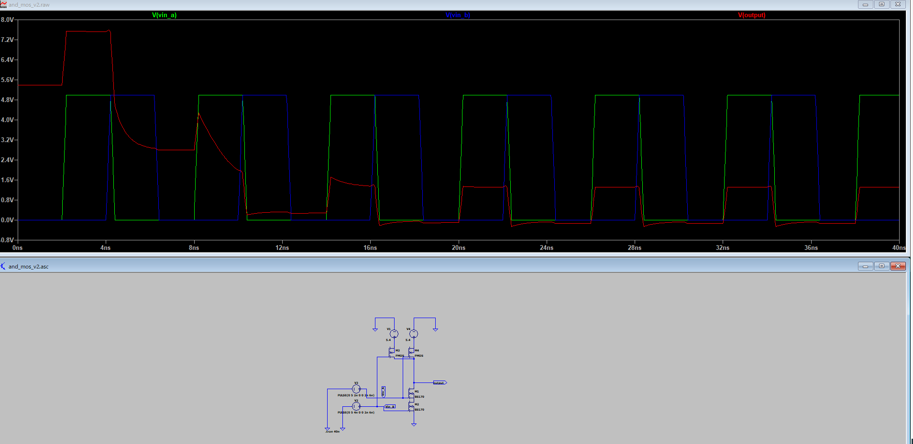

はい、LTspiceでANDゲートを作成する方法には大きく分けて2つあります。

1. **論理式（Behavioral Voltage Source）で作る方法**  
2. **トランジスタ（CMOSやNAND＋NOT構成など）で物理的に作る方法**

ここでは、**最も簡単で実用的な方法（Behavioral Voltage Sourceを使う方法）**と、  
**トランジスタで構成する例**の両方を紹介します。

---

## 1. Behavioral Voltage Source（bv）を使ったANDゲートの例

### 回路図イメージ

```
V1 (PULSE)    V2 (PULSE)
   |              |
  in1           in2
   |              |
   +------+
          |
         [B1]---- out
          |
         GND
```

### 回路図作成手順

1. **電源（V1, V2）を2つ配置**  
   - `F2`キー → `voltage` → 回路図上に2つ配置
   - それぞれ右クリックして「PULSE」波形を設定（例：`PULSE(0 5 0 1n 1n 1u 2u)`）

2. **ノード名を設定**  
   - V1の出力を「in1」、V2の出力を「in2」にリネーム

3. **Behavioral Voltage Source（bv）を配置**  
   - `F2`キー → `bv` → 回路図上に配置
   - 入力をin1, in2、出力をoutに接続

4. **bvの値（Value）を設定**  
   - bv部品を右クリックし、Valueに以下を入力  
     ```
     V=V(in1)>2.5 && V(in2)>2.5 ? 5 : 0
     ```

5. **GNDを忘れずに配置**

6. **シミュレーションコマンド**  
   - `.tran 0 10u` などを追加

### シミュレーション結果  
- in1とin2が両方HighのときoutがHigh（5V）になります。  
- それ以外はoutがLow（0V）です。

---

## 2. トランジスタで構成するANDゲート（NMOSのみ例）

### 回路図イメージ（NMOS 2直列）

```
Vcc
 |
[R]  (プルアップ抵抗)
 |
 +------ out
 |       
 |        
---      ---
| | Q1   | | Q2
| |      | |
GND     GND

Q1のゲート：in1
Q2のゲート：in2
```

### 回路図作成手順

1. **NMOSトランジスタを2つ直列に配置**
2. **プルアップ抵抗（R）をVccとoutの間に配置**
3. **Q1のゲートにin1、Q2のゲートにin2を接続**
4. **Vcc（例：5V）、GNDを配置**
5. **入力（V1, V2）をPULSEで設定**

### 動作
- in1とin2が両方Highのときのみ、outがLow（GND）に落ちます（NAND動作）
- outをNOT回路で反転させるとANDゲートになります

---

## まとめ

- **簡単に論理動作を確認したい場合はbv部品（Behavioral Voltage Source）で十分です**
- **物理回路を模擬したい場合はトランジスタで構成します**

---

### おすすめはbv部品の方法です！

もし具体的な回路図ファイル（.asc）やネットリストが必要であれば、お知らせください。  
また、トランジスタ回路の詳細な例が必要な場合もご相談ください。


失敗





これがAND回路




一応動作はした。

ただし、はじめの時に大きな電圧がかかっていて、この挙動は理由が分からない。


はい、ご質問の「MOSで作ったANDゲートで初めに大きな電流が流れる理由」について解説します。

---

## 回路の状況

あなたが使っている回路（NMOS直列＋プルアップ抵抗）は、  
**下記のような構成です：**

```
VDD
 |
[R1]（プルアップ抵抗）
 |
 out
 |
[M1]---[M2]
 |      |
GND    GND
```
- out端子はR1でVDD（5V）にプルアップ
- M1, M2はNMOSで直列接続
- 入力パルスでM1、M2のゲートを制御

---

## 現象：初めに大きな電流が流れる理由

### 1. **出力ノードの「充電」現象**
- シミュレーション開始時、outノードの電圧は0V（GND）に初期化されています。
- そこにVDD（5V）がR1を通じて一気に印加されるため、**outノードの寄生容量（C）**が急激に充電されます。
- このとき、**R1を流れる電流は一時的に大きくなります**（I = V/R1 で最大電流が流れる）。

### 2. **MOSFETがオンしている場合の「直流パス」**
- シミュレーションの始まりで**M1, M2の両方がオン状態**（ゲート電圧がHigh）だと、outノードは**プルアップ抵抗R1を通じてVDD**と、**M1, M2を通じてGND**に直結されます。
- つまり、**VDD → R1 → out → M1 → M2 → GND** という**直流パス**ができ、**R1に大電流が流れます**。
- この状態は「**シュートスルー電流**」や「**スルー電流**」と呼ばれ、MOSロジック回路の弱点です。

### 3. **寄生容量＋直流パスの合成効果**
- さらに、outノードの容量を充電しながら、直流パスにも大電流が流れるため、**シミュレーション初期に特に大きな電流が観測されます**。

---

## 対策

- **CMOS構成（PMOS＋NMOS）**にすると、両方が同時にオンになることがなく、直流パスができません。
- **プルアップ抵抗の値を大きくする**ことで電流を抑えられますが、スイッチング速度が遅くなります。
- **バッファやインバータを追加**して、出力を安定化させる方法も有効です。

---

## まとめ

- **初めに大きな電流が流れる主な理由は、出力ノードの充電と、MOSFETがオン状態でVDDからGNDへの直流パスが一時的にできるためです。**
- この現象はNMOSロジックやプルアップ抵抗を使った回路でよく見られます。


