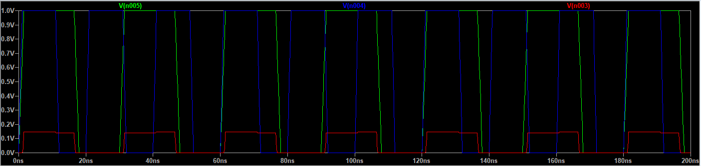

AND回路（論理積回路）をディスクリート部品で作る場合、**ダイオードを使う方法**（ダイオード論理、DL）と、**トランジスタを使う方法**（トランジスタ論理、TLやTTL）があります。それぞれの特徴と、どちらが「良い」といえるかを解説します。
 
---
 
## 1. ダイオードAND回路（ダイオード論理）
 
### 特徴
- **構成が簡単**（ダイオードと抵抗だけで作れる）
- **電圧降下が発生**（1入力あたりダイオードの順方向電圧降下：Siダイオードで約0.7V）
- **出力駆動能力が低い**（ファンアウトが小さい）
- **論理レベルが不安定になりやすい**（特に多段接続やノイズに弱い）
- **NOT回路（インバータ）が作れない**
 
### 回路例（正論理ANDの場合）
 
```
入力A ─┬─|>|──┬── 出力
        |       |
入力B ─┘─|>|───┘
             |
           プルダウン抵抗
            （GND）
```
 
---
 
## 2. トランジスタAND回路（トランジスタ論理）
 
### 特徴
- **出力駆動能力が高い**（ファンアウトが大きい）
- **論理レベルが安定**（ノイズ耐性が高い）
- **インバータや他の論理回路を構成しやすい**
- **電圧降下が小さい**（論理レベルがしっかり出る）
- **回路がやや複雑になる**（ダイオード論理より部品点数が多い）
 
### 回路例（NPNトランジスタによるAND）
 
例えば、NAND回路＋インバータでANDを構成するのが一般的です（TTLなど）。
 
---
 
## 3. どちらが良いか？
 
### 一般的には**トランジスタを使う方法**の方が「良い」とされます。
 
#### 理由
- **論理レベルがしっかり出る**（ダイオード論理は電圧降下でレベルが下がる）
- **出力駆動力が高い**
- **多段接続や大規模回路に向いている**
- **ノイズ耐性が高い**
 
#### ダイオード論理が有利な場合
- **回路が非常に簡単でよい場合**
- **部品点数やコストを最小限にしたい場合**
- **出力駆動力や論理レベル精度をあまり要求しない場合**
 
---
 
## まとめ
 
- **高品質で安定したAND回路を作りたい場合は、トランジスタを使う方法がおすすめです。**
- **簡易的な用途や、回路がごく小規模でよい場合のみダイオード論理も検討できます。**
- **大規模回路や信頼性が必要な用途では、トランジスタ（あるいはIC）による論理回路が一般的です。**
 



