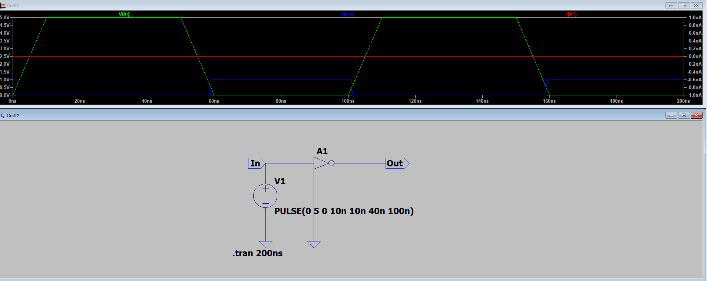
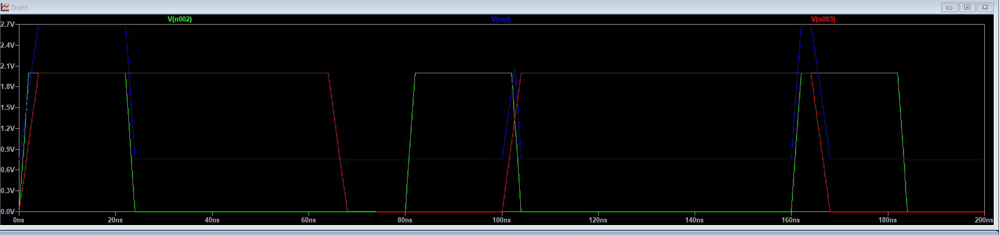
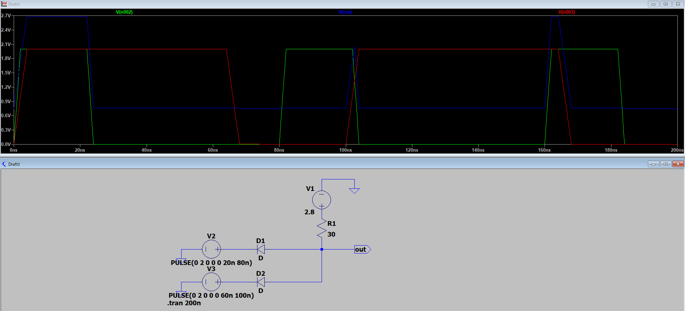
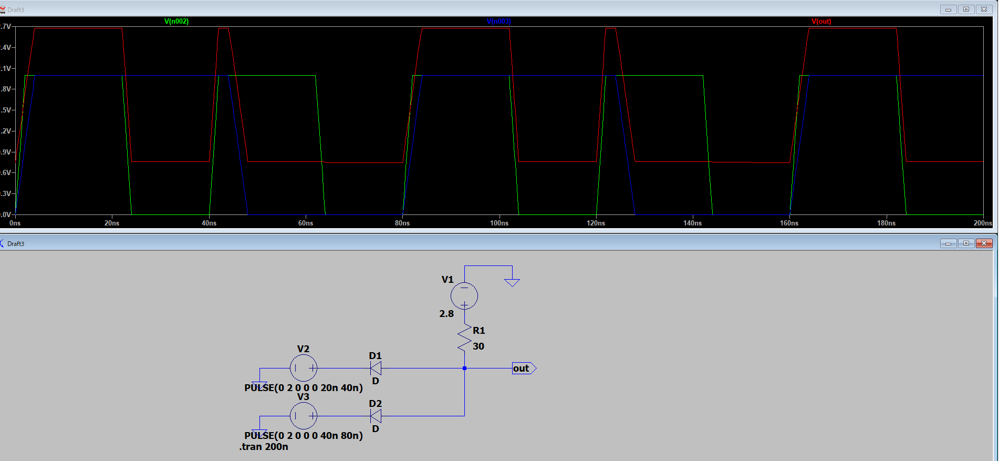

LTspiceでANDゲートを構築する手順を、**ディスクリート素子（トランジスタやダイオードなど）を使って自作する場合**と、**ICモデルを利用する場合**の2通りでご案内します。

---

# 1. ディスクリート素子でANDゲートを構築する例（NPNトランジスタ2個使用）

## 回路構成（2入力ANDゲート）

```
入力A ─┬─R1─┬─B（Q1）
        │     │
入力B ─┘    C（Q1）─R3─Vcc
              E（Q1）─B（Q2）
                      C（Q2）─R4─Vcc
                      E（Q2）─GND
出力 ─────────C（Q2）
```
※Q1, Q2：NPNトランジスタ、R1, R3, R4：抵抗

## 手順

1. **LTspiceを起動し、新規回路図を作成**
2. **部品配置**
   - NPNトランジスタ（`NPN`や`2N3904`など）を2個配置
   - 抵抗（`R`）を3～4本配置（ベース抵抗、コレクタ抵抗など）
   - 電源（`Vcc`として`V`）、グランド（`GND`）を配置
   - 入力A/B用に電圧源（`V`）を2つ配置
3. **配線**
   - Q1のベースにR1を介して入力A、Q2のベースにR2を介して入力B
   - Q1のコレクタをR3を介してVccへ、Q2のコレクタをR4を介してVccへ
   - Q1のエミッタをQ2のベースに接続、Q2のエミッタをGNDへ
   - 出力はQ2のコレクタから取り出す
4. **各素子の値を設定**
   - 例：R1, R2=10kΩ, R3, R4=1kΩ
   - Vcc=5V
   - 入力A/Bはパルス電圧源にして「0V⇔5V」で駆動
5. **シミュレーション設定**
   - `.tran`コマンドでトランジェント解析（例：`.tran 1ms 20ms`）
6. **動作確認**
   - 入力A/Bの電圧と出力の電圧をプローブで確認
   - 両方が「H」の時のみ出力が「H」になることを確認

---

# 2. ICモデルを利用する場合

LTspice標準ライブラリにはロジックICが含まれていませんが、外部モデル（例：74HC08など）を入手して使うことも可能です。

## 例：74HC08（2入力ANDゲートIC）

1. **74HC08のサブサーキットモデル（.subckt）を入手**
   - メーカーサイトやネットで「74HC08 spice model」などで検索
   - モデルファイル（.libや.txt）をダウンロード
2. **LTspiceにモデルを読み込む**
   - サブサーキットモデルをLTspiceのサポートファイルに追加
   - シンボル（`Component`→`Import Subcircuit`）を作成して回路図に配置
3. **ピン配置に従い、入力・出力・電源・GNDを配線**
4. **シミュレーション設定・動作確認は上記と同様**

---

# 3. 注意点

- LTspiceはアナログ回路シミュレータなので、ロジック回路のシミュレーションはディスクリート素子での自作が基本です。
- 本格的なデジタルICシミュレーションは、専用のモデルが必要です。

---

# 4. 参考回路例（NPNトランジスタ2個のANDゲート）

```plaintext
* 2入力ANDゲート例
Vcc 1 0 DC 5
VA 2 0 PULSE(0 5 0 1n 1n 5m 10m)
VB 3 0 PULSE(0 5 0 1n 1n 10m 20m)
R1 2 4 10k
R2 3 5 10k
Q1 4 6 0 2N3904
Q2 5 1 6 2N3904
R3 6 1 1k
.model 2N3904 NPN(IS=6.734f NF=1 BF=416.4 VAF=74.03 IKF=0.2846 ISE=6.734f NE=1.5 BR=0.7377 NR=1.5 VAR=11.18 IKR=0.2846 ISC=0 RE=0.5 RB=0.55 RC=1.5 CJE=4.388p CJC=3.638p TF=0.6n TR=50n)
.tran 0.1m 20m
.end
```

この回路をLTspiceで「ファイル→新規回路」で貼り付けてシミュレーションできます。

---

ご参考になれば幸いです。










Vin側を少しずらします。
80nsecでHighになるように設計したつもりがリップルが出てます。


