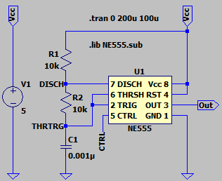
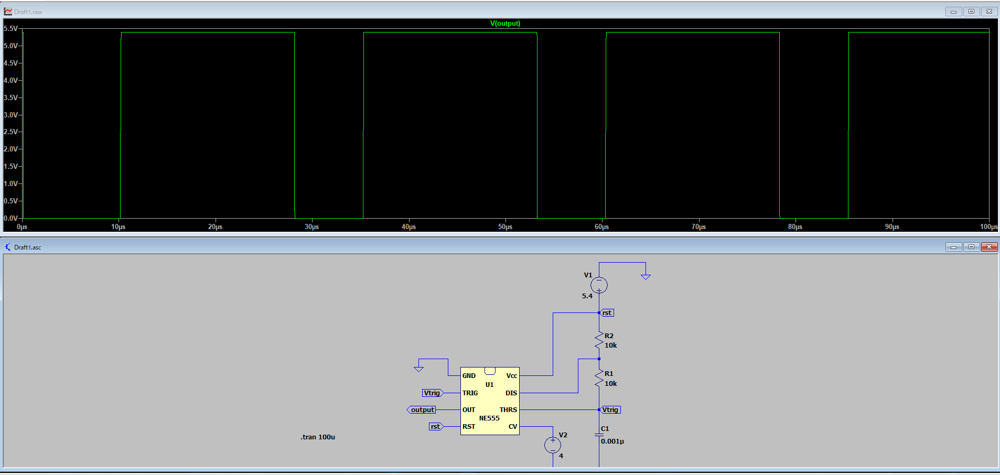
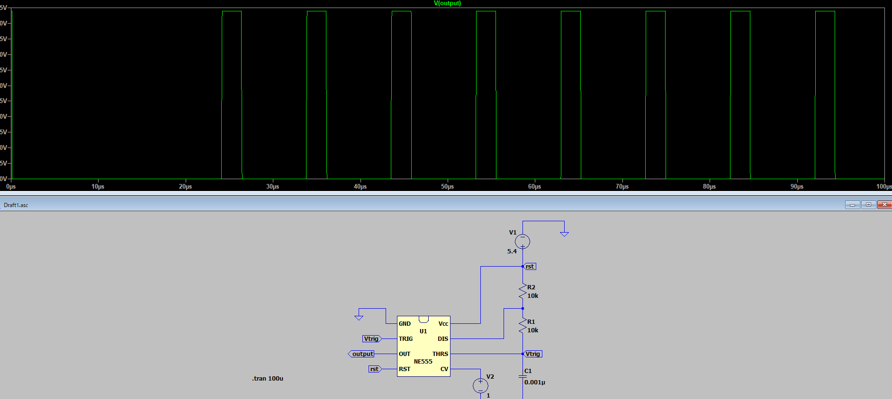

## NE555

| Pin | 名称      | 役割 |
|-----|-----------|----------------------------------------------------------------------------------------------------------------------------------------------------------------------------------------------------------------------------------------------------------------------------------------------------------------------------------------------------------------------------------------------------------------------------------------------------------------------------------|
| 1   | GND       | グラウンド基準電圧、ローレベル (0 V) |
| 2   | TRIG      | タイマーのOUT出力はTRIGピンに加えられる電圧の振幅に依存する。TRIG電圧をCTRL電圧の1/2以下にしたときOUTがハイレベルになりタイミングインターバルを開始する（CTRLピンをオープンにした時はCTRL電圧が標準でVCCの2/3になるためVCCの1/3以下で開始する）。THR電圧より優先されTRIG電圧をローレベルにしている限りOUTはハイレベルになる。|
| 3   | OUT       | ハイレベル出力時は+VCCより約1.7V低い電圧、ローレベル出力時はGND電圧でドライブされる。|
| 4   | RESET     | GNDに落とすとタイミングインターバルがリセットされ、約0.7V以上になるまで再始動しない。THRおよびTRIGよりも優先される。|
| 5   | CTRL (CONT) | タイミングインターバル制御の基準電圧を提供する（ピンをオープンにした時は標準でVCCの2/3になる）。|
| 6   | THR       | THR電圧をCTRL電圧以上にした時はOUTがローレベルとなりタイミングインターバルが終了する（CTRLピンをオープン時にした時は標準でVCCの2/3以上で終了する）。|
| 7   | DIS       | インターバル停止中(終了後)はオープンコレクタ出力としてコンデンサの放電などに使用する。OUT出力と同位相でOUTがハイレベル時はHi-Z出力、ローレベル時はローレベルを出力する。|
| 8   | VCC       | 多くの場合、3Vから15Vの正電源。|

### Vctr = 4Vの場合

デューティー比が上がる

### Vctr = 1Vの場合

デューティー比が下がる

ちょっと気になる挙動。
初めの間0が続く期間は何だろう？

