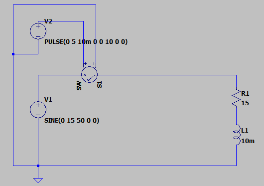
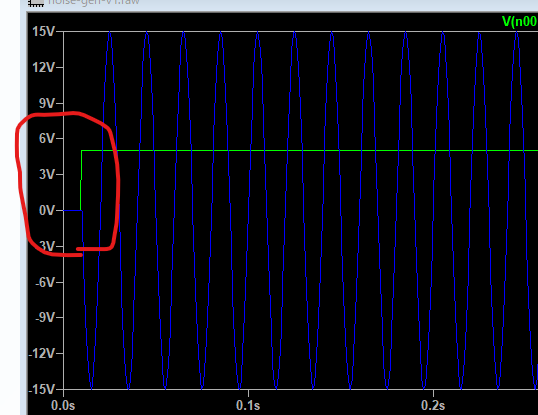

# SW

LTspice の **`SW`（スイッチモデル）** を使えば、電圧や電流でオン・オフを切り替えるスイッチを作ることができます。

---

## 🔹 スイッチの基本構成

LTspice でスイッチを置く方法は2種類あります：

1. **理想スイッチ（VSWITCH, ISWITCH）**
   * 電圧または電流で制御するスイッチ。
   * モデル (`.model`) で特性を指定する必要があります。
2. **シンボルの追加**
   * 部品配置で `sw`（Voltage Controlled Switch）や `csw`（Current Controlled Switch）を選んで配置できます。

---

## 🔹 例1: 電圧制御スイッチ（VSWITCH）

```spice
* VSWITCH example
Vin in 0 PULSE(0 5 0 1n 1n 1u 2u)   ; 制御用電圧（矩形波）

S1 n1 n2 Vin 0 SW                  ; n1-n2間をVinで制御するスイッチ
.model SW VSWITCH (RON=1m ROFF=1Meg VON=2 VOFF=1)

V1 n1 0 5
R1 n2 0 1k

.tran 0 10u 0 0.1n
.end
```

### 説明

* **S1 n1 n2 Vin 0 SW**
  * `n1-n2` がスイッチの両端
  * `Vin-0` が制御電圧入力
* **.model SW VSWITCH(...)**
  * `RON=1m` → ON抵抗
  * `ROFF=1Meg` → OFF抵抗
  * `VON=2` → Vinが2V以上でON
  * `VOFF=1` → Vinが1V以下でOFF

これで `Vin` が 0V〜5V のパルスを出すと、スイッチが ON/OFF します。

---

## 🔹 例2: 電流制御スイッチ（ISWITCH）

```spice
* ISWITCH example
Ictrl nc 0 PULSE(0 1m 0 1n 1n 1u 2u) ; 制御電流 0 or 1mA

S1 n1 n2 nc SW2
.model SW2 ISWITCH (RON=1m ROFF=1Meg ION=0.5m IOFF=0.1m)

V1 n1 0 5
R1 n2 0 1k

.tran 0 10u 0 0.1n
.end
```

### 説明

* 制御電流 `Ictrl` が 0.5mA 以上でON、0.1mA 以下でOFF。

---

## 🔹 よく使う設定

* **RON** : ON時の抵抗（小さくしすぎると収束しにくい → 数 mΩ〜数十 mΩ程度）
* **ROFF** : OFF時の抵抗（大きくしすぎると計算重い → 1MΩ〜1GΩ程度）
* **VON, VOFF** : ヒステリシスを持たせると収束が安定

---

## ✅ まとめ

* LTspice の `SW` モデルは **電圧や電流で制御できる理想スイッチ**
* `.model` で **RON/ROFF/VON/VOFF** を設定して使う
* 典型的には **Vin をパルスにして、切り替えタイミングを制御**する

---

👉 もしよければ、実際に「スイッチで  **2つの抵抗を切り替える回路例** 」を作ってみますか？


# 実演



結果、スイッチング出来るようになった。


