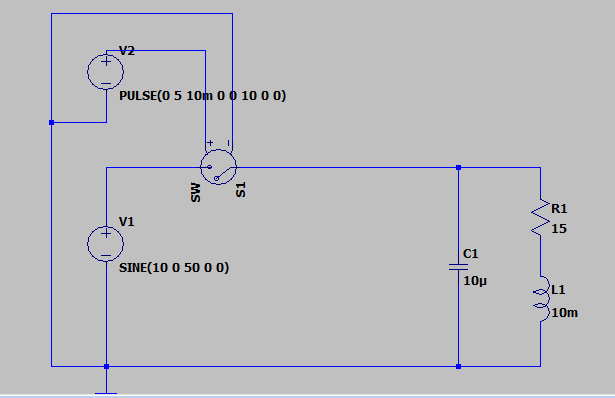
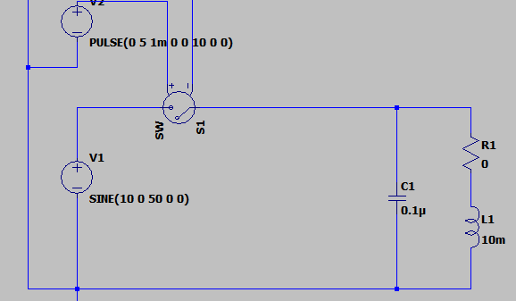

# LTSpiceでノイズ再現

---

## 🔹 再現するための基本的な工夫

### 1. **寄生要素を入れる**

実回路では配線や素子に必ず以下のような寄生成分が存在します。

* 配線インダクタンス（数 nH～数十 nH）
* 配線抵抗
* 素子の寄生容量（MOSFET の Cgs, Cgd, Cds、ダイオードの Cj など）

LTspice 上では **インダクタ・コンデンサ・抵抗を追加して寄生成分を模擬**します。

→ これでスイッチング時にリンギングが現れるようになります。

---

### 2. **素子モデルを精密にする**

* 理想スイッチ（SW素子や理想的なVswitch）は速すぎてノイズが出ません。
* MOSFETやダイオードを使うと、メーカー提供の SPICE モデルに寄生容量・逆回復特性が含まれているため、スイッチングノイズを再現しやすいです。

---

### 3. **電源やグラウンドのインピーダンスを持たせる**

* 電源やGNDを理想的に置くとノイズが見えません。
* 電源ラインに  **直列インダクタ** 、GNDに **インピーダンス** を加えることで、現実に近い波形になります。

---

### 4. **外付け部品をモデル化**

* スナバ回路（RC, RCD）
* デカップリングコンデンサ
* 配線のインダクタンス

  などを追加することで、ノイズ抑制効果も再現できます。

---

## 🔹 例：スイッチング電源のリンギング再現

1. MOSFET（メーカーSPICEモデル）を使う
2. スイッチングノードとGNDの間に配線インダクタ（例: 10nH）を追加
3. ダイオードは理想ではなく実デバイスモデルを使用
4. 電源ラインにESR付きコンデンサを配置

これでスイッチング時のオーバーシュート・リンギングが再現されます。

---

## 🔹 まとめ

* **できます**が、ノイズを再現するには「寄生成分をモデルに加える」ことが必須です。
* LTspiceのデフォルト素子は理想的すぎるため、 **実デバイスのSPICEモデル** ＋**配線インダクタンス・ESR/ESL** を入れるのがポイントです。

# リンギングを再現する最小回路

では、LTspice で **スイッチング時のリンギングを再現する最小回路例** を示します。

---

## 🔹 回路の概要

* **Vin** → MOSFET → 負荷RL → GND
* MOSFETの寄生容量（Cds）や、配線インダクタ（Lpar）を追加
* MOSFETはメーカー提供モデルを使うとさらにリアルですが、ここではシンプルに理想スイッチ＋寄生成分で再現します

---

## 🔹 LTspice ネットリスト例

これを `.cir` または `.asc` に貼ればシミュレーションできます。

```spice
* Switching noise (ringing) example in LTspice
Vin in 0 PULSE(0 12 0 1n 1n 50n 100n) ; 12V矩形波入力 (100ns周期, 50% duty)

* スイッチ（理想電圧制御スイッチ）
S1 in sw gate 0 SW
.model SW VSWITCH (RON=0.05 ROFF=1Meg VON=2 VOFF=0.5)

* 配線インダクタンス (寄生成分)
Lpar sw sw2 10nH

* 負荷抵抗
Rload sw2 0 10

* MOSFETドレイン-ソース間の寄生容量 (Cdsを模擬)
Cds sw 0 200p

* ゲート駆動
Vgate gate 0 PULSE(0 5 0 1n 1n 50n 100n) ; 5V矩形波でゲート駆動

.tran 0 1u 0 0.1n
.options plotwinsize=0
.backanno
.end
```

---

## 🔹 ポイント

1. **Vin (12Vパルス)** をMOSFETに印加
2. **スイッチ S1** を「理想」ではなく **Ronを小さく, Roffを大きく**した電圧制御スイッチで模擬
3. **Lpar (10nH)** が寄生インダクタンス → リンギングの原因
4. **Cds (200pF)** がMOSFETの出力容量 → LC共振でリンギング発生
5. **Rload (10Ω)** は負荷

シミュレーションすると、スイッチングの立ち上がり・立ち下がりで **オーバーシュート＋リンギング波形** が現れます。

---

👉 さらにリアルにしたい場合は、**IRFZ44NなどのMOSFET SPICEモデル**を使い、ダイオードの逆回復特性も追加すると現実に近い波形になります。


# LC共振


**LC共振（エルシーきょうしん）** は、インダクタ（L）とコンデンサ（C）が組み合わさった回路で、特定の周波数でエネルギーをやり取りして振動する現象です。

---

## 🔹 仕組み

* **コンデンサ（C）** は電圧をためる（電界にエネルギーを蓄える）
* **インダクタ（L）** は電流をためる（磁界にエネルギーを蓄える）
* この2つをつなぐと、エネルギーが
  * Cの電界 → Lの磁界 → Cの電界 → …

    と交互に移り変わり、電気振動が発生します。

---

## 🔹 共振周波数

LC回路には「ちょうどエネルギーがスムーズに行き来できる周波数」があります。これを **共振周波数** といいます。

式は次の通りです：

f0=12πLCf_0 = \frac{1}{2 \pi \sqrt{LC}}

* f0f_0：共振周波数 [Hz]
* LL：インダクタンス [H]
* CC：静電容量 [F]

---

## 🔹 現れる現象

1. **直列LC回路（Series LC）**
   * 共振周波数ではインピーダンスが最小（ほぼ0Ω）になり、大電流が流れる
   * フィルタや発振回路で利用される
2. **並列LC回路（Parallel LC）**
   * 共振周波数ではインピーダンスが最大（ほぼ無限大）になり、電流が流れにくくなる
   * 選択回路や同調回路で利用される

---

## 🔹 身近な例

* ラジオの選局（特定の周波数だけ選び出す）
* 無線通信の共振回路
* インバータやスイッチング電源のスナバ回路
* 金属探知機、ワイヤレス充電

---

✅ まとめると：

**LC共振とは、LとCの間でエネルギーが行き来することで特定の周波数に鋭く反応する現象** です。

この性質を利用して「周波数を選択する」仕組みが作られます。

---

👉 ご希望があれば、LTspiceで **LC共振回路のシミュレーション例（AC解析）** を書いてみましょうか？


# スイッチングの共振

LC共振をsauce側の回路に適用するとリプルが生じた。



もう少し大きめのリプルが起きて現象するようにするにはどうしたらよいんだろう


# リプルの大きさ

**スイッチングノイズが大きくなる条件** はいくつかあります。整理すると次のようになります。

---

## 🔹 スイッチングノイズが大きくなる主な要因

### 1. **スイッチング周波数が高い**

* 高周波成分は放射（EMI）しやすい
* フィルタ（LCフィルタなど）で減衰させにくくなる
* スイッチング素子の立ち上がり・立ち下がりが速いほど高調波が多くなる

---

### 2. **立ち上がり・立ち下がり時間が短い**

* トランジスタ（MOSFETなど）のオン／オフが急峻だと、
  * **di/dt（電流変化率）** が大きくなる
  * **dv/dt（電圧変化率）** も大きくなる
* この急激な変化がノイズ源になる

---

### 3. **負荷電流が大きい**

* 大電流を急にオン／オフすると、配線や基板パターンの寄生インダクタンスで大きな電圧スパイクが発生する

---

### 4. **寄生インダクタンス・寄生容量が大きい**

* 配線が長い、GNDや電源のインピーダンスが高いとノイズが乗りやすい
* MOSFETやダイオードの寄生容量・リバースリカバリー電流もスイッチングノイズを悪化させる

---

### 5. **デカップリング不足**

* 電源ラインにコンデンサが近く配置されていないと、スイッチング時に電圧が大きく揺れる（リップルやリンギング発生）

---

### 6. **レイアウトが悪い**

* GNDパターンが細い／ループが大きい → ノイズ電圧が発生しやすい
* 電力ラインと信号ラインが近すぎる → ノイズが信号に乗りやすい

---

## 🔹 具体例

* **DC-DCコンバータ**
  * 軽負荷時に「バーストモード」動作 → ノイズが不規則になり大きく感じる
* **モータ駆動回路**
  * PWMの周波数が高く、配線が長いとノイズが強く出る
* **LEDドライバ**
  * 立ち上がりが鋭いパルス電流 → EMIが強い

---

✅ まとめると：

**スイッチングノイズは「速い・大きい・不完全な経路」のときに増える** と覚えると良いです。

---

👉 もしよければ、次に「スイッチングノイズを減らすための具体的な対策例（部品・基板レイアウト）」を整理しましょうか？


## 振動的な条件

スイッチングノイズが **振動的（リンギング・発振っぽく見える）** になるのは、回路に存在する **インダクタンス（L）とコンデンサ（C）が共振条件を作ってしまうとき** です。

---

## 🔹 振動が起きやすい条件

1. **インダクタンスが大きい & コンデンサが小さい場合**
   * 配線の寄生インダクタンスが比較的大きく、C（寄生容量）が小さいと、共振周波数が高くなり、**高周波のリンギング**が出やすい。
   * 例：高速スイッチングMOSFETのドレインで数十〜数百MHzのリンギング。
2. **コンデンサが大きい & インダクタンスが小さい場合**
   * 逆にCが大きく、Lが小さいと共振周波数が下がり、**低周波の振動**として現れる。
   * 例：出力フィルタ（LCフィルタ）が軽負荷で「ギャー」という音を出す場合。
3. **LとCの値が「ちょうど釣り合う」場合**
   * LC回路の共振周波数

     f0=12πLCf_0 = \frac{1}{2\pi\sqrt{LC}}
   * この周波数成分をスイッチングによるパルスが刺激すると、**減衰しないリンギング**になる。
4. **抵抗成分（R）が小さい場合**
   * LCが理想的に近い（損失が少ない）とQ値（鋭さ）が高くなり、**減衰せずに何回も振動**してしまう。

---

## 🔹 具体的な例

* **MOSFETのドレイン–ソース間**

  * 配線インダクタンス（数nH〜数十nH）とMOSFETの寄生容量（数十pF〜数百pF）が共振して数十MHz〜数百MHzのリンギングが発生。
* **電源出力フィルタ（LC回路）**

  * L=10µH, C=100µF → 共振周波数は

    f0≈12π10μH×100μF≈159 Hzf_0 ≈ \frac{1}{2\pi\sqrt{10\mu H \times 100\mu F}} \approx 159 \, \text{Hz}

  → 出力電圧が負荷変動で「ふわふわ振動する」。

---

## 🔹 まとめ

* **小さなL × 小さなC → 高周波リンギング（MHz帯）**
* **大きなL × 大きなC → 低周波振動（Hz〜kHz帯）**
* **Rが小さいと減衰せず大きく響く**

---

👉 ここで質問ですが、あなたが気になっている「振動的になる」のは、

* MOSFETの**高速スイッチングのリンギング（MHz帯の波形）**
* それとも**出力電圧がゆっくり振動するような現象（Hz〜kHz帯）**



