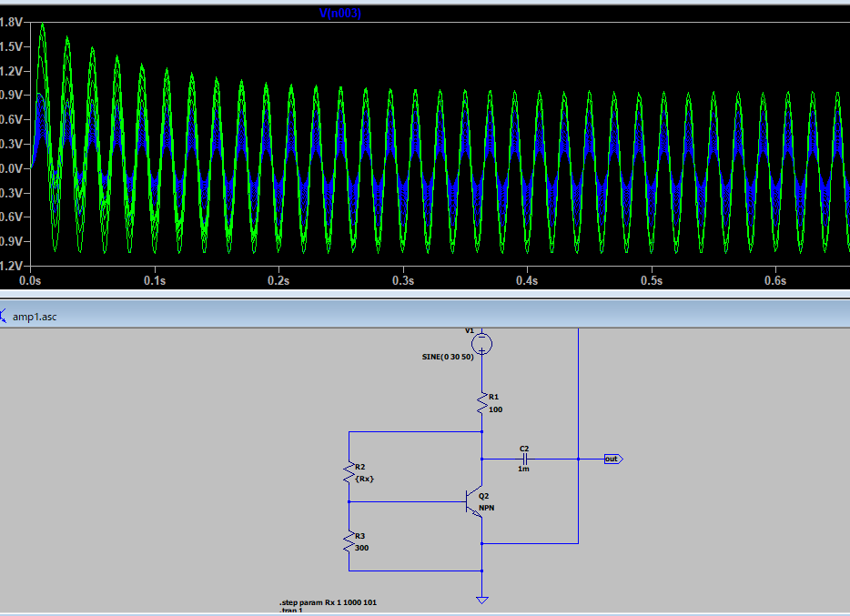
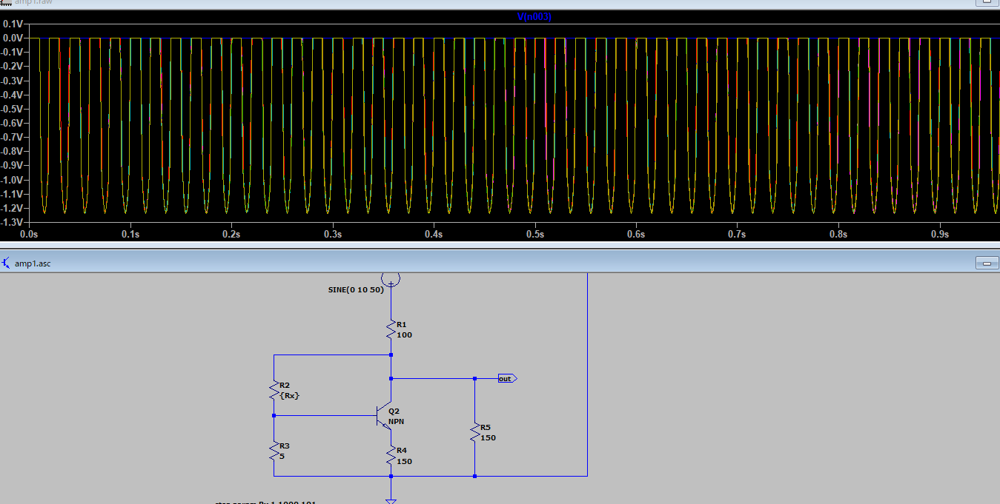
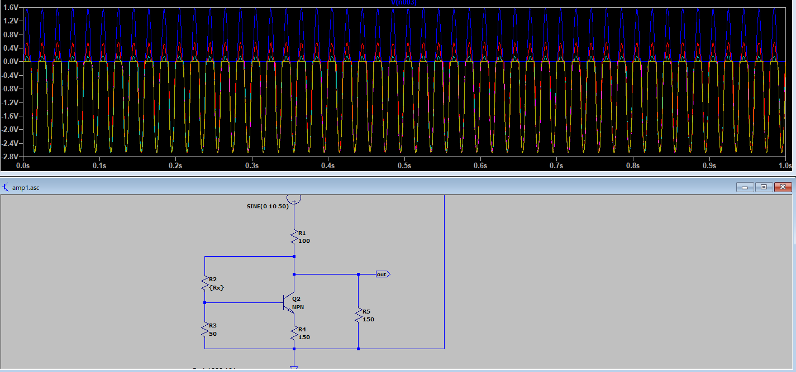

## 目的

LTSpiceで抵抗値を可変にしてシミュレーションする。

[LTspiceで可変抵抗を使う2つの方法。3つの事例とともに解説](https://electronic-circuit.com/ltspice-variable-resistance/)

## メリット

抵抗値を可変でシミュレーションするメリットはずばり☆

最適な抵抗値を簡単に決められるようになる

ことです。

これによりはんだで抵抗を付け替えする時間を省略できるようになります。

## シチュエーション

1. 電流や電圧の制御
   　LEDやICなど、特定の電流・電圧で動作させたい部品の保護や動作調整。
2. ゲインや信号レベルの調整
   　アンプ回路やフィルタ回路で、出力の大きさや周波数特性を変えたい場合。
3. センサーの感度調整
   　センサー回路で、出力信号の範囲や感度を調整したい場合。
4. バイアスやオフセットの設定
   　トランジスタやオペアンプの動作点（バイアス）を最適化するため。
5. 回路の動作確認・デバッグ
   　設計通りに動作しない場合、抵抗値を変えて原因を調査するため。
6. 消費電力の調整
   　回路全体の消費電力を抑えたい場合。

### STEPコマンドで抵抗値を可変

抵抗値を可変にする方法

1. 回路図の抵抗R1の素子（シンボル）上で右クリックすると、Resistorウィンドウが表示される。
2. Resistance[Ω]の「 **1** 」を「 **{Rx}** 」に変更する。

#### STEPコマンドで抵抗値の変数を可変する

メニューの「Edit」→「SPICE Directive」を選択すると、Edit Text on the Schematicウィンドウが表示されるので、

.step param Rx 1 9 2

と入力する。

この設定により抵抗R1の「抵抗値Rx」を**1Ω～9Ω**まで、**2Ω間隔**で可変することができます。

抵抗可変にした場合の挙動。

プローブしたのはエミッタの電圧。

マイナス側は流れる。

この回路、プラス側はほとんど流れない・・・

ということで、プルダウンの抵抗を大きくすると、御覧の通り流れるようになる。

抵抗のバランスは重要です。

