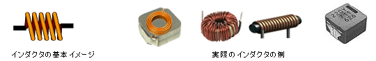
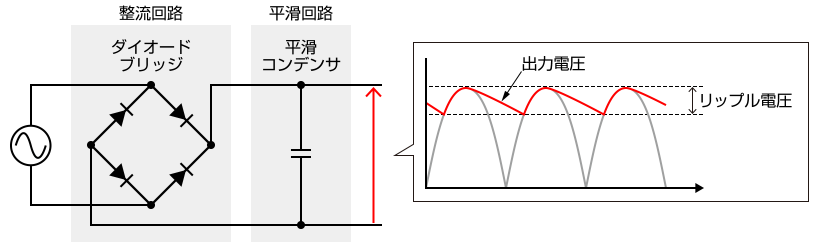
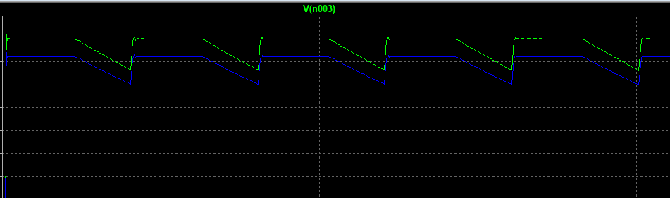
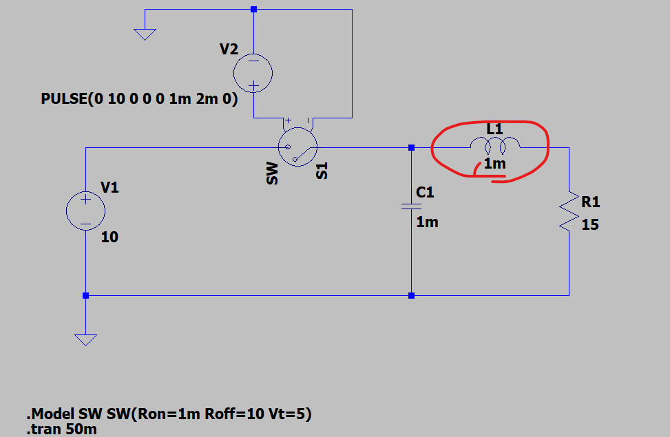
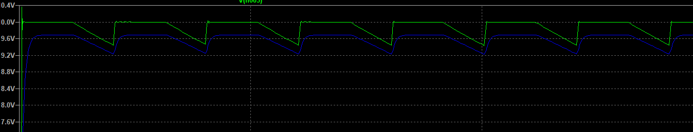
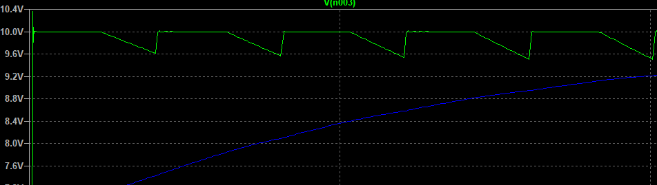
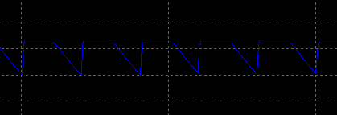

## 目的

インダクタンスの性質についてLTSpiceを用いて確認する。

「インダクタンス（コイル）」は、電気回路・電子回路の両方でよく登場しますが、その役割は **「電流の変化に抵抗する」性質** に基づいています。

コイルは電気エネルギを蓄積する効果があります。

蓄積の式は以下で表されます

$$
L = (k × μ × S × N²) / l
$$

| 記号 | 意味           | 単位         |
| ---- | -------------- | ------------ |
| L    | インダクタンス | ヘンリー (H) |
| k    | 長岡係数       | なし         |
| μ   | コアの透磁率   | H/m          |
| N    | コイルの巻数   | 回           |
| S    | コイルの断面積 | m²          |
| l    | コイルの長さ   | m            |

# ✅ インダクタンスの基本的な性質

* コイルに電流を流すと **磁場が発生**
* 電流が変化すると **ファラデーの電磁誘導**により起電力（逆向きの電圧）が生じる
* このため **電流を急に変化させにくい**

👉 数式で表すと：

[

V = L \frac{di}{dt}

]

* (L)：インダクタンス [H]
* (di/dt)：電流の変化率

---

# ✅ インダクタンスの役割（用途別）

## 1. **直流（DC）回路での役割**

* **電流を平滑化する**
  * スイッチング電源の出力で、リップルを減らす（コンデンサと組み合わせて平滑回路）
* **突入電流を抑える**
  * 電流の立ち上がりをゆるやかにする

> 電流の平滑化する
>
> 突入電流を抑える。＝立ち上がりを緩やかにする

## 2. **交流（AC）回路での役割**

* **周波数によるインピーダンス特性**
  * (Z = j\omega L) なので、周波数が高いほどインピーダンスが大きい
  * 低周波は通しやすく、高周波は通しにくい
* **フィルタ回路**
  * 低周波は通す（ローパスフィルタ）、高周波は遮断する（ハイカット）
  * コンデンサと組み合わせてバンドパス/バンドストップフィルタも作れる
* **共振回路**
  * LC回路を作ると特定周波数で共振 → 発振器やチューナーに利用

> 交流回路におけるローバス、ハイカットフィルタ。
>
> LC回路を作ると、特定周波数で共振。

## 3. **エネルギーの蓄積**

* インダクタは **磁場にエネルギーを蓄える素子**

  [

  W = \frac{1}{2} L I^2

  ]
* 例：スイッチング電源（昇圧・降圧コンバータ）で電流を一時的に蓄えて変換に利用

> スイッチング電源で電流を一時的に蓄積して変換に利用

## 4. **信号処理・通信での役割**

* **高周波回路**ではアンテナ・RFフィルタ・発振回路に必須
* **トランス** （変圧器）はインダクタの相互作用（相互インダクタンス）を利用

> インダクタの相互作用を利用
>
> アンテナ、RFフィルタ、発振回路に利用

# ✅ まとめ

インダクタンスの役割は大きく分けると：

1. **電流の変化を抑える** （平滑化、突入電流防止）
2. **周波数特性を利用する** （フィルタ、共振）
3. **磁場にエネルギーを蓄える** （電源回路、昇降圧コンバータ）
4. **電磁誘導を応用する** （トランス、無線通信）

# ✅ 平滑化におけるコンデンサとインダクタの違い

| 項目               | コンデンサ (C)                                                       | インダクタ (L)                                                                       |
| ------------------ | -------------------------------------------------------------------- | ------------------------------------------------------------------------------------ |
| 基本性質           | **電圧の変化を妨げる**                                         | **電流の変化を妨げる**                                                         |
| リアクタンス       | (X_C = \frac{1}{\omega C}) → 周波数が高いほど小さい（高周波を通す） | (X_L = \omega L) → 周波数が高いほど大きい（高周波を遮断する）                       |
| 平滑化の仕方       | **並列に接続**して高周波リップルをバイパス（GNDへ逃がす）      | **直列に接続**して高周波リップルをブロック                                     |
| 得意分野           | 高周波ノイズの除去（デカップリングコンデンサ、バイパスコンデンサ）   | 低周波の平滑化、大電流のリップル抑制（電源チョーク、スイッチング電源の出力フィルタ） |
| エネルギーの蓄え方 | 電界に蓄積 ((W=\tfrac{1}{2}CV^2))                                    | 磁界に蓄積 ((W=\tfrac{1}{2}LI^2))                                                    |

# ✅ 平滑化回路での典型的な使い方

1. **コンデンサのみ（Cフィルタ）**
   * 整流後の波形の高周波成分を吸収 → 電圧リップルを減らす
   * ただし大電流を流すと充放電の影響でリップルが増える
2. **インダクタのみ（Lフィルタ）**
   * 電流の急激な変化を抑える → 電流リップルを減らす
   * ただし部品が大きくなる、直流抵抗で電圧降下が発生する
3. **LCフィルタ（コンデンサ＋インダクタ）**
   * インダクタで高周波成分をブロックし、コンデンサで残った成分を逃がす
   * スイッチング電源の出力フィルタに多用される

# ✅ イメージで理解すると…

* **コンデンサ** → 「電圧を安定させる（電圧リップルを減らす）」
* **インダクタ** → 「電流を安定させる（電流リップルを減らす）」

そして両者を組み合わせた **LCフィルタ** が「電圧も電流も滑らか」にする強力な平滑化回路になります。

## 言語

### リップル

リップル（ripple）は直流の電流の中に含まれている脈動の成分のことです。リプルともよばれます。電源入力周波数やノイズであるスイッチング周波数と同期した成分が出力電圧に重ねられるのが特徴です。

電源内部の入力平滑コンデンサの容量やアンプの応答速度のほか、スイッチング周波数や出力フィルタ、出力電流によって脈動成分の条件が決まります。

リップルに似たものとしてノイズがありますが、JEITA（一般社団法人 電子情報技術産業協会）の規格によると、リップルは交流電源と同じ50Hzや60Hzの周波数成分からなる変動と定義されている一方で、ノイズはACアダプターのスイッチングにより生じる数十kHz以上の周波数成分からなる変動と定義されています。

リップルとノイズの両方の性質をあわせ持つものをリップルノイズといいます。電源装置において出力電圧を安定させたい場合には、リップルノイズが少ないものが適しています。

### 平滑の機能

インダクタンスがない場合

微妙にリプルが立ってるように見える。

L=1mの場合

抵抗の電流が丸まった

L=100mの場合

抵抗の電流が振動しなくなった

### 結論

今回の回路だと、抵抗側でリプルは出づらい。

というのはコンデンサの電圧と同じ状態なので。

とはいえ、流れる電流が抑えられるようになったということは確認できた。

