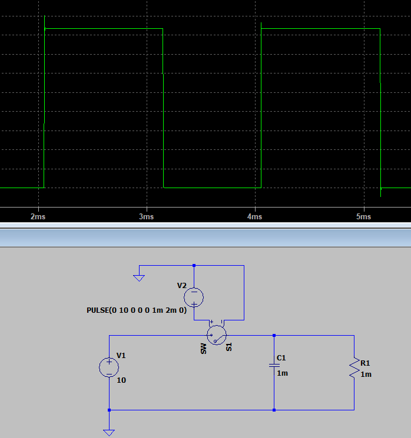
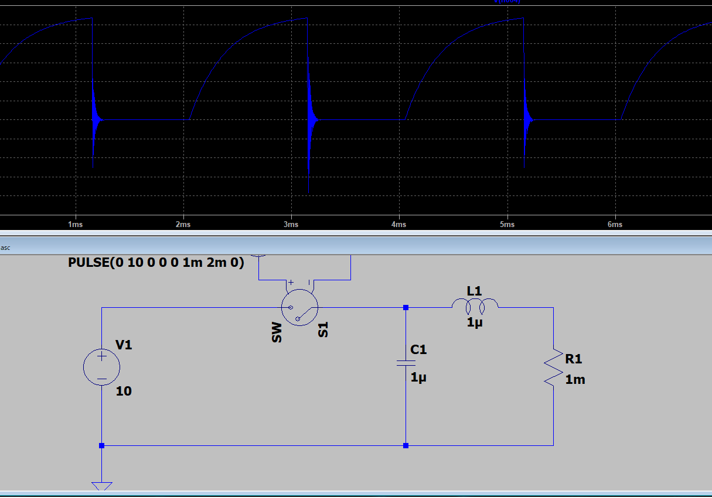
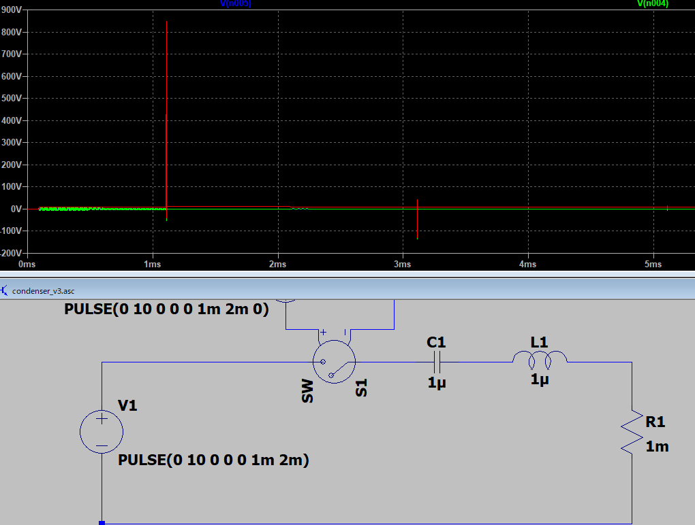
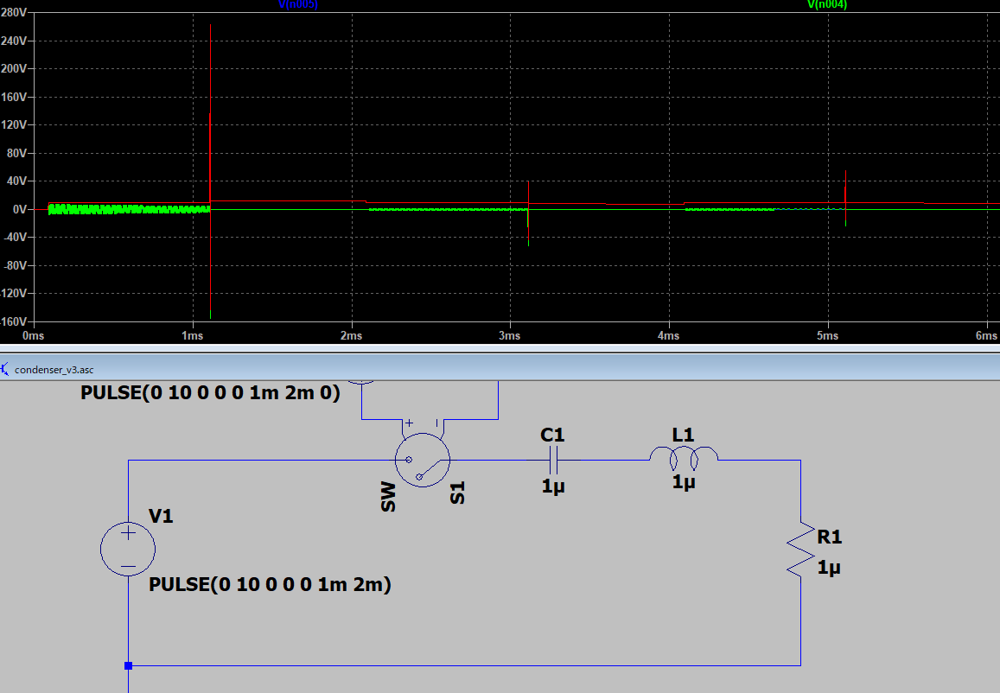
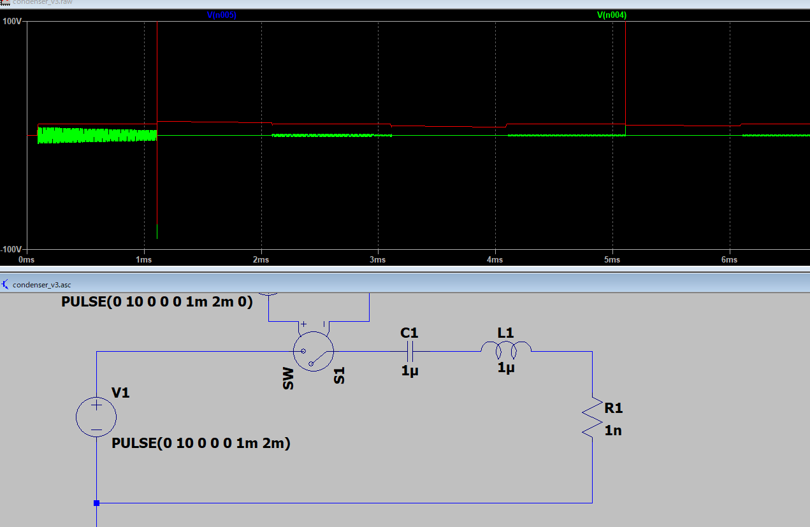
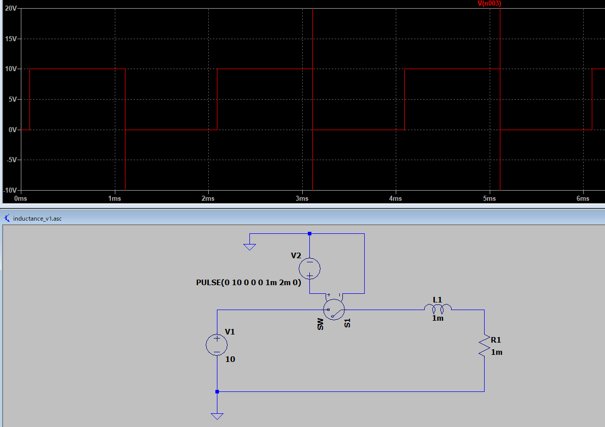

# ✅ 突入電流が「振動的になる」理由

電気回路で突入電流（inrush current）が流れたとき、電流波形が **オーバーシュートして振動的（減衰振動）になる**ことがあります。

その理由は **回路が RLC 系の二次系として振る舞うから** です。

---

## 1. 突入電流とは？

* 電源投入直後、コンデンサが空っぽのとき → 一気に充電しようとして大電流が流れる
* インダクタがあると → 電流の急変に抵抗して「エネルギーのやりとり」が発生

---

## 2. 振動的になる仕組み

* 電源投入時、**コンデンサ (C)** は「電圧変化を妨げる」
* **インダクタ (L)** は「電流変化を妨げる」
* 両者を組み合わせた回路（L と C が直列や並列で存在する系）は、**エネルギーを電界と磁界の間でやり取り**します。

👉 これが **LC共振** の正体。

* 実際には抵抗 (R) もあるので、完全な共振ではなく **減衰振動** となる。

---

## 3. 数式での理解

RLC直列回路にステップ電圧を加えた場合の応答は二次方程式で表せます：

[

L\frac{d^2 i}{dt^2} + R \frac{di}{dt} + \frac{1}{C} i = \frac{dV}{dt}

]

解の形は、減衰率 ζ に応じて変わります：

* **過減衰 (ζ > 1)** → 振動せずにゆっくり落ち着く
* **臨界減衰 (ζ = 1)** → 速やかに一発で収束
* **不足減衰 (ζ < 1)** → 振動しながら収束（よく見る突入電流の波形）

---

## 4. イメージ例

* **コンデンサ電源投入時**

  → 最初は短絡状態 → 大電流

  → インダクタがあると電流変化を抑制

  → 充電途中で L と C がエネルギーをやりとりして **電流が上下に振動**
* **スイッチング電源の入力**

  → EMIフィルタにLとCがある → 突入時に LC 共振が発生して電流が振動的になる

---

## 5. まとめ

電気回路に突入電流が流れると電流が振動的になるのは：

* 回路に **インダクタンス（L）とキャパシタンス（C）が存在**して
* 突入時に **エネルギーが電界（C）と磁界（L）の間で交換**され
* **Rの抵抗分**で徐々に減衰する「RLC減衰振動」になるから

---

👉 実際の波形を LTSpice で観察すると、**R が小さいほど振動が激しく、R を大きくすると振動せずにゆっくり落ち着く**のが確認できます。


# **LTspice で突入時の減衰振動（RLCの過渡応答）を観察できる回路例**

以下は「電源の立ち上げ（ステップ）で L と C がエネルギーを交換して電流が振動する」典型例です。

パラメータを変えて（R を増やす／L・C を変える）振る舞いがどう変わるか確認してください。

---

## ポイント（先に要点だけ）

* **回路** ：電圧ステップ → 直列 R → L → C → GND（シンプルな直列 RLC）
* **観測** ：`I(L1)`（コイル電流）と `V(node)`（C にかかる電圧）をプロット
* **期待** ：R が小さいと `I(L1)` は振動（不足減衰）、R が大きいと振動が減る（過減衰）
* 理論値：
  * 共振角周波数 ( \omega_0 = \dfrac{1}{\sqrt{L C}} )
  * 共振周波数 ( f_0 = \dfrac{\omega_0}{2\pi} )
  * 減衰比 ( \zeta = \dfrac{R}{2} \sqrt{\dfrac{C}{L}} )（直列RLCの場合）

---

## LTspice の回路（netlist）

このまま `.asc` に貼るか `.net`/.`cir` ファイルとして保存して LTspice で開いてください。

```
* RLC transient: show inrush oscillation
.param R=0.1m        ; 変更して試す (例: 0.1, 1, 10, 200)
.param L=10m         ; 10 mH
.param C=100u        ; 100 uF
* Voltage step: 0->10V at t=0
V1 VIN 0 PULSE(0 10 0 1u 1u 0 50m)
Rser VIN N1 {R}
L1 N1 N2 {L}
C1 N2 0 {C}

* measure currents/voltages
.tran 0 200m uic
.probe
.backanno
.end
```

### 説明

* `V1`：0→10V のステップパルス（立ち上がり 1µs）
* `Rser`：直列抵抗（これがダンピングを決める）。`.param R` を変えて試してください。
* `L1`：コイル 10 mH、`C1`：コンデンサ 100 µF
* `.tran 0 200m uic`：200msまで過渡解析。`uic`は初期条件をゼロにする（任意で外しても良い）。

---

## シミュレーションの実行とプロット

1. 回路を読み込んでシミュレーション実行（Run）
2. 波形ビューで以下をプロット：
   * `I(L1)` ← コイル電流（突入電流の振動）
   * `V(N2)` または `V(C1)` ← コンデンサ電圧
3. `.step param R list 0.1 1 10 200` のようにして R をステップすると複数ケース比較できます。

---

## 例：パラメータと理論的予測（目安）

* L = 10 mH, C = 100 µF → ( \omega_0 = 1/\sqrt{0.01 \times 100\times10^{-6}} = 1000\ \mathrm{rad/s} )

  → ( f_0 \approx 159\ \mathrm{Hz} )
* 減衰比 ζ = R/2 * sqrt(C/L)

  * R = 0.1Ω → ζ ≈ 0.005（非常に不足減衰 → 強い振動）
  * R = 10Ω → ζ ≈ 0.5（やや減衰、振動はあるがすぐ収まる）
  * R = 200Ω → ζ ≈ 10（過減衰 → 振動しない）

---

## 実機で観察される追加要因（シミュレータとの違い）

* コイルの直流抵抗（DCR）や寄生インダクタンス・寄生容量、コンデンサの ESR（等価直列抵抗）は減衰に寄与します。
* ダイオード整流や電源インピーダンスなど、実配線の寄生成分も影響します。
* 電源の内部インピーダンスが低ければ突入ピークは大きくなりやすい。

---

## 突入振動を抑える設計手段（実装的対策）

1. **直列に抵抗を入れる** （またはインダクタのDCRでダンピング）
2. **NTC（サーミスタ）を突入時に利用**して初期抵抗を与え、温まれば抵抗を下げる方法
3. **RCスナバ** （CとRを直列にして並列接続）でLCの共振をダンプ
4. **ソフトスタート（プリチャージ）回路** ：最初は小電圧で立ち上げ、徐々に電圧を上げる
5. **電源の出力インピーダンスを増やす（制限）** ：突入を抑制
6. **回路の寄生を利用して狙ったダンピングを設計** （適切なR, ESRを選ぶ）

---

## LTspiceでの拡張例（Rをステップして比較）

netlistの先頭に以下を追記して複数ケースを一度に実行できます:

```
.step param R list 0.1 1 10 200
```

これで波形ビューで `I(L1)` を表示すると、ステップごとに色違いで波形が表示され、Rによる違いが一目で分かります。

---

## 参考プロットの読み方（期待される挙動）

* **不足減衰（ζ < 1）** ：立ち上がりで過渡オーバーシュート、大振幅の正弦減衰（指数的に減衰）
* **臨界/やや減衰（ζ ≈ 1）** ：オーバーシュートが小さく、速く収束
* **過減衰（ζ > 1）** ：振動せず緩やかに目標値へ遷移

---

もしよければあなたの想定条件（電源電圧、L, C の候補値、負荷電流、整流の有無など）を教えてください。

その条件に合わせて **具体的な LTspice 回路（部品値・測定ポイント・.step 例・期待されるピーク値の概算）** を作って差し上げます。





出ました。

但し並列です。

直列にするとさらに振動的になるはずです。




直列のケース



振動的にはなるんですが・・・

より抵抗を小さくした場合。振動が大きくなったような気がします。




R＝１n Ω



かなり振動は大きくなりました。

やはり、抵抗が小さいと振動的になります。



